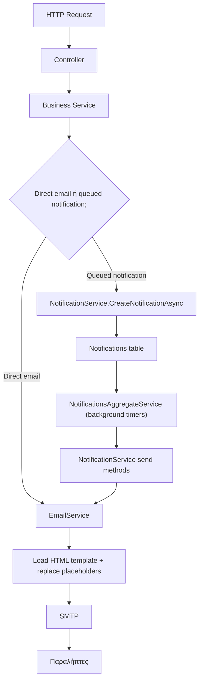
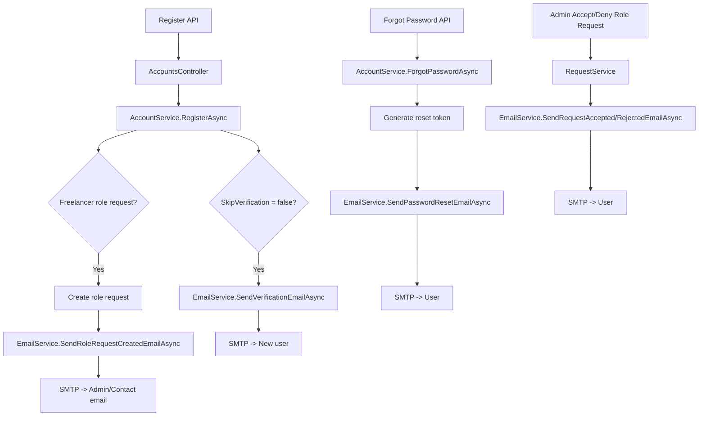
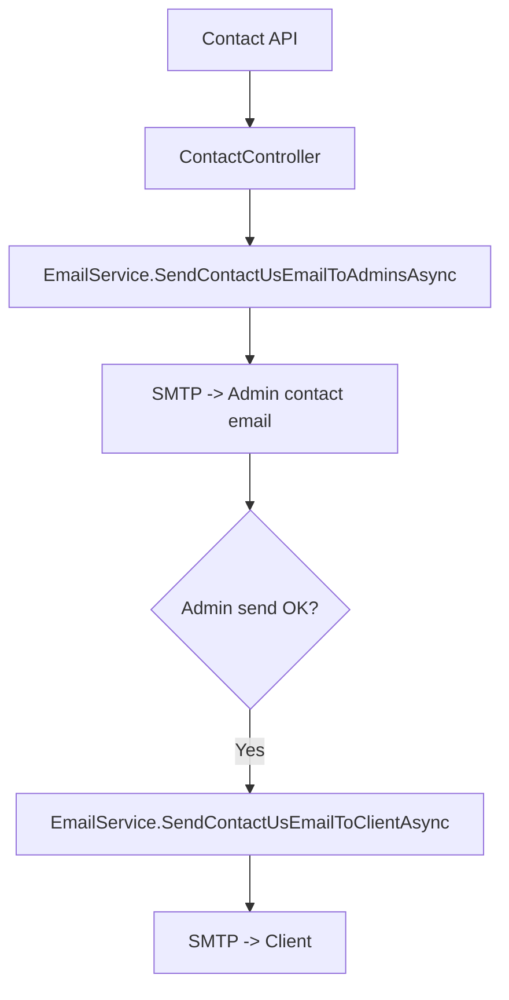
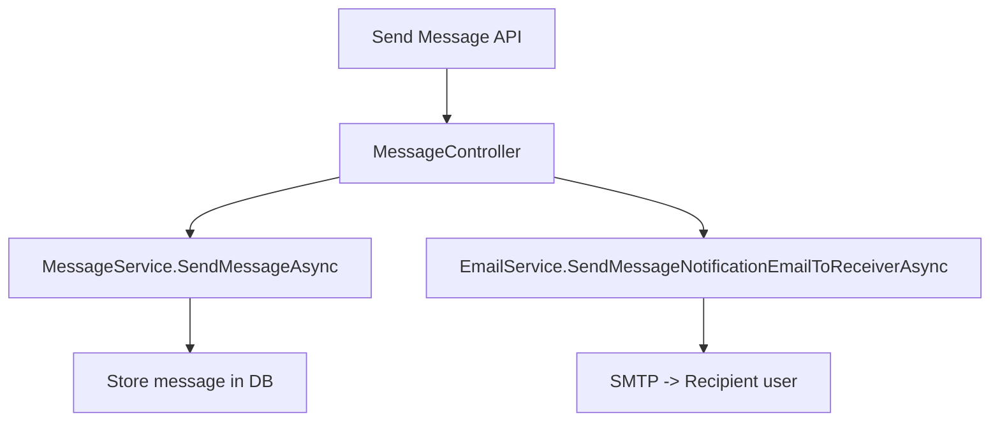
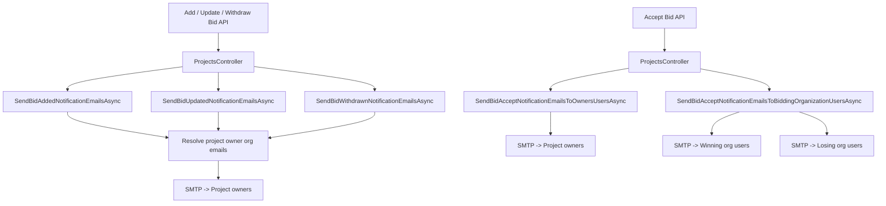
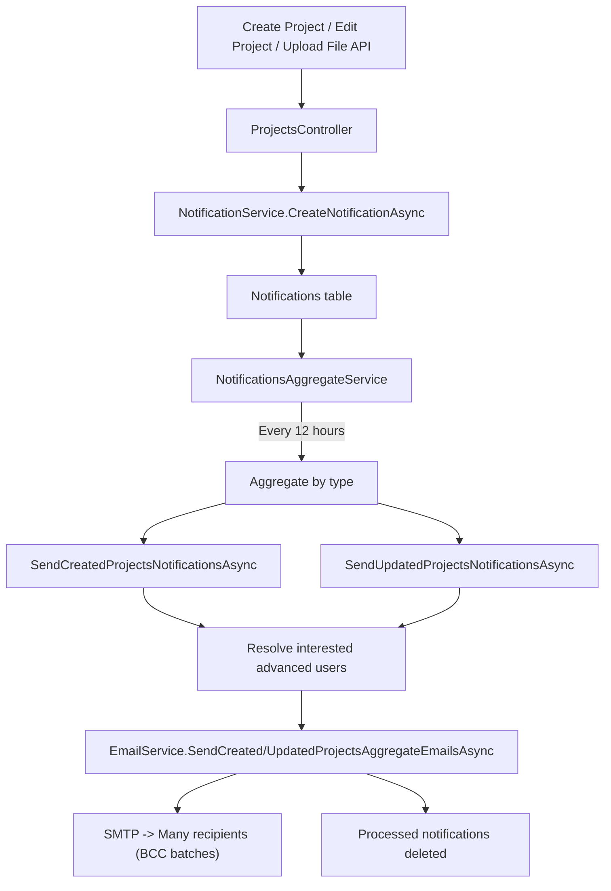
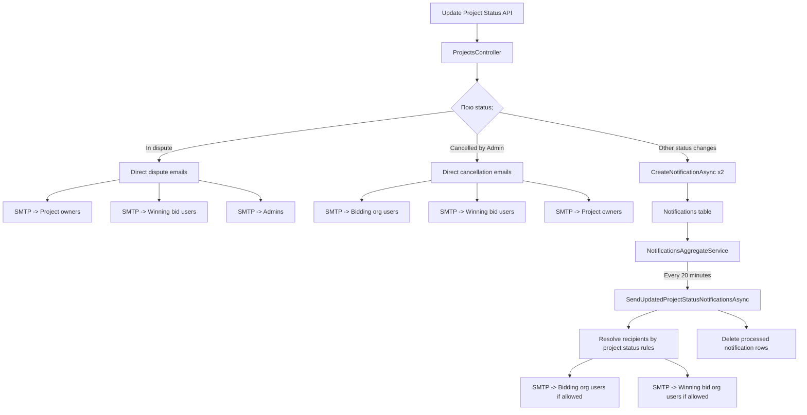
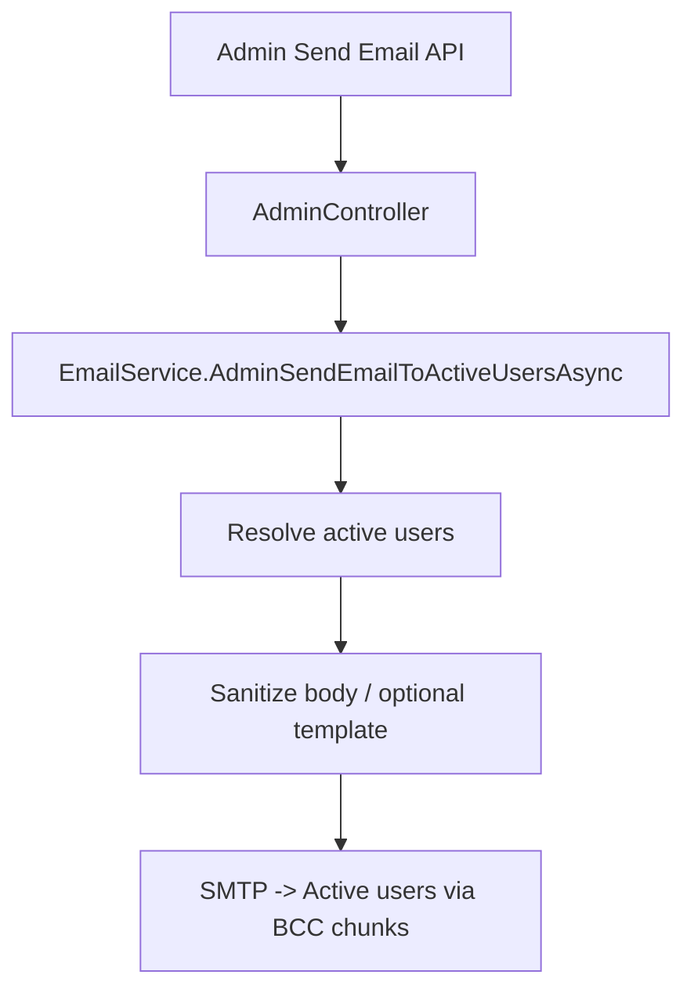

---
categories:
  - "[[Documentation]]"
created: 2026-05-17
product: Accelup
component:
tags:
  - documentation/auth
  - accelup/notifications
---

## Summary
Code flows for notifications and emails.

## Details

### Διάγραμμα Ροών
Παρακάτω είναι το συνολικό routing των emails/notifications στο backend.

#### 1. Account / Access Flows

Τι πάει πού:
- verification email -> στον νέο χρήστη
- password reset email -> στον χρήστη που ζήτησε reset
- role request created -> στους admins
- role request approved/rejected -> πίσω στον χρήστη

#### 2. Contact Form

Τι πάει πού:
- το αρχικό μήνυμα -> στους admins
- confirmation/copy -> στον πελάτη μόνο αν το πρώτο send πετύχει

#### 3. User-to-User Messages

Τι πάει πού:
- το actual message αποθηκεύεται στη DB
- email notification -> μόνο στον παραλήπτη, σαν ειδοποίηση ότι έχει νέο μήνυμα

#### 4. Bid Flows

Τι πάει πού:
- new bid / updated bid / withdrawn bid -> στους owners του project
- accepted bid:
  - owners -> ενημέρωση ότι επιλέχθηκε bid
  - winning bidder org -> winning email
  - losing bidder orgs -> losing email

#### 5. Project Create / Edit / File Upload: Queued Aggregate Notifications
Αυτό είναι το βασικό queued flow.

Τι πάει πού:
- δεν φεύγει άμεσα email
- γράφεται event στον πίνακα `Notifications`
- ο background worker τα μαζεύει
- στέλνει ένα aggregate email σε πολλούς recipients
- μετά διαγράφει τα processed notification rows

#### 6. Project Status Change
Υπάρχουν 2 διαφορετικά branches.

Τι πάει πού:
- `In_dispute` -> άμεσο email σε owners, winning users, admins
- `Cancelled_by_Admin` -> άμεσο email σε bidders, winners, owners
- άλλα status changes -> queued notification, μετά batch send ανά status rules

Παρακάτω είναι ο καθαρός πίνακας για το current behavior.

| Status | Flow | Τελικοί παραλήπτες | Σχόλιο |
|---|---|---|---|
| `In_dispute` | Direct email | Project owners, winning bid users, admins | Άμεσο special-case flow |
| `Cancelled_by_Admin` | Direct email | Bidding organization users, winning bid users, project owners | Άμεσο special-case flow |
| `Active` | Queued | Bidding organization users, winning bid organization users | Περνά από `Notifications` + worker |
| `Bidding_closed` | Queued | Bidding organization users | Περνά από `Notifications` + worker |
| `Employer_cancelled` | Queued | Bidding organization users, winning bid organization users | Περνά από `Notifications` + worker |
| `Closed` | Queued | Bidding organization users, winning bid organization users | Περνά από `Notifications` + worker |
| `Under_development` | Queued | Winning bid organization users | Περνά από `Notifications` + worker |
| `Bidding_expired` | Queued | Κανείς, με βάση το current code | Γράφεται notification αλλά δεν βλέπω τελικό send |
| `Winner_selected` | Queued | Κανείς, με βάση το current code | Γράφεται notification αλλά δεν βλέπω τελικό send |
| `Payment_pending` | Queued | Κανείς, με βάση το current code | Γράφεται notification αλλά δεν βλέπω τελικό send |
| `Completed` | Queued | Κανείς, με βάση το current code | Γράφεται notification αλλά δεν βλέπω τελικό send |
Η βασική παρατήρηση είναι ότι το queued branch δεν σημαίνει πάντα και τελικό email. Για 4 statuses το event μπαίνει στην ουρά, αλλά ο `NotificationService` δεν τα θεωρεί eligible για αποστολή.
Αν το δούμε από πλευράς requirement, το πιο σημαντικό κενό είναι:
- δεν ενημερώνονται σταθερά οι `project owners` για generic status changes
- κάποια statuses αλλάζουν, μπαίνουν στην ουρά, αλλά δεν παράγουν καθόλου outgoing notification
Αν θέλεις, επόμενο βήμα μπορώ να σου γράψω ένα πολύ σύντομο `coverage verdict` για το requirement ανά status, π.χ. `fully covered / partially covered / not covered`.

#### 7. Admin Broadcast

Τι πάει πού:
- ένα admin-authored μήνυμα -> σε όλους τους active users που περνάνε τα φίλτρα
**Πρακτικά, τα “μηνύματα” πάνε σε 3 προορισμούς**
1. Άμεσο SMTP send προς συγκεκριμένους παραλήπτες.
2. `Notifications` table ως προσωρινό queue marker.
3. Από το queue ξανά στο `EmailService`, που τελικά τα στέλνει με SMTP.

**Σημεία του code που αντιστοιχούν στα παραπάνω**
- Controller entry points: [ProjectsController.cs](C:/Users/michael/developer/accelup/accelup-backend/Enoll/Controllers/ProjectsController.cs), [AccountsController.cs](C:/Users/michael/developer/accelup/accelup-backend/Enoll/Controllers/AccountsController.cs), [MessageController.cs](C:/Users/michael/developer/accelup/accelup-backend/Enoll/Controllers/MessageController.cs), [ContactController.cs](C:/Users/michael/developer/accelup/accelup-backend/Enoll/Controllers/ContactController.cs), [AdminController.cs](C:/Users/michael/developer/accelup/accelup-backend/Enoll/Controllers/AdminController.cs), [RequestController.cs](C:/Users/michael/developer/accelup/accelup-backend/Enoll/Controllers/RequestController.cs)
- Direct mail layer: [EmailService.cs](C:/Users/michael/developer/accelup/accelup-backend/Enoll/Services/EmailService.cs)
- Queue/event layer: [NotificationService.cs](C:/Users/michael/developer/accelup/accelup-backend/Enoll/Services/NotificationService.cs)
- Background aggregation: [NotificationsAggregateService.cs](C:/Users/michael/developer/accelup/accelup-backend/Enoll/Services/NotificationsAggregateService.cs)
- Stored notification model: [Notification.cs](C:/Users/michael/developer/accelup/accelup-backend/Enoll/Model/Entities/Notification.cs)

## Links
