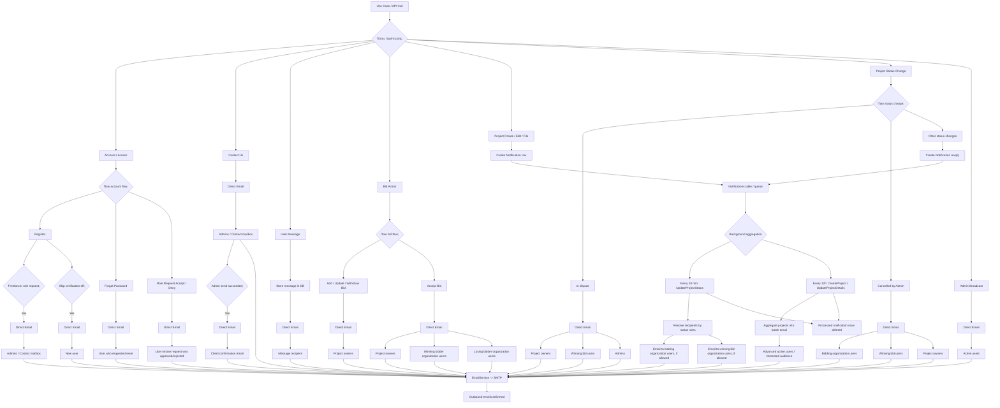
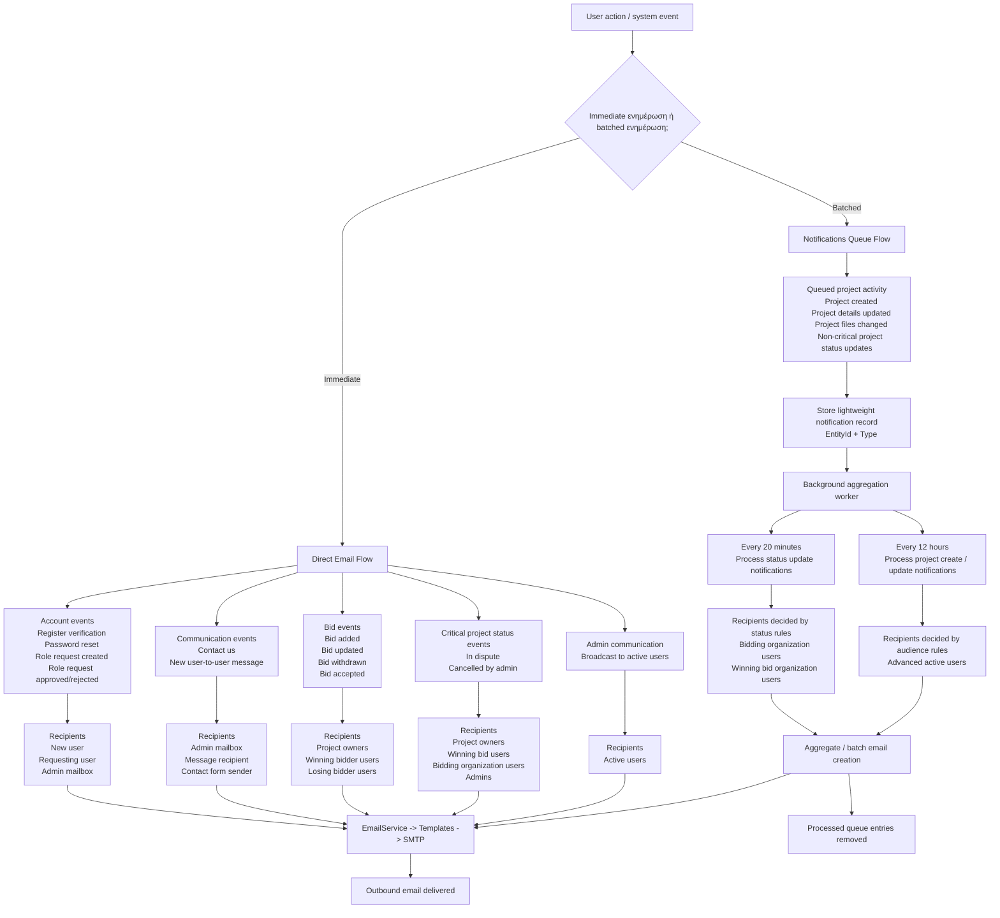

---
categories:
  - "[[Documentation]]"
created: 2026-05-17
product: Accelup
component:
tags:
  - documentation/auth
  - accelup/notifications
---

## Summary
Email and notifications inside accelup project.
## Details

Παρακάτω είναι ένα ενιαίο high-level διάγραμμα που δείχνει όλα τα βασικά use cases, τη βασική απόφαση `direct email` vs `notifications queue`, και τους τελικούς παραλήπτες.

**Πώς να το διαβάζεις**
- `Direct Email`: το request οδηγεί κατευθείαν στο `EmailService` και μετά σε SMTP.
- `Create Notification row`: το request δεν στέλνει αμέσως email. Γράφει event στον πίνακα `Notifications`.
- `Background aggregation`: ο worker μαζεύει queued notifications και τα μετατρέπει αργότερα σε emails.
- `Project Status Change` έχει μικτό μοντέλο:
  - `In dispute` και `Cancelled by Admin` -> direct email
  - τα υπόλοιπα status changes -> queue -> delayed email

**Το βασικό decision tree σε μία πρόταση**
- account, contact, messages, bids, admin broadcast, dispute/cancel flows -> `direct email`
- project create/edit/file upload και τα περισσότερα generic project status updates -> `notifications queue` -> background aggregation -> email

Παρακάτω είναι μια πιο καθαρή, business-friendly εκδοχή, με έμφαση στις αποφάσεις και στο πού καταλήγει κάθε ειδοποίηση.

**Η ουσία του συστήματος**
- Υπάρχουν δύο παράλληλα μονοπάτια: `Direct Email Flow` και `Notifications Queue Flow`.
- Το direct flow χρησιμοποιείται όταν η ενημέρωση πρέπει να φύγει αμέσως ή είναι πολύ συγκεκριμένη ως προς παραλήπτες.
- Το queue flow χρησιμοποιείται κυρίως για project-related activity που θέλουν batching και όχι spam με άμεσα πολλά mails.
**Πρακτικός κανόνας**
- αν το event είναι προσωπικό, transactional ή κρίσιμο -> direct email
- αν το event είναι “project activity update” που μπορεί να ομαδοποιηθεί -> queue -> background worker -> batch email
Αν θέλεις, μπορώ να δώσω και τρίτη εκδοχή, ακόμα πιο executive, σαν one-slide architecture diagram με μόνο 6-7 κουτιά.
## Links
Αναλυτικά διαγράμματα ανά περίπτωση: [[Notifications & emails code flows]]
