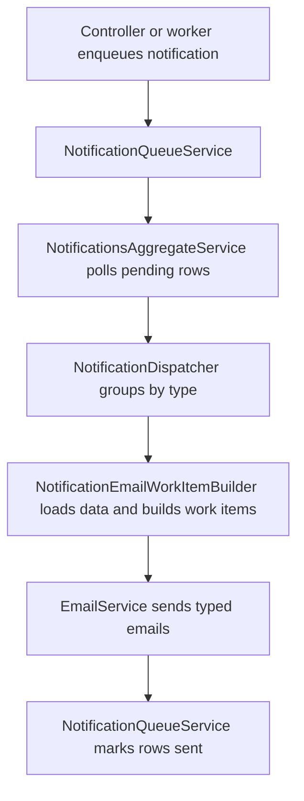

---
categories:
  - "[[Work]]"
  - "[[Documentation]]"
created: 2026-06-11
updated: 2026-06-11
product: Accelup
component: Notifications
tags:
  - documentation/accelup
  - topic/domain
---

# Notifications Processing Architecture

## Overview
Project-related notification email handling is split into separate layers for queue persistence, aggregate polling, work-item building, dispatch orchestration, and final email rendering and sending.

## Current Behavior
- `NotificationQueueService` persists notification rows and reads pending email work.
- `NotificationsAggregateService` polls pending rows by priority bucket.
- `NotificationDispatcher` groups rows by notification type, requests typed work items, sends them, and acknowledges only covered rows.
- `NotificationEmailWorkItemBuilder` loads entity data and builds typed payloads for queued and immediate project flows.
- `EmailService` now mainly renders and sends typed email payloads instead of discovering queued-project recipients directly.

## Business Meaning
Notification delivery is now structured as a reusable pipeline instead of controller-specific or email-service-specific logic.

## Rules
- [[ShouldSendEmail Gates Queued Email Dispatch]]
- [[Notifications Are Marked Sent Instead of Deleted]]
- [[Immediate Dispute and Admin-Cancelled Project Emails Use Dispatcher Plus Builder]]

## Risks
- [[Notification Queue Lacks Reservation-Claim Semantics for Multi-Instance Dispatch]]
- [[High-Priority Notification Worker Scaffold Exists but Is Not Active]]

## Related PRs
- [[PR-feature-AC-21_Add_notifications_when_project_expires_or_nears_expiry Notification Flow Split and Project Expiry Reminders]]

## Diagram

