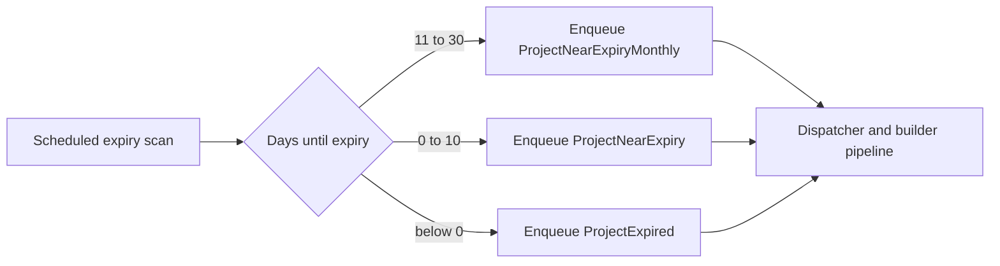

---
categories:
  - "[[Work]]"
  - "[[Documentation]]"
created: 2026-06-11
updated: 2026-06-11
product: Accelup
component: Notifications
tags:
  - documentation/accelup
  - topic/domain
---

# Project Expiry Reminder Lifecycle

## Overview
Projects now participate in a scheduled reminder lifecycle that can produce monthly near-expiry, near-expiry, and expired notification work.

## Current Behavior
- `ProjectExpiryNotificationService` scans projects on a schedule.
- Projects with bid expiry 11 to 30 days ahead can enqueue `ProjectNearExpiryMonthly`.
- Projects with bid expiry 0 to 10 days ahead can enqueue `ProjectNearExpiry`.
- Projects with bid expiry before today can enqueue `ProjectExpired`.
- Those queued rows are later dispatched through the same notification pipeline as other queued project emails.

## Business Meaning
Expiry reminders turn project deadline awareness into a durable background workflow rather than a best-effort foreground check.

## Rules
- [[Project Expiry Reminder Windows and Dedupe Rules]]
- [[Notifications Are Marked Sent Instead of Deleted]]

## Risks
- [[Notification Queue Lacks Reservation-Claim Semantics for Multi-Instance Dispatch]]

## Related PRs
- [[PR-feature-AC-21_Add_notifications_when_project_expires_or_nears_expiry Notification Flow Split and Project Expiry Reminders]]

## Diagram

