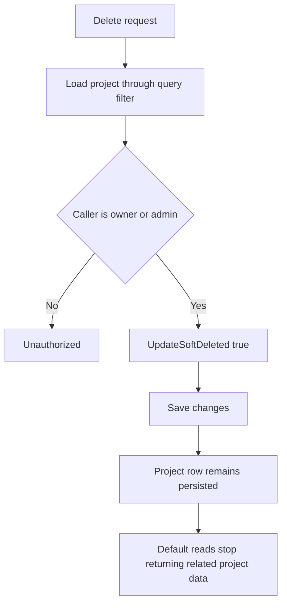

---
categories:
  - "[[Work]]"
  - "[[Documentation]]"
created: 2026-06-11
updated: 2026-06-11
product: Accelup
component: Projects
tags:
  - documentation/accelup
  - topic/domain
---

# Project Soft Delete Lifecycle

## Overview
Projects are deleted by transitioning into a soft-deleted state while the underlying row and related history remain persisted.

## Current Behavior
- `DELETE /projects/{projectId}` loads the project through the default `Project` query filter.
- The service allows the transition when the caller is the project owner or an admin.
- Successful deletion calls `project.UpdateSoftDeleted(true)` and saves the change.
- The project row remains in the database after deletion.
- Default reads for related bids, visits, invoices, and uploads also disappear because their entities inherit project visibility through query filters.

## Business Meaning
Soft delete hides a project from normal product flows without discarding the historical record needed for audit or recovery design later.

## Rules
- [[Deleting a Project Hides It Instead of Removing It]]
- [[Project Delete Is Allowed for Owner or Admin]]
- [[Bid-Rooted Permission Flows Inherit Project Soft-Delete Visibility]]

## Risks
- [[Soft-Delete Visibility Depends on EF Query Filters and Can Be Bypassed]]
- [[No Visible Restore or Undelete Flow for Soft-Deleted Projects]]

## Related PRs
- [[PR-feature-AC-19_Add_hide_or_delete_project Hide or Delete Project]]

## Diagram

