---
categories:
  - "[[Work]]"
created: 2026-06-24
product: RAISE
component:
tags: []
---
# WebRTC Dataset Transfer Architecture

Design document for **adding** peer-to-peer WebRTC DataChannel transfers alongside the existing HTTP relay pipeline. SignalR handles WebRTC signaling; coturn (STUN/TURN) is the NAT traversal fallback. The current `RelayTransferService` / multipart HTTP flow **remains the default and fully supported** until WebRTC is proven in production; only then do we phase out the legacy path.

---

## Table of contents

1. [Goals and scope](#1-goals-and-scope)
2. [Current architecture (primary, unchanged)](#2-current-architecture-primary-unchanged)
3. [Dual-path architecture](#3-dual-path-architecture)
3.1. [Transport selection](#31-transport-selection)
4. [Components](#4-components)
5. [Transfer scenarios](#5-transfer-scenarios)
6. [End-to-end flow](#6-end-to-end-flow)
   - [6.1 Client ↔ Node upload](#61-client--node-upload-example)
   - [6.1.1 Who talks to coturn](#611-who-talks-to-coturn-and-when)
   - [6.1.2 Direct vs TURN selection](#612-when-direct-p2p-vs-turn-relay-is-selected)
   - [6.1.3 Upload data paths](#613-upload-data-paths-after-ice)
7. [Signaling protocol (SignalR)](#7-signaling-protocol-signalr)
8. [WebRTC session establishment](#8-webrtc-session-establishment)
9. [DataChannel file protocol](#9-datachannel-file-protocol)
10. [coturn integration and authorization](#10-coturn-integration-and-authorization)
11. [Security and authorization](#11-security-and-authorization)
12. [Backend domain model](#12-backend-domain-model)
13. [Failure modes and fallbacks](#13-failure-modes-and-fallbacks)
14. [Observability](#14-observability)
15. [Rollout and phase-out strategy](#15-rollout-and-phase-out-strategy)
16. [Open decisions](#16-open-decisions)

---

## 1. Goals and scope

### Goals

- **Add** a WebRTC transfer path without breaking or removing the existing HTTP relay (`RelayTransferService`, `NodeHub` URL signals, multipart endpoints).
- Eventually move dataset, sample, and node-to-node file bytes **off the API gateway** — but only after WebRTC is validated; until then the relay path stays the safe default.
- Enable **direct client download from a node** as a new WebRTC-only capability (HTTP relay today does not support full dataset download from node).
- Preserve existing **authorization rules** on both paths (dataset ownership, node upload approval, access requests, experiment result approvals).
- Support **NAT traversal** on the WebRTC path: prefer direct P2P; fall back to TURN relay when ICE cannot establish a host/srflx path; fall back to **HTTP relay** when WebRTC setup or transfer fails.
- **Optionally** route node-to-node replication over WebRTC (SIPSorcery) while keeping the current backend-relay flow available in parallel.

### In scope

| Transfer type | Direction | Initiator | Signaling path |
|---------------|-----------|-----------|----------------|
| Dataset upload | Client → Node | Angular | Client Hub ⇄ Backend ⇄ Node Hub |
| Dataset download | Node → Client | Angular | Client Hub ⇄ Backend ⇄ Node Hub |
| Sample upload | Client → Node | Angular | Same as dataset upload |
| Sample download | Node → Client | Angular / API consumer | Same as dataset download |
| Node replication | Node → Node | Backend (experiment / schedule) | Node Hub ⇄ Backend ⇄ Node Hub |
| Experiment results | Node → Backend (MinIO) | Node | Optional phase 2; keep HTTP relay or migrate later |

### Out of scope (initial phase)

- **Streamed datasets** (`DatasetType.StreamedDataset`) — continue using MQTT/agent pipeline; no WebRTC file transfer.
- Replacing MinIO persistence for samples already stored in object storage.
- Media tracks / video — DataChannel only.

---

## 2. Current architecture (primary, unchanged)

This remains the **default transport** for all flows that already use it. No endpoints or services are removed during WebRTC rollout.

Today, file bytes on the relay path pass through the API gateway:

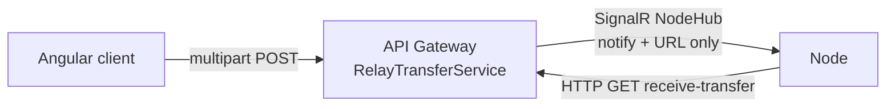
```mermaid
flowchart LR
    Angular["Angular client"]
    Gateway["API Gateway<br/>RelayTransferService"]
    Node["Node"]

    Angular -->|"multipart POST"| Gateway
    Node -->|"HTTP GET receive-transfer"| Gateway
    Gateway -->|"SignalR NodeHub<br/>notify + URL only"| Node
```

**HTTP relay sequence (existing default)**

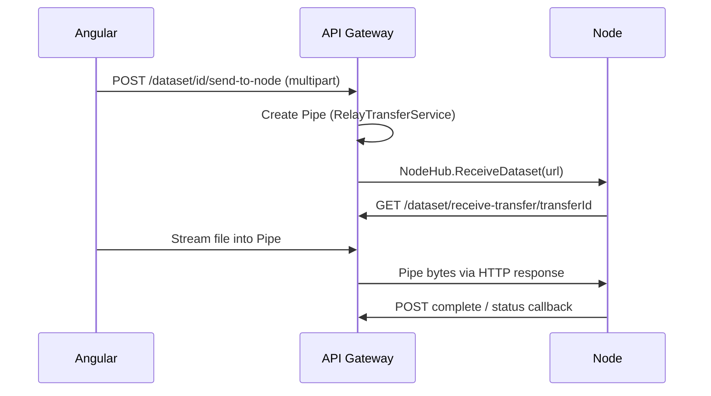
```mermaid
sequenceDiagram
    participant C as Angular
    participant G as API Gateway
    participant N as Node

    C->>G: POST /dataset/id/send-to-node (multipart)
    G->>G: Create Pipe (RelayTransferService)
    G->>N: NodeHub.ReceiveDataset(url)
    N->>G: GET /dataset/receive-transfer/transferId
    C->>G: Stream file into Pipe
    G->>N: Pipe bytes via HTTP response
    N->>G: POST complete / status callback
```

**Key existing pieces**

| Piece | Role |
|-------|------|
| `RelayTransferService` | In-memory `Pipe` keyed by `transferId`; producer writes, consumer reads via `/dataset/receive-transfer/{id}`. |
| `NodeHub` (`signalr/node-hub`) | Node SignalR connection; backend invokes `ReceiveDataset`, `SendDatasetTransferAsync`, etc. with backend URLs. |
| `ExternalRequestService` | Orchestrates upload/transfer: creates pipe, signals node, copies HTTP stream into pipe. |
| `DatasetTransfer` aggregate | Tracks node-to-node transfer status (`Pending` → `Initiated` → `Transferring` → `Finished`). |

**Why we keep it**

- Battle-tested in production; known failure modes and monitoring.
- Works when WebRTC cannot (strict firewalls, missing coturn, older node versions, browser limitations).
- Zero migration risk for existing Angular flows and node agents until explicitly opted in.

**Pain points WebRTC aims to address (future, not blockers for keeping relay)**

- Gateway memory and bandwidth become the bottleneck for multi-GB datasets (40 GB limit on transfer endpoint).
- No true **client ← node** download on the relay path; client always pulls from backend endpoints for samples.
- Node-to-node transfers relay through backend HTTP even when nodes could reach each other directly.
- Single `transferId` pipe is fragile (one consumer, gateway restart loses state).

---

## 3. Dual-path architecture

Two transports coexist. The backend chooses or the client requests a **transport mode** per operation (see [§3.1](#31-transport-selection)).

| Path | Role during rollout | Data plane | Signaling |
|------|---------------------|------------|-----------|
| **HTTP relay (existing)** | Default / fallback | Gateway `RelayTransferService` pipes + HTTP | `NodeHub` with backend URLs |
| **WebRTC (new)** | Opt-in, then promoted | P2P DataChannel (direct or coturn TURN) | `TransferHub` SDP/ICE only |

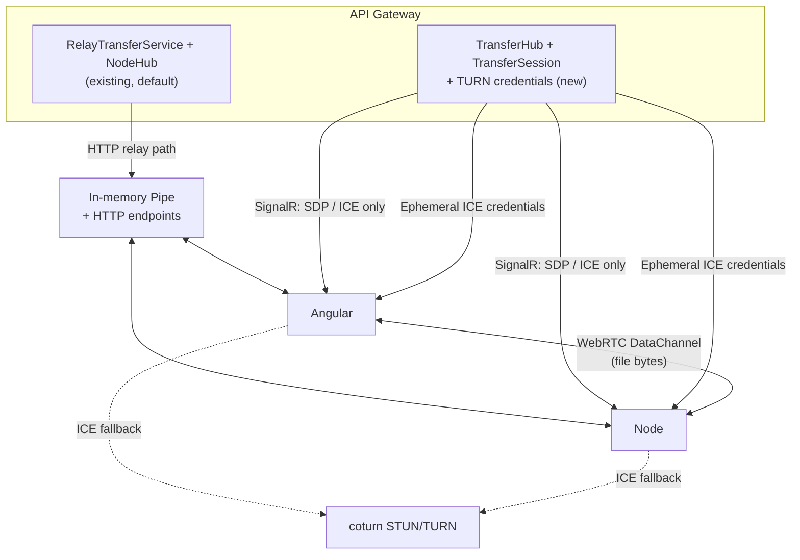
```mermaid
flowchart TB
    subgraph Gateway["API Gateway"]
        Relay["RelayTransferService + NodeHub<br/>(existing, default)"]
        WebRtcStack["TransferHub + TransferSession<br/>+ TURN credentials (new)"]
    end

    Angular["Angular"]
    Node["Node"]
    Coturn["coturn STUN/TURN"]

    Relay -->|"HTTP relay path"| Pipe["In-memory Pipe<br/>+ HTTP endpoints"]
    Pipe <--> Angular
    Pipe <--> Node

    WebRtcStack -->|"SignalR: SDP / ICE only"| Angular
    WebRtcStack -->|"SignalR: SDP / ICE only"| Node
    WebRtcStack -->|"Ephemeral ICE credentials"| Angular
    WebRtcStack -->|"Ephemeral ICE credentials"| Node

    Angular <-->|"WebRTC DataChannel<br/>(file bytes)"| Node
    Angular -.->|"ICE fallback"| Coturn
    Node -.->|"ICE fallback"| Coturn
```

On the **WebRTC path**, SignalR handles **signaling only**. File bytes flow over **WebRTC DataChannel** (direct or via TURN). The relay path is unchanged.

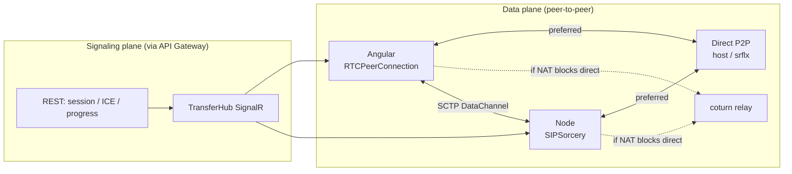
```mermaid
flowchart LR
    subgraph Signaling["Signaling plane (via API Gateway)"]
        REST["REST: session / ICE / progress"]
        Hub["TransferHub SignalR"]
    end

    subgraph Data["Data plane (peer-to-peer)"]
        A["Angular<br/>RTCPeerConnection"]
        N["Node<br/>SIPSorcery"]
        P2P["Direct P2P<br/>host / srflx"]
        TURN["coturn relay"]
    end

    REST --> Hub
    Hub --> A
    Hub --> N
    A <-->|"preferred"| P2P
    N <-->|"preferred"| P2P
    A -.->|"if NAT blocks direct"| TURN
    N -.->|"if NAT blocks direct"| TURN
    A <-->|"SCTP DataChannel"| N
```

**Principle (WebRTC path only):** After ICE completes, the backend is not in the data path except for optional progress webhooks and TURN relay bandwidth (ICE fallback). If WebRTC fails, control returns to the **HTTP relay path** — the backend is again in the data path, same as today.

### 3.1 Transport selection

Every transfer operation declares which path to use. Until WebRTC is the proven default, **HTTP relay wins** when in doubt.

**Selection order (recommended)**

1. Explicit client/API choice (`transport: "webrtc" | "httpRelay"`).
2. If WebRTC requested but node or client lacks capability → **HTTP relay** (log + metric).
3. If WebRTC session fails during signaling or ICE → **automatic fallback to HTTP relay** when `Transfer:AutoFallbackToHttpRelay` is true (default in staging/production until confidence is high).
4. Global default when unspecified → **HTTP relay**.

**Configuration (appsettings)**

| Key | Default (rollout) | Purpose |
|-----|-------------------|---------|
| `Transfer:DefaultTransport` | `HttpRelay` | Default when client does not specify |
| `Transfer:WebRtcEnabled` | `false` → `true` | Gate WebRTC path globally |
| `Transfer:HttpRelayEnabled` | `true` | Keep legacy path available (always true until phase-out) |
| `Transfer:AutoFallbackToHttpRelay` | `true` | Retry failed WebRTC via existing endpoints |
| `Transfer:WebRtcOnlyForDownload` | `false` | If true, download-from-node is WebRTC-only (no relay equivalent) |

**Capability negotiation**

- Node reports `supportsWebRtcTransfer: true` on `NodeHub` connect (or via node version metadata).
- Angular checks `Transfer:WebRtcEnabled` and node capability before offering WebRTC in UI.
- Node agent version below threshold always uses HTTP relay for replication even if backend prefers WebRTC.

**Transport selection flow**

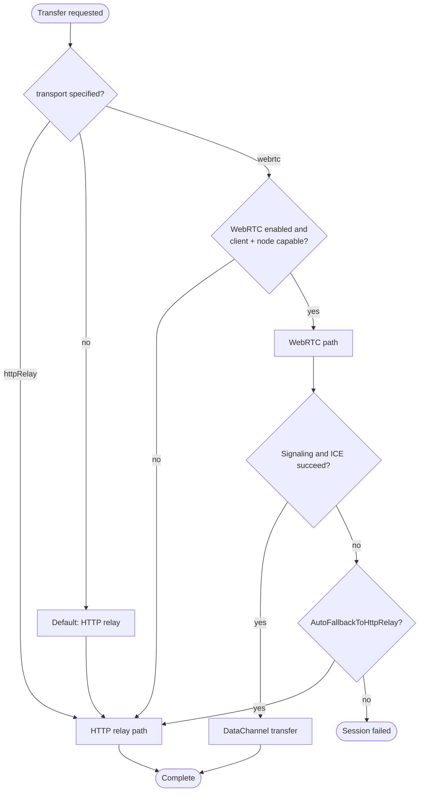
```mermaid
flowchart TD
    Start([Transfer requested]) --> Specified{transport specified?}

    Specified -->|httpRelay| Relay[HTTP relay path]
    Specified -->|no| Default[Default: HTTP relay]
    Specified -->|webrtc| Capable{WebRTC enabled and<br/>client + node capable?}

    Capable -->|no| Relay
    Capable -->|yes| WebRTC[WebRTC path]

    WebRTC --> ICE{Signaling and ICE succeed?}
    ICE -->|yes| DC[DataChannel transfer]
    ICE -->|no| Fallback{AutoFallbackToHttpRelay?}

    Fallback -->|yes| Relay
    Fallback -->|no| Error([Session failed])

    DC --> Done([Complete])
    Relay --> Done
    Default --> Relay
```

---

## 4. Components

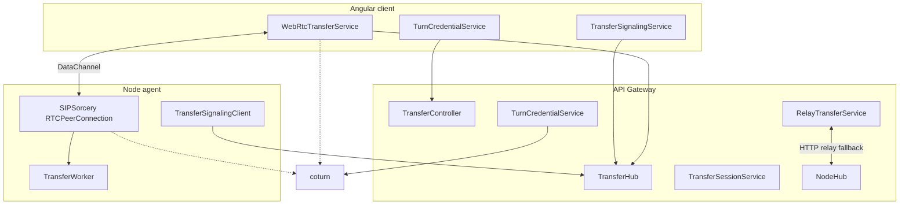
```mermaid
flowchart TB
    subgraph Angular["Angular client"]
        TS["TransferSignalingService"]
        WT["WebRtcTransferService"]
        TC["TurnCredentialService"]
    end

    subgraph Backend["API Gateway"]
        TH["TransferHub"]
        TSS["TransferSessionService"]
        TCtl["TransferController"]
        TCS["TurnCredentialService"]
        RTS["RelayTransferService"]
        NH["NodeHub"]
    end

    subgraph NodeAgent["Node agent"]
        SS["SIPSorcery RTCPeerConnection"]
        TSC["TransferSignalingClient"]
        TW["TransferWorker"]
    end

    Coturn["coturn"]

    TC --> TCtl
    TS --> TH
    WT --> TH
    TSC --> TH
    TCS --> Coturn
    SS --> TW
    WT <-->|"DataChannel"| SS
    WT -.-> Coturn
    SS -.-> Coturn
    RTS <-->|"HTTP relay fallback"| NH
```

### 4.1 Angular client

- **`TransferSignalingService`**: SignalR connection to `TransferHub`; joins session groups; sends/receives SDP and ICE candidates.
- **`WebRtcTransferService`**: Wraps `RTCPeerConnection`, creates ordered `RTCDataChannel`, implements chunk send/receive and progress UI.
- **`TurnCredentialService`**: Fetches short-lived ICE server config from REST before starting a session.

Uses browser APIs only for WebRTC (no SIPSorcery on client).

### 4.2 API Gateway (backend)

| New / extended | Responsibility |
|----------------|----------------|
| **`TransferHub`** | Routes signaling between client connection and node connection for a `transferSessionId`. |
| **`TransferSessionService`** | Creates session, validates permissions, tracks state, issues TURN credentials, persists audit/progress. |
| **`TransferController`** | REST: `POST /transfer/sessions`, `GET .../ice-servers`, `POST .../cancel`, progress callbacks. |
| **`TurnCredentialService`** | Generates ephemeral coturn credentials (REST API or HMAC username scheme). |
| **`NodeHub`** (extended) | Optional: node-initiated signaling methods, or nodes also connect to `TransferHub`. |

**Unchanged:** `RelayTransferService`, `ExternalRequestService` relay orchestration, existing `DatasetController` multipart/GET endpoints — all remain first-class. WebRTC adds parallel services; it does not replace them during rollout.

### 4.3 Node agent

- **SIPSorcery** (`SIPSorceryMedia.WebRTC` or current supported package): `RTCPeerConnection`, DataChannel, ICE handling aligned with browser behavior.
- **`TransferSignalingClient`**: SignalR client to backend `TransferHub` (or extended `NodeHub`).
- **`TransferWorker`**: Reads/writes local dataset files; implements same DataChannel framing as Angular.

Node registers with existing `NodeHub` for presence; transfer signaling can share that connection or use a dedicated hub method namespace.

### 4.4 coturn

- Deployed as standalone service (or sidecar); **not** embedded in the gateway.
- Provides **STUN** (binding requests) and **TURN** (relay allocations).
- Authentication tied to backend-issued **ephemeral credentials** scoped to a transfer session and participant pair.
- Optional: query backend HTTP auth hook for long-lived node credentials (less preferred than ephemeral).

---

## 5. Transfer scenarios

### 5.1 Client upload dataset → primary node

**HTTP relay (existing, default):** `POST /dataset/{id}/send-to-node` — multipart upload, pipe relay, `NodeHub.ReceiveDataset` with `/dataset/receive-transfer/{id}`. Unchanged.

**WebRTC (new, optional):**

1. Client calls `POST /transfer/sessions` with `{ type: "DatasetUpload", datasetId, nodeId, transport: "webrtc" }` — or starts WebRTC after same validations via extended send-to-node response.
2. Backend runs the **same** authorization as `SendDatasetToNodeAsync`; sets `NodeUploadPending`.
3. Backend creates `TransferSession`, notifies node via `TransferHub` / extended signal.
4. WebRTC handshake; client sends file over DataChannel to node.
5. Node verifies hash/size; backend marks dataset enabled (same domain transitions as relay path).

On WebRTC failure → client or backend retries via **`POST /dataset/{id}/send-to-node`** (HTTP relay).

**Role convention:** Client creates the DataChannel (`createDataChannel`) and is the **offerer** (simplifies browser-initiated upload UX).

### 5.2 Client download dataset ← node

**HTTP relay:** Not available for full dataset file today (samples use `GET /dataset/{id}/receive-sample`). No change to sample relay unless WebRTC sample download is opted in.

**WebRTC (new capability):**

1. Client calls `POST /transfer/sessions` with `{ type: "DatasetDownload", datasetId, nodeId? }`.
2. Backend validates access (owner, marketplace grant, project membership, etc.).
3. Backend signals **source node** to send file over WebRTC.
4. Node sends bytes over DataChannel.

There is no HTTP-relay equivalent for full dataset download; if WebRTC fails, UI shows error (or falls back to any future object-storage URL if added separately). Sample download may still use existing HTTP relay when `transport: "httpRelay"`.

**Role convention:** Node creates the DataChannel when it is the **sender**; node is offerer OR client is offerer with node opening the channel in `ondatachannel` — pick one pattern and use it everywhere (recommended: **sender creates channel**).

### 5.3 Sample upload / download

Same machinery with `TransferEntityType.DatasetSample`, smaller size limits, and existing sample status transitions (`DatasetSampleStatus`).

Sample download: WebRTC is **optional**; `GET /dataset/{id}/receive-sample` and node → gateway pipe remain the default until WebRTC sample download is explicitly selected or promoted.

### 5.4 Node → node dataset replication

**HTTP relay (existing, default):** `InitiateDatasetTransferToNodeAsync` → `NodeSendDatasetTransferSignalAsync` → primary uploads to `POST /dataset/{id}/transfer/{nodeId}` → target pulls relay URLs. Unchanged.

**WebRTC (new, optional):**

1. Backend creates `{ type: "NodeReplication", ... }` when `transport: "webrtc"` and both nodes support it.
2. Signals both nodes on `TransferHub`.
3. From-node sends dataset + optional sample via DataChannel (see [§9](#9-datachannel-file-protocol)).
4. Same `DatasetTransfer` status/progress domain as relay path.

On WebRTC failure → backend falls back to **`NodeSendDatasetTransferSignalAsync`** + existing HTTP transfer endpoint (same `DatasetTransfer` row).

Both nodes use SIPSorcery on the WebRTC path; neither uses Angular.

### 5.5 Experiment-driven transfers

`ScheduleDatasetTransfersAsync` keeps calling **`NodeSendDatasetTransferSignalAsync`** (HTTP relay) by default.

When `Transfer:DefaultTransport` is `WebRtc` and nodes support it:

1. Create `TransferSession` per `DatasetTransfer` row.
2. Signal from-node and to-node for WebRTC.
3. On failure, **automatically** invoke existing HTTP relay signal + URLs for that transfer.

---

## 6. End-to-end flow

Client ↔ node upload spans **three planes**. coturn is used only in the **ICE plane** — never in SignalR signaling and never for REST session management.

| Plane | Participants | coturn involved? |
|-------|--------------|------------------|
| **Control** | Angular, API Gateway, Node | No — auth, session create, progress, complete |
| **Signaling** | Angular, API Gateway, Node (via `TransferHub`) | No — SDP offers/answers and ICE candidate strings only |
| **ICE / media** | Angular, Node, **coturn** | Yes — STUN discovery and TURN relay when direct P2P fails |

Both Angular and Node receive `iceServers` from the backend **before** creating `RTCPeerConnection`. Each peer then contacts coturn **directly** (not via the gateway) to gather candidates. The application does not choose direct vs TURN; the WebRTC ICE agent does during connectivity checks.

### 6.1 Client ↔ Node (upload example)

Full upload flow in five phases. Phases 2 and 4 are where coturn is used.

**Phase 1 — Session + credentials** (coturn not contacted)

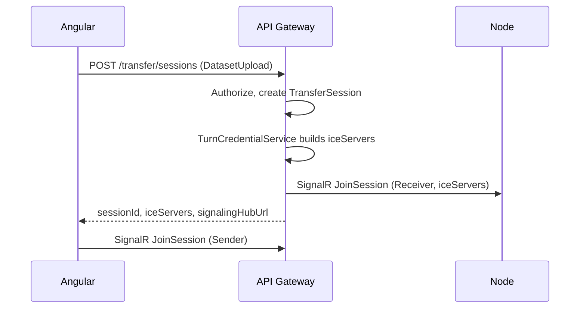
```mermaid
sequenceDiagram
    participant A as Angular
    participant B as API Gateway
    participant N as Node

    A->>B: POST /transfer/sessions (DatasetUpload)
    B->>B: Authorize, create TransferSession
    B->>B: TurnCredentialService builds iceServers
    B->>N: SignalR JoinSession (Receiver, iceServers)
    B-->>A: sessionId, iceServers, signalingHubUrl
    A->>B: SignalR JoinSession (Sender)
```

**Phase 2 — ICE candidate gathering** (Angular and Node contact coturn directly)

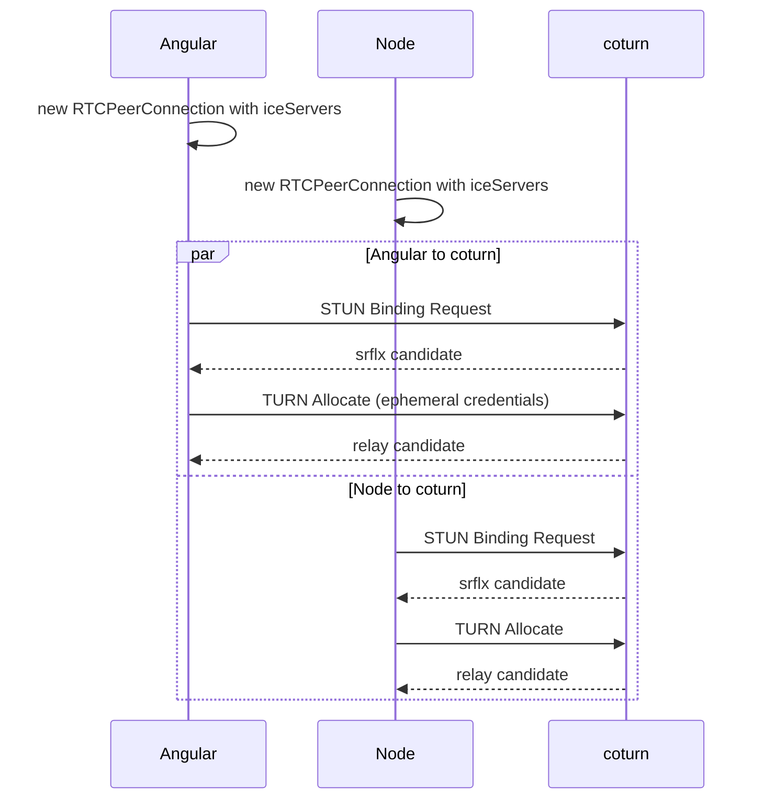
```mermaid
sequenceDiagram
    participant A as Angular
    participant N as Node
    participant C as coturn

    A->>A: new RTCPeerConnection with iceServers
    N->>N: new RTCPeerConnection with iceServers

    par Angular to coturn
        A->>C: STUN Binding Request
        C-->>A: srflx candidate
        A->>C: TURN Allocate (ephemeral credentials)
        C-->>A: relay candidate
    and Node to coturn
        N->>C: STUN Binding Request
        C-->>N: srflx candidate
        N->>C: TURN Allocate
        C-->>N: relay candidate
    end
```

**Phase 3 — Signaling** (SDP and candidates via API Gateway only; coturn not in this path)

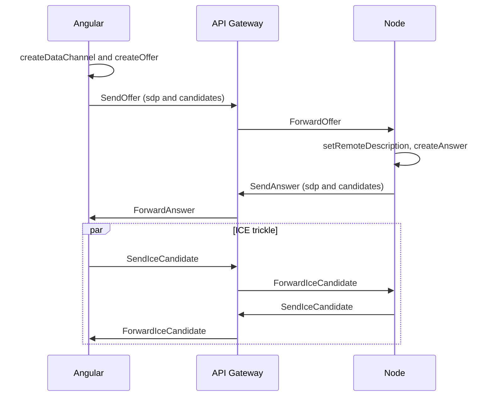
```mermaid
sequenceDiagram
    participant A as Angular
    participant B as API Gateway
    participant N as Node

    A->>A: createDataChannel and createOffer
    A->>B: SendOffer (sdp and candidates)
    B->>N: ForwardOffer
    N->>N: setRemoteDescription, createAnswer
    N->>B: SendAnswer (sdp and candidates)
    B->>A: ForwardAnswer

    par ICE trickle
        A->>B: SendIceCandidate
        B->>N: ForwardIceCandidate
        N->>B: SendIceCandidate
        B->>A: ForwardIceCandidate
    end
```

**Phase 4 — ICE connectivity checks** (automatic; direct P2P or TURN via coturn)

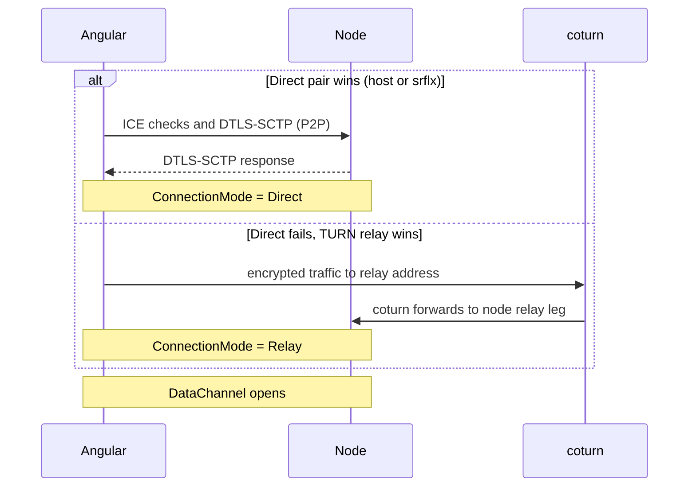
```mermaid
sequenceDiagram
    participant A as Angular
    participant N as Node
    participant C as coturn

    alt Direct pair wins (host or srflx)
        A->>N: ICE checks and DTLS-SCTP (P2P)
        N-->>A: DTLS-SCTP response
        Note over A,N: ConnectionMode = Direct
    else Direct fails, TURN relay wins
        A->>C: encrypted traffic to relay address
        C->>N: coturn forwards to node relay leg
        Note over A,N: ConnectionMode = Relay
    end

    Note over A,N: DataChannel opens
```

**Phase 5 — File transfer** (same protocol on direct or TURN path)

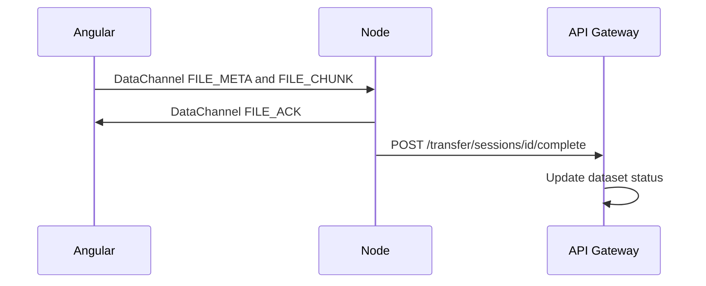
```mermaid
sequenceDiagram
    participant A as Angular
    participant N as Node
    participant B as API Gateway

    A->>N: DataChannel FILE_META and FILE_CHUNK
    N->>A: DataChannel FILE_ACK
    N->>B: POST /transfer/sessions/id/complete
    B->>B: Update dataset status
```

### 6.1.1 Who talks to coturn, and when

coturn is **never** called by the API Gateway for media. Only Angular and the node agent contact it, using credentials the gateway issued in Phase 1.

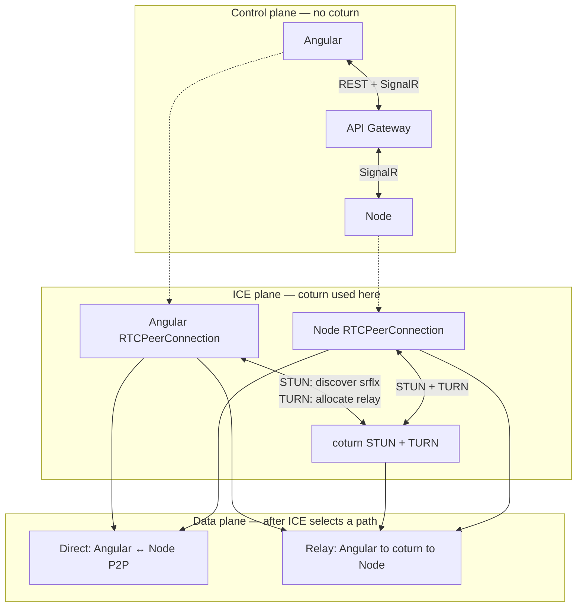
```mermaid
flowchart TB
    subgraph Control["Control plane — no coturn"]
        A1["Angular"]
        G["API Gateway"]
        N1["Node"]
        A1 <-->|"REST + SignalR"| G
        G <-->|"SignalR"| N1
    end

    subgraph ICE["ICE plane — coturn used here"]
        A2["Angular RTCPeerConnection"]
        N2["Node RTCPeerConnection"]
        C["coturn STUN + TURN"]
        A2 <-->|"STUN: discover srflx<br/>TURN: allocate relay"| C
        N2 <-->|"STUN + TURN"| C
    end

    subgraph Data["Data plane — after ICE selects a path"]
        Direct["Direct: Angular ↔ Node P2P"]
        Relay["Relay: Angular to coturn to Node"]
    end

    A1 -.-> A2
    N1 -.-> N2
    A2 --> Direct
    N2 --> Direct
    A2 --> Relay
    C --> Relay
    N2 --> Relay
```

| Step | Who | Action on coturn | Purpose |
|------|-----|------------------|---------|
| Session create | **API Gateway** | Does not contact coturn | Builds `iceServers` with HMAC credentials (§10.2) |
| PC create | **Angular + Node** | Not yet | Both store `iceServers` in `RTCPeerConnection` config |
| ICE gathering | **Angular + Node** | **STUN** binding to `:3478` | Learn public/reflexive address (`srflx` candidate) |
| ICE gathering | **Angular + Node** | **TURN** allocate with ephemeral user/pass | Obtain relay address (`relay` candidate) — *reserved*, not used until direct fails |
| Signaling | **Angular ↔ Node via Gateway** | coturn not involved | Exchange SDP + candidate strings (relay candidates contain coturn IP) |
| ICE checks | **Angular ↔ Node** (P2P) | coturn not involved if direct works | Probe host/srflx pairs |
| ICE checks | **Angular → coturn → Node** | **TURN relay active** | Used when no direct pair works; all DataChannel bytes flow through coturn |
| File upload | **Angular → Node** | Through coturn **only if** Phase 4 chose relay | Same `FILE_*` messages; path differs |

### 6.1.2 When direct P2P vs TURN relay is selected

There is **no application-level switch**. Angular and SIPSorcery run ICE automatically between Phase 3 and Phase 5. Priority order (simplified):

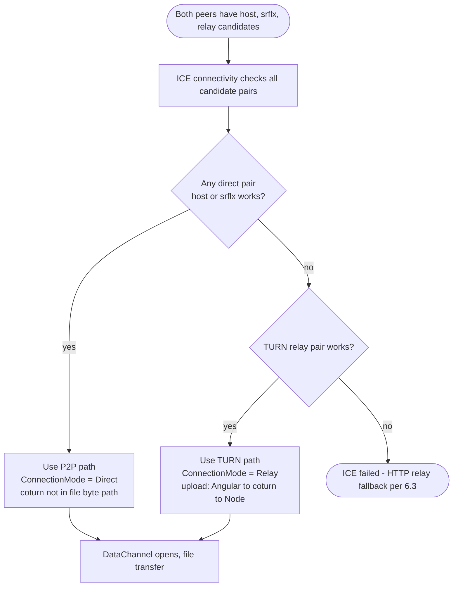
```mermaid
flowchart TD
    Start([Both peers have host, srflx, relay candidates]) --> Checks[ICE connectivity checks all candidate pairs]
    Checks --> Direct{Any direct pair<br/>host or srflx works?}
    Direct -->|yes| P2P["Use P2P path<br/>ConnectionMode = Direct<br/>coturn not in file byte path"]
    Direct -->|no| TURN{TURN relay pair works?}
    TURN -->|yes| Relay["Use TURN path<br/>ConnectionMode = Relay<br/>upload: Angular to coturn to Node"]
    TURN -->|no| Fail([ICE failed - HTTP relay fallback per 6.3])

    P2P --> DC[DataChannel opens, file transfer]
    Relay --> DC
```

**Direct path usually works when:** node has a reachable public IP or workable port forwarding; client NAT allows UDP hole punching; STUN-derived `srflx` candidates are sufficient.

**TURN relay usually needed when:** symmetric NAT, corporate firewalls, UDP blocked (retry `turn:...?transport=tcp`), or client/node cannot route to each other’s host/srflx addresses.

**Record the outcome:** on `POST .../complete`, the node (or client) reports `connectionMode: "direct" | "relay"` from `RTCPeerConnection.getStats()` selected candidate pair — for metrics in §14.

### 6.1.3 Upload data paths (after ICE)

Same DataChannel protocol (§9); only the network path differs.

**Direct (preferred)**

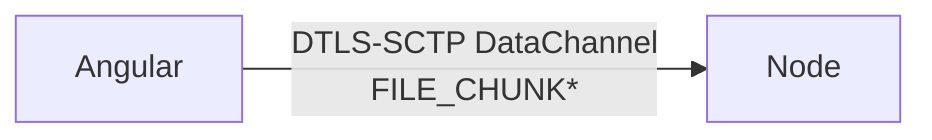
```mermaid
flowchart LR
    A["Angular"] -->|"DTLS-SCTP DataChannel<br/>FILE_CHUNK*"| N["Node"]
```

**TURN relay (ICE fallback inside WebRTC)**

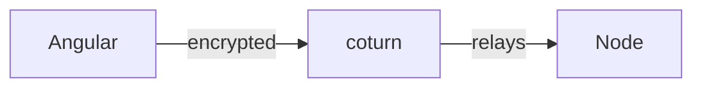
```mermaid
flowchart LR
    A["Angular"] -->|"encrypted"| C["coturn"]
    C -->|"relays"| N["Node"]
```

If **both** direct and TURN fail (Phase 4 `Fail`), the session never reaches Phase 5 — see §6.3 for HTTP relay fallback via `RelayTransferService`.

### 6.2 Node ↔ Node (replication)

Same signaling path, but both peers connect to `TransferHub` as `Node` role. Backend does not terminate HTTP file streams.

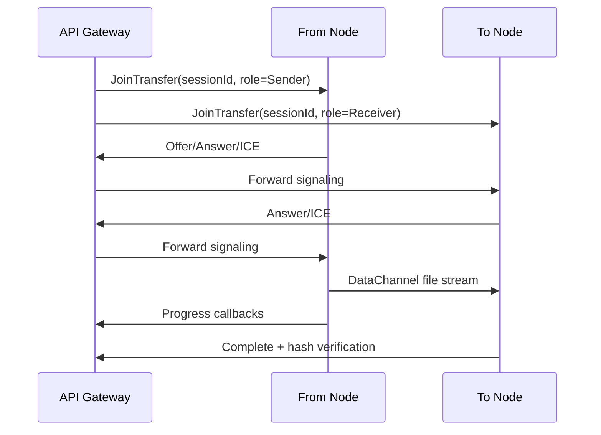
```mermaid
sequenceDiagram
    participant B as API Gateway
    participant F as From Node
    participant T as To Node

    B->>F: JoinTransfer(sessionId, role=Sender)
    B->>T: JoinTransfer(sessionId, role=Receiver)
    F->>B: Offer/Answer/ICE
    B->>T: Forward signaling
    T->>B: Answer/ICE
    B->>F: Forward signaling
    F->>T: DataChannel file stream
    F->>B: Progress callbacks
    T->>B: Complete + hash verification
```

### 6.3 WebRTC failure → HTTP relay fallback

When `Transfer:AutoFallbackToHttpRelay` is true, a failed WebRTC session retries on the existing relay path without creating a new domain record.

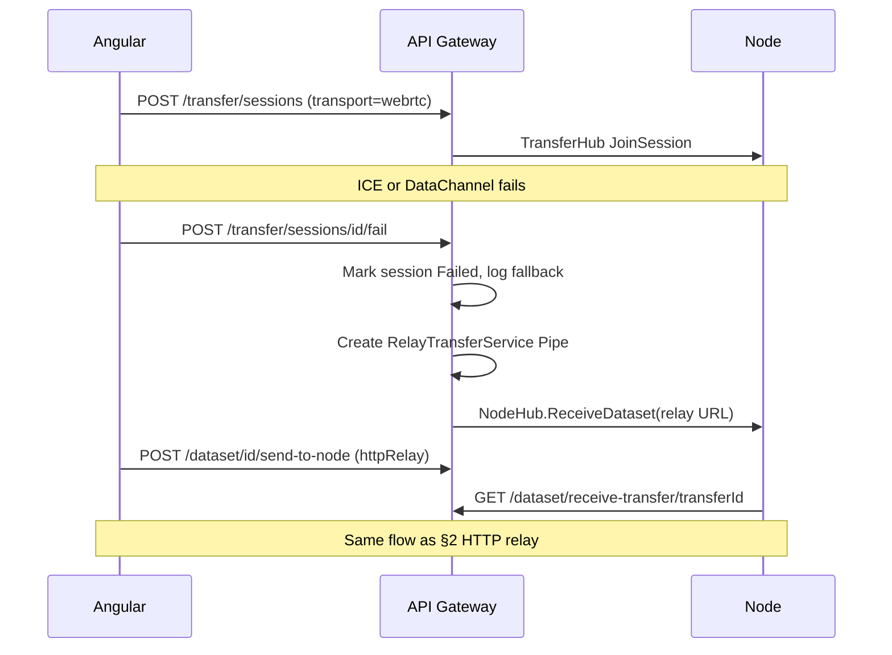
```mermaid
sequenceDiagram
    participant C as Angular
    participant G as API Gateway
    participant N as Node

    C->>G: POST /transfer/sessions (transport=webrtc)
    G->>N: TransferHub JoinSession
    Note over C,N: ICE or DataChannel fails
    C->>G: POST /transfer/sessions/id/fail
    G->>G: Mark session Failed, log fallback
    G->>G: Create RelayTransferService Pipe
    G->>N: NodeHub.ReceiveDataset(relay URL)
    C->>G: POST /dataset/id/send-to-node (httpRelay)
    N->>G: GET /dataset/receive-transfer/transferId
    Note over C,N: Same flow as §2 HTTP relay
```

---

## 7. Signaling protocol (SignalR)

Introduce **`TransferHub`** at `signalr/transfer-hub` (authorized). Keeps `NodeHub` focused on experiments/deploy; transfer signaling stays symmetric for client and node.

Alternatively, extend `NodeHub` + new **`ClientTransferHub`** with shared `ITransferSignalingService` — single hub is simpler for routing.

### 7.1 Hub methods (client → server)

| Method | Payload | Description |
|--------|---------|-------------|
| `JoinSession` | `{ sessionId }` | Adds connection to group `transfer:{sessionId}` after server validates participant. |
| `SendOffer` | `{ sessionId, sdp }` | SDP offer. |
| `SendAnswer` | `{ sessionId, sdp }` | SDP answer. |
| `SendIceCandidate` | `{ sessionId, candidate, sdpMid, sdpMLineIndex }` | Trickle ICE. |
| `LeaveSession` | `{ sessionId }` | Explicit teardown. |

### 7.2 Hub callbacks (server → client/node)

| Callback | Description |
|----------|-------------|
| `ReceiveOffer` | Forwarded from peer. |
| `ReceiveAnswer` | Forwarded from peer. |
| `ReceiveIceCandidate` | Forwarded ICE fragment. |
| `SessionReady` | Both peers joined; sender may begin offer. |
| `SessionCancelled` | Backend or peer cancelled; close PC. |

### 7.3 Routing rules

- Each connection authenticated (JWT); `JoinSession` checks user/node belongs to session.
- Server forwards signaling **only** to the other participant(s) in the group.
- Server **never** stores SDP long-term; optional short TTL diagnostic log only.
- Message size: SDP fits SignalR defaults; if not, increase hub limit or split (unusual).

### 7.4 Session lifecycle (REST + SignalR)

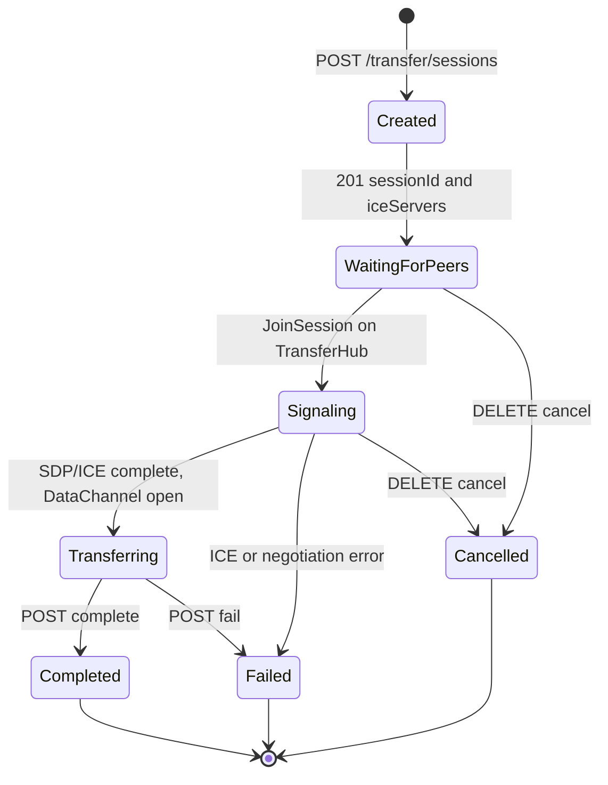
```mermaid
stateDiagram-v2
    [*] --> Created: POST /transfer/sessions
    Created --> WaitingForPeers: 201 sessionId and iceServers
    WaitingForPeers --> Signaling: JoinSession on TransferHub
    Signaling --> Transferring: SDP/ICE complete, DataChannel open
    Transferring --> Completed: POST complete
    Transferring --> Failed: POST fail
    Signaling --> Failed: ICE or negotiation error
    WaitingForPeers --> Cancelled: DELETE cancel
    Signaling --> Cancelled: DELETE cancel
    Failed --> [*]
    Completed --> [*]
    Cancelled --> [*]
```

Optional progress updates: `POST /transfer/sessions/{id}/progress` while in `Transferring`.

**REST endpoints**

| Method | Path | Purpose |
|--------|------|---------|
| `POST` | `/transfer/sessions` | Create session |
| `POST` | `/transfer/sessions/{id}/progress` | Progress (optional) |
| `POST` | `/transfer/sessions/{id}/complete` | Success |
| `POST` | `/transfer/sessions/{id}/fail` | Failure |
| `DELETE` | `/transfer/sessions/{id}` | Cancel |

---

## 8. WebRTC session establishment

### 8.1 ICE server configuration

Returned in session creation response:

```json
{
  "iceServers": [
    { "urls": "stun:coturn.example.com:3478" },
    {
      "urls": "turn:coturn.example.com:3478?transport=udp",
      "username": "<ephemeral-user>",
      "credential": "<ephemeral-password>"
    },
    {
      "urls": "turn:coturn.example.com:3478?transport=tcp",
      "username": "<ephemeral-user>",
      "credential": "<ephemeral-password>"
    }
  ]
}
```

Credentials valid for `session.expiresAt` (e.g. 1–4 hours, tuned to max transfer duration).

Both peers pass this config into `RTCPeerConnection` **before** offer/answer. coturn is then contacted directly during ICE gathering (§6.1 Phase 2); the gateway never proxies STUN/TURN traffic.

### 8.2 Peer connection settings (both sides)

| Setting | Value | Notes |
|---------|-------|-------|
| `iceTransportPolicy` | `all` | Use `relay` only for debugging forced TURN. |
| DataChannel | `ordered: true`, `maxRetransmits` or `maxPacketLifeTime` | Prefer reliability for file integrity. |
| SCTP buffer | Platform default; tune on node for high BDP links | Monitor backpressure (see §9). |
| Bundle | `max-bundle` | Standard for single DataChannel. |

### 8.3 Role matrix

| Scenario | Offerer | DataChannel creator | Direction |
|----------|---------|---------------------|-----------|
| Client upload | Client | Client | Client → Node |
| Client download | Client | Node | Node → Client |
| Node replication | From-node | From-node | From → To |

### 8.4 SIPSorcery on nodes

- Align codec/DataChannel API with browser semantics (SIPSorcery 6.x WebRTC stack).
- Shared **`TransferProtocol`** library (`.NET` class library referenced by node agent and optionally gateway for tests) defining message framing constants and hash verification helpers.
- Node maintains single SignalR connection; serializes multiple concurrent transfer sessions per node with independent `RTCPeerConnection` instances (limit concurrency via config).

---

## 9. DataChannel file protocol

Application-level framing over SCTP. Binary messages preferred for chunks; JSON for control.

### 9.1 Message types

| Type | Format | Description |
|------|--------|-------------|
| `FILE_META` | JSON | `{ transferId, fileName, sizeBytes, sha256, mimeType?, chunkSize }` |
| `FILE_CHUNK` | Binary | Header: `[uint32 seq][uint32 length]` + payload |
| `FILE_COMPLETE` | JSON | `{ sha256, sizeBytes }` |
| `FILE_ACK` | JSON | `{ ok, error? }` |
| `PROGRESS` | JSON | `{ bytesSent, bytesTotal }` (optional; can use REST instead) |
| `ABORT` | JSON | `{ reason }` |

**Message sequence**

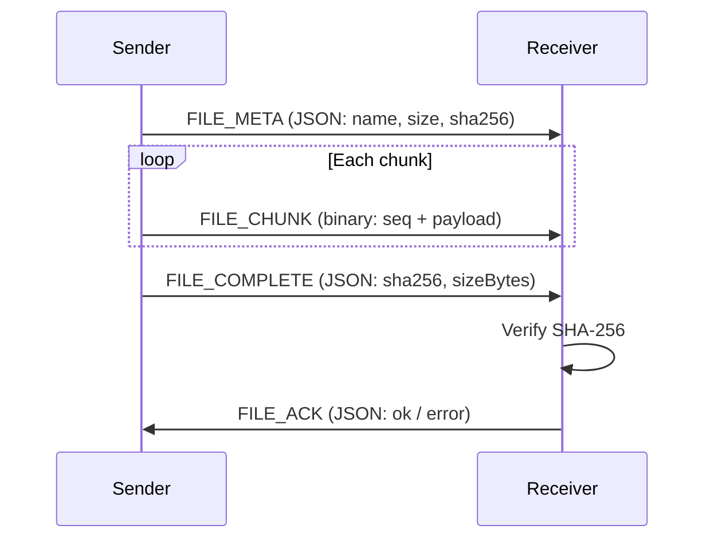
```mermaid
sequenceDiagram
    participant S as Sender
    participant R as Receiver

    S->>R: FILE_META (JSON: name, size, sha256)
    loop Each chunk
        S->>R: FILE_CHUNK (binary: seq + payload)
    end
    S->>R: FILE_COMPLETE (JSON: sha256, sizeBytes)
    R->>R: Verify SHA-256
    R->>S: FILE_ACK (JSON: ok / error)
```

### 9.2 Transfer rules

- **Chunk size:** 256 KiB default (configurable); must match on both sides.
- **Flow control:** Sender respects `bufferedAmountLowThreshold` / async backpressure (browser + SIPSorcery APIs differ — wrap in common helper).
- **Integrity:** Receiver computes SHA-256; compares to `FILE_META.sha256` before `FILE_ACK`.
- **Resume:** Phase 2 — include `byteOffset` in `FILE_META` and `Range`-like chunk acks; v1 requires full restart on failure.
- **Multiple files:** Node replication sends **dataset** then **sample** as two sequential sessions (simpler) or two labeled channels in one PC (advanced).

### 9.3 Mapping to existing domain

Both paths update the **same** domain entities (`Dataset` status, `DatasetTransfer`, sample status). Transport is recorded for audit.

| Concept | HTTP relay | WebRTC path |
|---------|------------|-------------|
| Transfer identifier | `RelayTransferService` GUID | `TransferSession.Id` |
| Entity type | `TransferEntityType` | Session `entityType` |
| Progress | Implicit (pipe copy) / node callbacks | `PROGRESS` or REST + `DatasetTransfer.ProgressPercentage` |
| Filename | HTTP `Content-Disposition` | `FILE_META.fileName` |
| Transport audit field | `HttpRelay` (implicit) | `TransferSession.TransportMode` = `WebRtc` |

---

## 10. coturn integration and authorization

### 10.1 Deployment

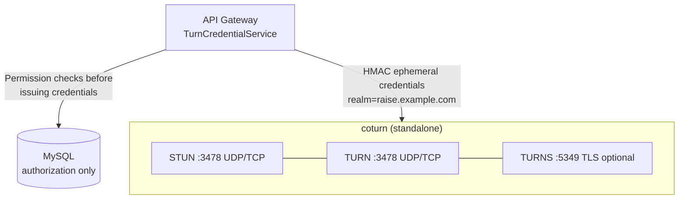
```mermaid
flowchart TB
    subgraph Coturn["coturn (standalone)"]
        STUN["STUN :3478 UDP/TCP"]
        TURN["TURN :3478 UDP/TCP"]
        TURNS["TURNS :5349 TLS optional"]
    end

    Backend["API Gateway<br/>TurnCredentialService"]
    DB[("MySQL<br/>authorization only")]

    Backend -->|"HMAC ephemeral credentials<br/>realm=raise.example.com"| Coturn
    Backend -->|"Permission checks before<br/>issuing credentials"| DB
    STUN --- TURN
    TURN --- TURNS
```

Place coturn on a public IP with sufficient **relay bandwidth quotas**; separate from API gateway scaling.

### 10.2 Recommended auth: time-limited credentials (shared secret)

Backend and coturn share `TURN_STATIC_AUTH_SECRET`.

Ephemeral username (coturn REST style):

```mermaid
flowchart LR
    A["unix_expiry"] --> U["username"]
    B["transferSessionId"] --> U
    C["participantId"] --> U
    U --> H["HMAC-SHA1(secret, username)"]
    H --> P["password = base64(hmac)"]
```

Plain form: `username = "<unix_expiry>:<transferSessionId>:<participantId>"` and `password = base64(HMAC-SHA1(secret, username))`.

coturn validates expiry and HMAC without hitting the database on every packet. Backend embeds **session scope** in the username.

**Authorization flow**

1. `POST /transfer/sessions` — backend checks DB permissions **before** issuing credentials.
2. Credentials encode `transferSessionId` + `userId|nodeId` so coturn allocation is tied to an already-authorized session.
3. Optional: coturn `allowed-peer-ip` not available for dynamic peers — rely on TURN username expiry + session teardown instead.

### 10.3 Alternative: MySQL user database

Map coturn `mysql-userdb` to tables:

```sql
-- Illustrative; exact coturn schema depends on version/plugin
turn_users (name, realm, password, origin)
turn_permissions (name, realm, ip_range, peer_ip_range)
```

Backend inserts row on session create, deletes on complete. Higher DB load; use when HMAC scheme is insufficient for audit requirements.

### 10.4 Database tables (backend)

```mermaid
erDiagram
    TransferSessions ||--o{ TransferSessionParticipants : has
    TransferSessions ||--o{ TransferSessionEvents : audits

    TransferSessions {
        guid Id PK
        string Type
        string EntityType
        guid EntityId
        string Status
        guid InitiatorUserId
        guid FromNodeId
        guid ToNodeId
        guid DatasetTransferId
        datetime ExpiresAt
        datetime CreatedAt
        long BytesTransferred
        string ConnectionMode
        string TransportMode
        guid FallbackFromSessionId
        string ErrorMessage
    }

    TransferSessionParticipants {
        guid Id PK
        guid TransferSessionId FK
        string ParticipantType
        guid ParticipantId
        string Role
        string SignalRConnectionId
        datetime JoinedAt
    }

    TransferSessionEvents {
        guid Id PK
        guid TransferSessionId FK
        string EventType
        json PayloadJson
        datetime CreatedAt
    }
```

Reuse existing **`NodeApprovedUsers`**, dataset access grants, and `DatasetTransfer` status machine — `TransferSessionService` calls the same domain validators currently used in `ExternalRequestService`.

### 10.5 coturn quotas

Configure per-user/session limits to prevent abuse:

- `max-bps` on relay allocations
- `total-quota` / `user-quota` for concurrent allocations
- Session TTL aligned with credential expiry

---

## 11. Security and authorization

### 11.1 Signaling

- All hubs require JWT (`[Authorize]`).
- `JoinSession` verifies:
  - **User** is session initiator or has read/download grant for dataset.
  - **Node** is `FromNodeId`, `ToNodeId`, or primary node for dataset.
- Rate-limit session creation per user/node.

### 11.2 Data plane

- **WebRTC path:** File bytes do not pass through the gateway (except TURN relay bandwidth when ICE uses coturn).
- **HTTP relay path:** Unchanged — bytes still flow through `RelayTransferService` until phase-out.
- TURN credentials are **short-lived** and **session-scoped**.
- DTLS-SRTP / SCTP encryption is provided by WebRTC; optional additional file encryption (client-side) is out of scope v1.

### 11.3 Threat considerations

| Threat | Mitigation |
|--------|------------|
| Unauthorized join to signaling group | Server-side participant validation on `JoinSession`. |
| TURN credential theft | Short TTL; bind to session; HTTPS for REST. |
| MITM on signaling | TLS for SignalR; consider fingerprint verification in `FILE_META` for high assurance. |
| Node impersonation | Node connects with existing NodeHub auth (`NodeId` header + user token). |

Keep `[AllowAnonymous]` on sample receive endpoints until WebRTC sample download is default **and** auth story is complete; phase-out of anonymous HTTP is part of final legacy removal, not WebRTC launch.

---

## 12. Backend domain model

### 12.1 Transfer session types

```csharp
public enum TransferSessionType
{
    DatasetUpload,      // client → node
    DatasetDownload,    // node → client
    SampleUpload,
    SampleDownload,
    NodeReplication,    // node → node (dataset + optional sample)
}

public enum TransferSessionStatus
{
    Created,
    WaitingForPeers,
    Signaling,
    Transferring,
    Completed,
    Failed,
    Cancelled,
    Expired
}
```

### 12.2 Integration with existing services

**Rule:** Existing methods and endpoints stay. WebRTC is invoked via new API surface or an optional parameter — not by rewriting call sites to remove relay logic.

| Existing | Rollout behavior | After legacy phase-out (future) |
|----------|------------------|----------------------------------|
| `SendDatasetToNodeAsync` | Unchanged for `transport: httpRelay`. Add branch: if WebRTC, create `TransferSession` and return `{ sessionId, transport: "webrtc" }` without opening pipe. | WebRTC default; HTTP relay removed when flag cleared. |
| `TransferDatasetToNodeAsync` | Unchanged. Still serves HTTP relay uploads from primary node. | Removed only after node WebRTC replication is default. |
| `InitiateDatasetTransferToNodeAsync` | Unchanged HTTP signal path. Optionally also create `TransferSession` when WebRTC requested. | Same as above. |
| `ReceiveDatasetSampleFromNodeAsync` | Unchanged (pipe / MinIO). WebRTC sample download is additive. | Unchanged until sample strategy decided. |
| `RelayTransferService` | **Always registered.** Primary data path until phase-out. | Retained for experiment results → MinIO even after dataset WebRTC default. |
| `NodeHub` URL-based signals | **Unchanged.** Still used for all HTTP relay transfers. | Slimmed after node agents no longer need relay URLs. |

### 12.3 API sketch (Angular)

```http
POST /transfer/sessions
Content-Type: application/json

{
  "type": "DatasetDownload",
  "datasetId": "3fa85f64-5717-4562-b3fc-2c963f66afa6",
  "nodeId": "optional-target-node"
}
```

```http
201 Created

{
  "sessionId": "...",
  "transport": "webrtc",
  "role": "Receiver",
  "expiresAt": "2026-06-24T15:00:00Z",
  "iceServers": [ ... ],
  "signalingHubUrl": "/signalr/transfer-hub",
  "fallback": {
    "transport": "httpRelay",
    "endpoint": "/dataset/{id}/receive-sample"
  }
}
```

Extended send-to-node (optional convenience — keeps one entry point):

```http
POST /dataset/{id}/send-to-node
Content-Type: multipart/form-data

transport=webrtc   (optional; default httpRelay)
```

Response when `transport=webrtc`: `{ sessionId, signalingHubUrl, iceServers, ... }` — no pipe until fallback.

---

## 13. Failure modes and fallbacks

Fallback priority: **WebRTC retry (same transport) → HTTP relay (existing path) → user-visible error**.

| Condition | WebRTC path behavior | HTTP relay (always available until phase-out) |
|-----------|----------------------|-----------------------------------------------|
| Node offline at session create | Fail fast (`NodeUnavailableError`) | Same — no transfer |
| Node lacks WebRTC capability | N/A — use HTTP relay immediately | Standard flow |
| ICE failed (no direct, TURN failed) | Mark session `Failed`; auto-fallback if enabled | `SendDatasetToNodeAsync` / `NodeSendDatasetTransferSignalAsync` |
| Mid-transfer WebRTC disconnect | v1: abort; retry WebRTC or fall back to HTTP relay | Existing pipe behavior unchanged |
| Gateway restart during WebRTC signaling | Rejoin session from DB; renegotiate or fall back | Relay pipes may still be lost (existing limitation) |
| coturn outage | Direct P2P if possible; else fall back to HTTP relay | Unaffected |
| Concurrent transfer limit on node | Queue or reject `429` | Same limits apply independently per transport |

**Feature flags:** See [§3.1](#31-transport-selection). `Transfer:HttpRelayEnabled` stays `true` for entire rollout; disabling it is **phase-out only**, not an rollout step.

---

## 14. Observability

- **Structured logs:** `transferSessionId`, type, nodes, `connectionMode` (direct vs relay), duration, bytes.
- **Metrics:** sessions created/completed/failed; ICE mode ratio; TURN relay bytes (from coturn logs).
- **Tracing:** OpenTelemetry spans for signaling phases (not per-chunk).
- **Alerts:** High TURN relay ratio (network design issue); session stuck in `Signaling` > N minutes.

---

## 15. Rollout and phase-out strategy

Rollout **adds** WebRTC in parallel. Phase-out **removes** HTTP relay only after explicit sign-off per flow. Nothing is deleted in phases 0–4.

### Phase 0 — Infrastructure (no user-visible change)

- Deploy coturn; add `TransferSession` tables and services.
- `Transfer:WebRtcEnabled = false`; all traffic stays on HTTP relay.
- Existing tests and functional flows must pass unchanged.

### Phase 1 — WebRTC available, HTTP relay default

- Ship `TransferHub`, Angular WebRTC module, node SIPSorcery behind capability flags.
- UI: optional “Use direct transfer (beta)” or environment-only; default remains multipart `send-to-node`.
- Implement **automatic fallback** from WebRTC to HTTP relay on failure.
- Metrics: compare success rate, duration, bytes, `connectionMode` (direct vs TURN) vs relay.

### Phase 2 — WebRTC opt-in promoted

- Enable WebRTC by default for upload **where node supports it**; HTTP relay still one click or automatic fallback away.
- Add client download-from-node (WebRTC-only feature).
- Sample download: offer WebRTC alongside existing `receive-sample` HTTP.

### Phase 3 — WebRTC default for replication (relay still present)

- Experiment and scheduled node transfers prefer WebRTC when both nodes capable.
- On failure, same `DatasetTransfer` row retries via existing HTTP relay signal — no duplicate transfer records.
- `POST /dataset/{id}/transfer/{nodeId}` remains for relay path and fallback.

### Phase 4 — Confidence gate (pre phase-out)

- Run with `Transfer:DefaultTransport = WebRtc` in production for agreed soak period.
- Alert if WebRTC success rate drops below threshold → auto-revert default to `HttpRelay` via config (no deploy).
- Document per-environment decision to begin phase-out.

### Phase 5 — Legacy phase-out (future, separate decision)

Only after phase 4 sign-off:

- Set `Transfer:HttpRelayEnabled = false` per flow (upload, replication, sample) — one at a time.
- Remove unused relay endpoints and `RelayTransferService` usage for datasets.
- **Keep** HTTP relay for experiment results → MinIO until that path has its own design.
- Remove dual-transport UI; WebRTC becomes the only documented path.

```mermaid
timeline
    title Rollout traffic mix (conceptual)
    section Phase 0–1
        HTTP relay : 100% of dataset transfers
        WebRTC : Disabled (infra only)
    section Phase 2
        HTTP relay : Default + automatic fallback
        WebRTC : Opt-in / beta
    section Phase 3–4
        HTTP relay : Fallback only
        WebRTC : Default for capable peers
    section Phase 5
        HTTP relay : Removed per flow (except experiment results)
        WebRTC : Primary path
```

```mermaid
flowchart LR
    P0["Phase 0<br/>Infra"] --> P1["Phase 1<br/>WebRTC beta"]
    P1 --> P2["Phase 2<br/>Promoted opt-in"]
    P2 --> P3["Phase 3–4<br/>Default + soak"]
    P3 --> P4{"Metrics OK<br/>30+ days?"}
    P4 -->|no| P2
    P4 -->|yes| P5["Phase 5<br/>Phase-out relay"]
```

---

## 16. Open decisions

| # | Decision | Options | Recommendation |
|---|----------|---------|----------------|
| 1 | Single hub vs split | `TransferHub` only vs `NodeHub` + client hub | **Single `TransferHub`** for symmetric routing |
| 2 | Sample + dataset in one PC | One session, two files vs two sessions | **Two sequential sessions** for v1 |
| 3 | TURN auth | HMAC ephemeral vs DB userdb | **HMAC ephemeral**; DB for authorization before issuance |
| 4 | Offerer on download | Client vs node offerer | **Client offerer**, node opens DataChannel in `ondatachannel` |
| 5 | Progress transport | DataChannel `PROGRESS` vs REST callbacks | **REST callbacks** from node to reduce hub noise |
| 6 | Max concurrent WebRTC sessions per node | 1 / 3 / N | Start with **2** (one replication + one client) |
| 7 | When to begin phase-out | Time-based vs metric-based | **Metric-based**: WebRTC success ≥ relay for 30 days per flow |

---

## Appendix A — Mapping from current SignalR methods

`NodeHub` methods **stay** for HTTP relay. WebRTC adds parallel signals (via `TransferHub` or extended hub).

| Current `INodeClient` method | HTTP relay | WebRTC (additive) |
|------------------------------|------------|-------------------|
| `ReceiveDataset` | Primary upload path | Also: `JoinTransfer` on `TransferHub` when `transport=webrtc` |
| `ReceiveDatasetTransfer` | Primary node-to-node | Also: `NodeReplication` session |
| `SendDatasetTransferAsync` | Primary replication initiate | Also: backend may create `TransferSession` first; fallback keeps this URL |
| `SendDatasetSample` / `ReceiveDatasetSample` | Primary sample path | Optional WebRTC sample sessions |
| `SendExperimentResults` | Unchanged | Unchanged (HTTP relay long-term) |

---

## Appendix B — Reference: current relay endpoint pattern

Today the node receives a backend URL and pulls bytes from the gateway pipe. WebRTC uses a session ID instead; failed WebRTC attempts fall back to the same relay URL.

```mermaid
flowchart TD
    Attempt["Transfer attempt"] --> Mode{transport}

    Mode -->|httpRelay default| Relay["NodeHub signal with receive-transfer URL"]
    Relay --> Pipe["RelayTransferService Pipe<br/>HTTP GET stream"]

    Mode -->|webrtc| Session["NodeHub / TransferHub signal<br/>transferSessionId + JoinSession"]
    Session --> P2P["WebRTC DataChannel<br/>(no byte HTTP endpoint)"]

    Session -->|failure + AutoFallback| Relay
```

---

*Document version: 1.3.1 — Mermaid diagram cleanup (Raise PID Service).*
