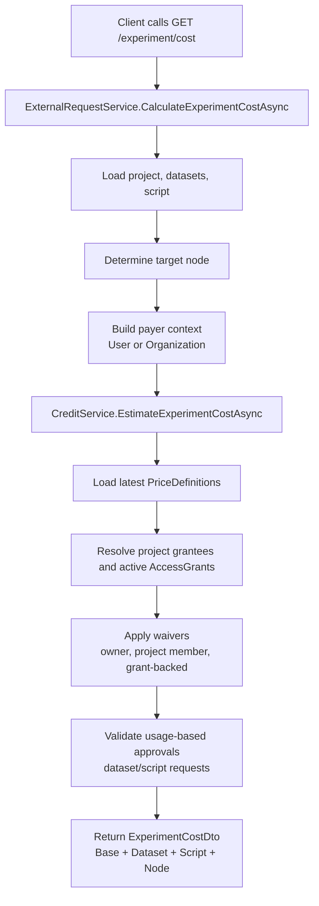
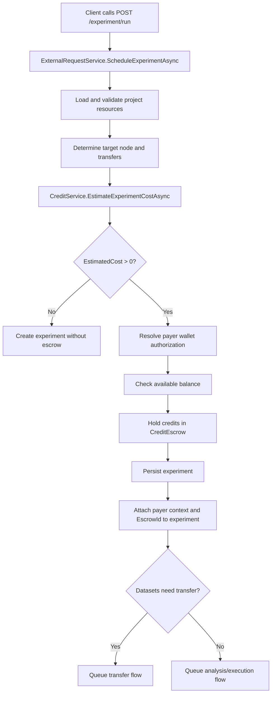
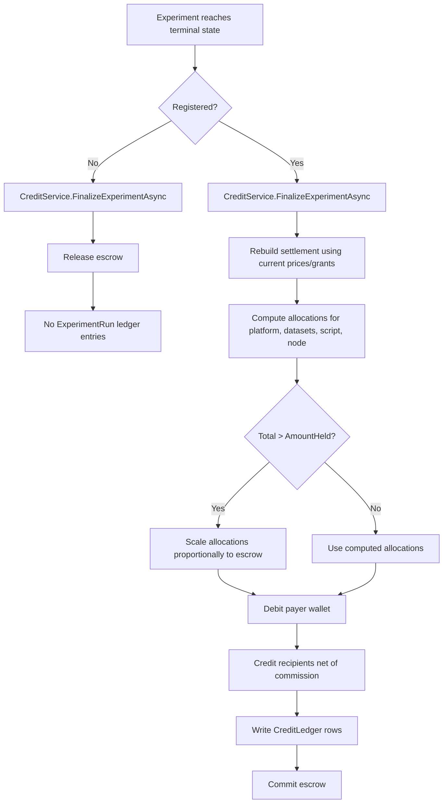
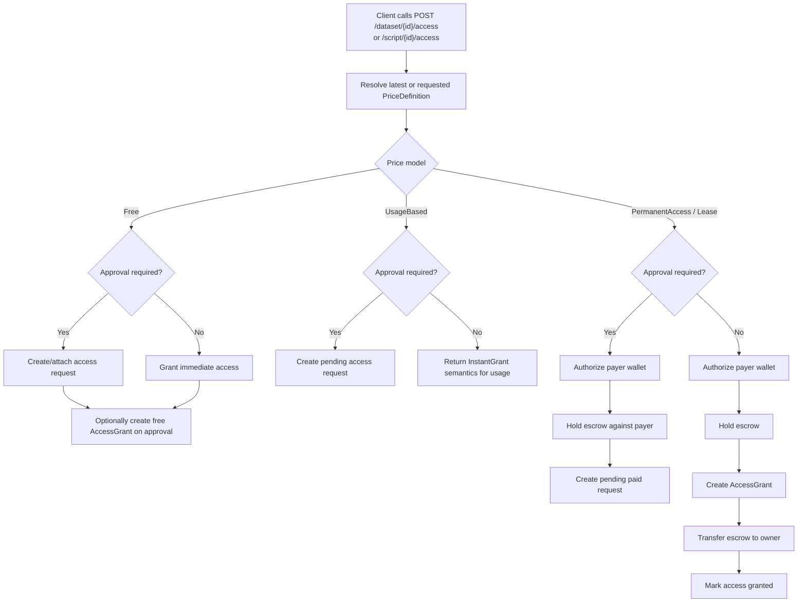
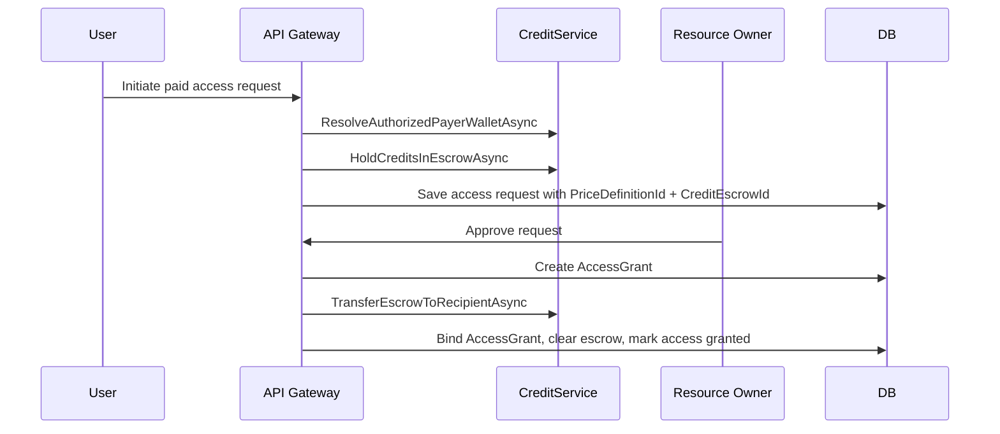
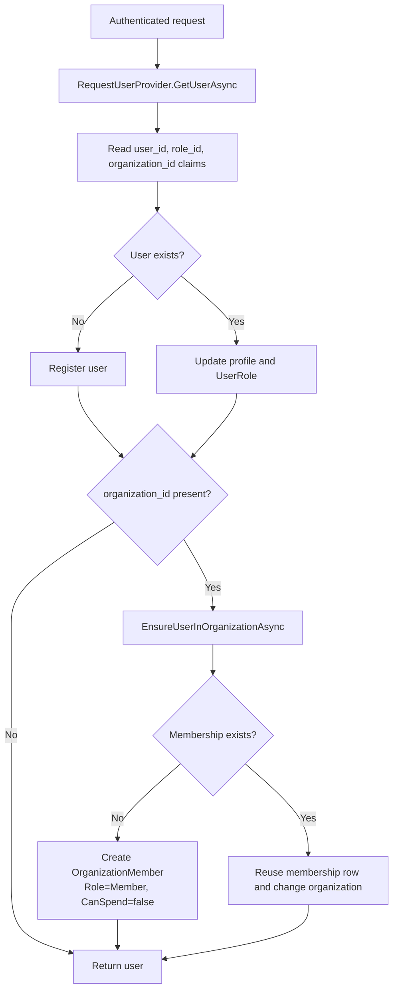
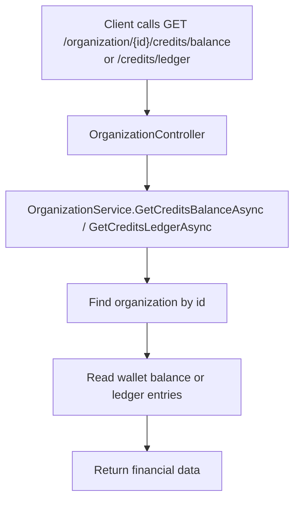
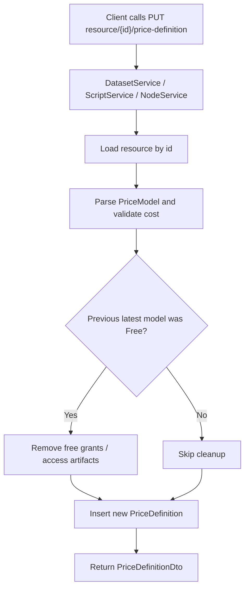

---
categories:
  - "[[Documentation]]"
created: 2026-04-21
product: RAISE-HE
component:
tags:
  - documentation/auth
  - topic/credits
---
## Summary
Raise credit system overview.

### Credit System Documentation
​
This document is intended to stand on its own:
​
- it explains the core entities
- it describes pricing and access behavior
- it documents experiment costing and settlement
- it summarizes the runtime lifecycle
​
#### 1. Purpose
​
The credit system adds commercial and accounting behavior on top of the existing experiment platform:
​
- users and organizations can hold credits in wallets
- resources can publish price definitions
- resource access can require approval, payment, or both
- experiments can be priced before execution
- credits can be held in escrow before the run
- credits are only finally distributed when the experiment completes successfully
- all money movement is recorded in a ledger
​
#### 2. Main Building Blocks
​
##### Wallet
​
A wallet belongs to either:
​
- a `User`
- an `Organization`
​
It stores:
​
- `Balance`
- held credits via linked `CreditEscrow` rows
- available balance computed as `Balance - held escrows`
​
##### CreditEscrow
​
An escrow reserves credits without immediately transferring them.
​
Typical uses:
​
- before an experiment run
- during paid resource access flows
​
Possible states:
​
- `Held`
- `Committed`
- `Released`
​
##### CreditLedger
​
The ledger is the accounting trail of credit movement.
​
Each row stores:
​
- payer type and payer id
- recipient type and recipient id
- gross amount
- commission amount
- net amount
- transaction type
- reference type and reference id
​
##### PriceDefinition
​
A `PriceDefinition` stores the commercial terms for a billable resource:
​
- dataset
- script
- node
​
Each update inserts a new row. Billing uses the latest applicable row for the resource.
​
##### AccessGrant
​
An `AccessGrant` represents a granted right to use a resource. It can come from:
​
- free approval flow
- one-time purchase
- lease purchase
​
It is later reused by experiment pricing logic to waive charges when the payer or project already holds the right to use the resource.
​
#### 3. Price Models
​
The implementation supports these pricing modes:
​

| Model             | Meaning                                                      |
| ----------------- | ------------------------------------------------------------ |
| `Free`            | No per-run charge for the resource                           |
| `UsageBased`      | Pay per use unless ownership/project/grant waives the charge |
| `PermanentAccess` | One-time purchase, then future experiment use can be waived  |
| `Lease`           | Time-bounded access grant; waived while active               |
​
Important rule:
​
- the latest `PriceDefinition` is used for new estimates and settlement
- active grants can still waive later `UsageBased` pricing
​
#### 4. Configuration
​
The main settings are under `Credits` in `appsettings.json`.
​

| Setting              | Meaning                                                                      |
| -------------------- | ---------------------------------------------------------------------------- |
| `BaseExperimentCost` | Fixed platform charge added to experiment pricing                            |
| `CommissionRate`     | Commission removed from non-platform recipient allocations during settlement |
​
Related runtime settings also affect the lifecycle:
​
- `ExperimentSchedulingRunPollingSeconds`
- `RegistrationPollingSeconds`
- `SkipBlockchainRegistration`
​
#### 5. Resource Pricing APIs
​
Price definitions are managed through:
​
- `PUT dataset/{id}/price-definition`
- `PUT script/{id}/price-definition`
- `PUT node/{id}/price-definition`
​
Request body:
​
- `Model`
- `Cost`
- optional `LeaseDays`
​
Behavior:
​
- a new `PriceDefinition` row is inserted
- future estimates and settlements use the newest row
- for dataset/script transitions away from `Free`, old free-grant artifacts may be cleaned up
​
#### 6. Access APIs For Datasets And Scripts
​
Main endpoints:
​
- `POST dataset/{id}/access`
- `POST script/{id}/access`
- access-request cancel endpoints for both resource types
​
These APIs support three practical outcomes:
​
- `PendingApproval`
- `PendingPaymentAndApproval`
- `InstantGrant`
​
The exact result depends on:
​
- current price model
- whether approval is required
- whether a payer wallet is needed
- whether an active grant already exists
​
#### 7. Experiment Costing
​
##### Cost Preview
​
`GET experiment/cost` calculates the estimated charge before scheduling.
​
The estimate includes:
​
- `BaseCost`
- `DatasetCost`
- `ScriptCost`
- `NodeCost`
- `EstimatedCost`
​
The system loads:
​
- datasets
- script
- resolved target node
- latest price definitions
- project grantees
- active access grants
​
It then applies waivers for:
​
- payer using their own resources
- project members using each other's resources
- active grants
​
##### Usage-Based Approval Rules
​
For `Free` and `UsageBased` resources, money is not the only requirement.
​
Extra approval rules apply when:
​
- a dataset requires an access request
- a private script is being used
​
In those cases, at least one eligible user in the payer/project context must already have approved access unless another waiver path applies.
​
#### 8. Experiment Run Lifecycle
​
When `POST experiment/run` is called:
​
1. the same pricing logic is executed again
2. if total cost is zero, the experiment is created without escrow
3. if total cost is positive, a payer must be supplied
4. wallet authorization and available balance are checked
5. credits are held in `CreditEscrow`
6. the experiment is persisted with payer context and escrow reference
7. transfer / analysis / execution pipeline continues
​
Important detail:
​
- credits are not finally distributed at schedule time
- they are only reserved
​
#### 9. Settlement And Failure Handling
​
##### On Failure
​
If the experiment ends in a non-success terminal state, the escrow is released.
​
Examples:
​
- dataset transfer failure
- script analysis failure
- execution failure
- registration failure
​
Result:
​
- no final charge
- no `ExperimentRun` ledger rows for that experiment
​
##### On Success
​
When the experiment reaches `Registered`, settlement is finalized.
​
The system:
​
1. rebuilds the settlement using current prices and grants
2. computes allocations for platform and resource owners
3. scales charges down if recalculated totals exceed the held escrow
4. debits the payer wallet
5. credits recipients with net amounts
6. records commission
7. writes ledger rows
8. commits the escrow
​
#### 10. Commission Rules
​
Commission is applied only to non-platform recipient allocations.
​
Rules:
​
- `Ceiling(gross * CommissionRate)`
- minimum of `1`
- capped so net amount does not become negative
​
The platform base fee itself has no commission deduction.
​
Important consequence:
​
- commission does not increase the estimate shown to the payer
- it only reduces what recipients finally receive
​
#### 11. Organizations And Payers
​
The branch adds organization-aware credit behavior:
​
- wallets can belong to organizations
- nodes can be organization-owned
- experiment cost calculation can use organization payer context
- grants can belong to organizations
- organization membership affects waiver logic
​
This matters because:
​
- org-owned grants can reduce cost for project members
- org-owned nodes can change who receives node revenue
- only authorized members should be able to spend org credits
​
#### 12. Admin And Visibility APIs
​
Additional APIs introduced by the branch include:
​
- `POST admin/credits/add`
- `GET user/credits/balance`
- `GET user/credits/ledger`
- organization balance and ledger endpoints
​
These endpoints expose the wallet and ledger side of the system to users, admins, and organizations.
​
#### 13. Data Model Summary
​
Main entities introduced or extended:
​
- `Wallet`
- `CreditEscrow`
- `CreditLedger`
- `PriceDefinition`
- `AccessGrant`
- `Organization`
- `OrganizationMember`
- `User.UserRole`
- `Experiment.PayerType`
- `Experiment.PayerOrganizationId`
- `Experiment.EscrowId`
- access-request links to price definition, escrow, grant, and cancellation metadata
​
Database support is added in the credits migration:
​
- wallets
- escrows
- ledgers
- organizations
- organization members
- price definitions
- access grants
​
#### 14. Recommended Reading Order
​
If you want to map this document back to implementation, read in this order:
​
1. [CREDIT_SYSTEM_FLOWS.md](/c:/Users/michael/developer/raise-services/CREDIT_SYSTEM_FLOWS.md:1)
2. `Raise.APIGateway/CoreServices/CreditService.cs`
3. `Raise.APIGateway/CoreServices/ExternalRequestService.cs`
4. `Raise.APIGateway/Services/DatasetService.cs`
5. `Raise.APIGateway/Services/ScriptService.cs`
6. `Raise.APIGateway/Services/NodeService.cs`
​
#### 15. Short End-To-End Summary
​
In the happy path:
​
1. an owner publishes pricing for datasets, scripts, or nodes
2. a user or organization obtains the necessary access rights
3. the client requests `GET experiment/cost`
4. the client submits `POST experiment/run`
5. credits are held in escrow
6. the experiment runs
7. if the run fails, escrow is released
8. if the run reaches `Registered`, credits are settled and ledger rows are written
​
### Credit System Flows
Diagrams for the main flows introduced in `feature/RAI-329_Implement_Credit_System`.
#### 1. Experiment Cost Preview And Run

#### 2. Experiment Finalization And Settlement

#### 3. Dataset And Script Access Flows

#### 4. Organization-Based Authorization

#### 5. Sensitive Finance Endpoints

Current implementation note:
- The controller/service path above does not currently enforce `admin` or `org member` authorization before returning finance data.
#### 6. Price Definition Update Flow

Current implementation note:
- The update methods should be read together with resource ownership checks, because this flow mutates commercial terms and can also affect existing grants.
​
## Links
