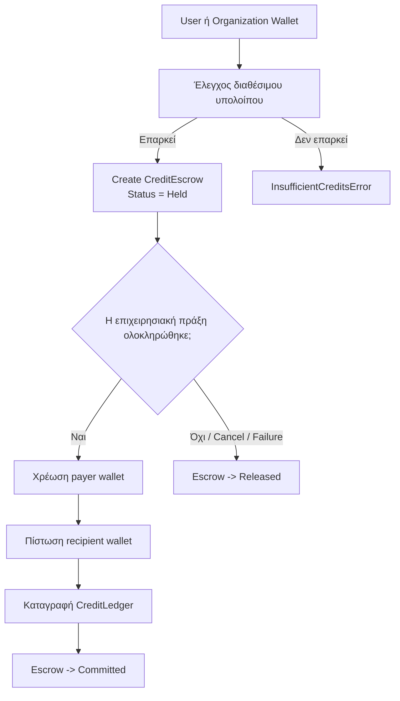
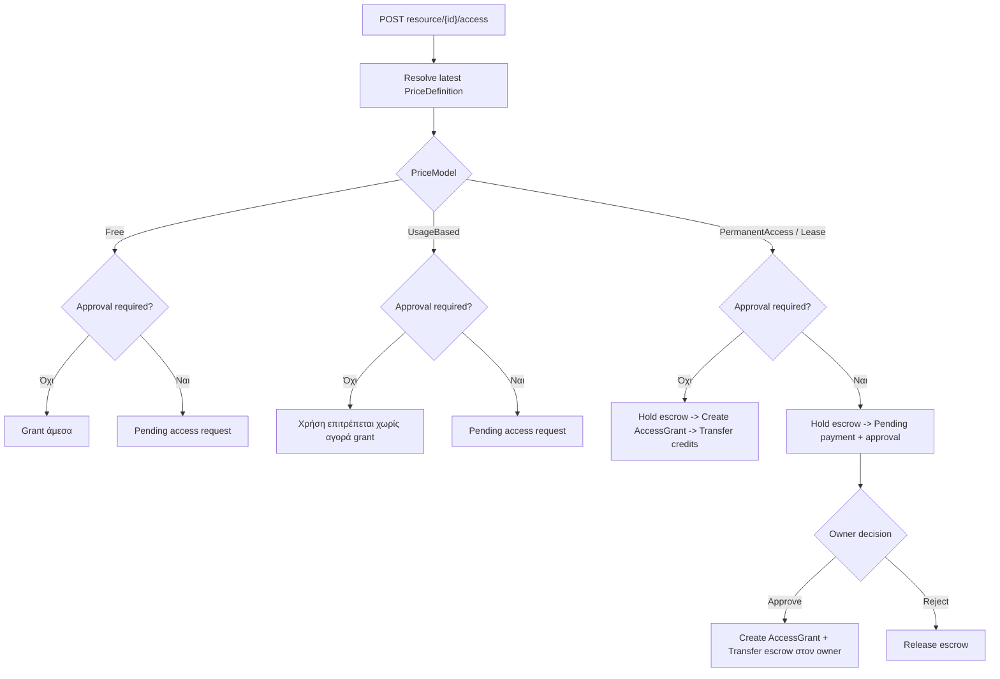
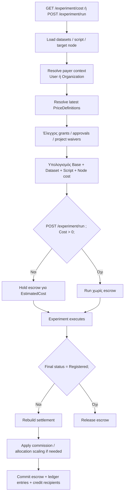
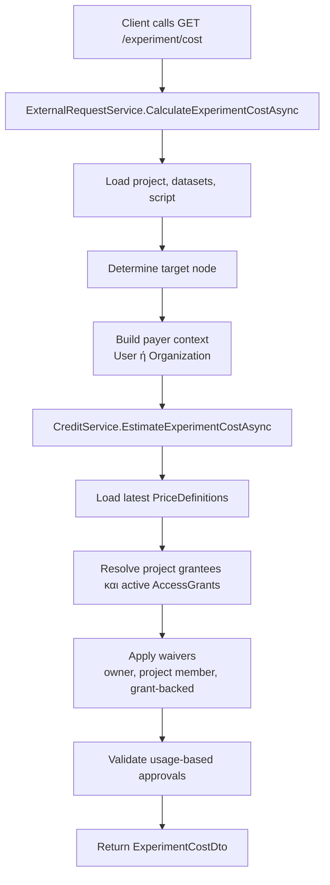
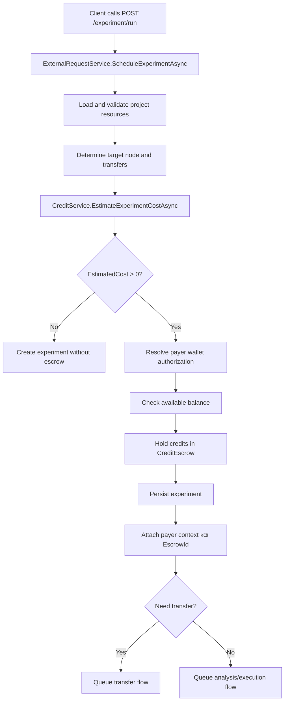
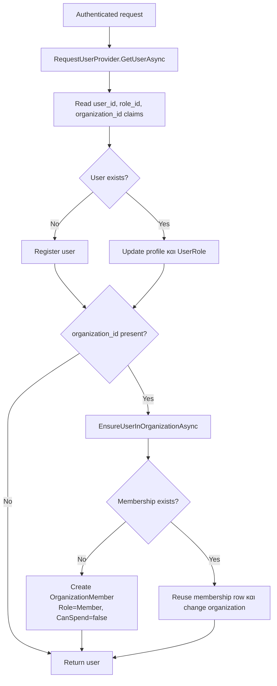
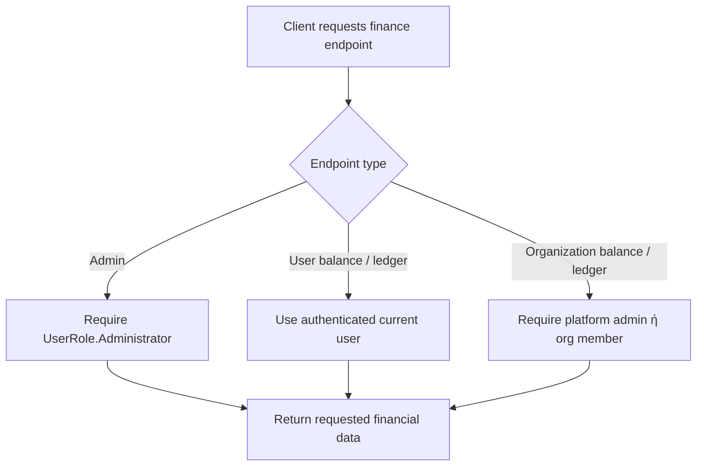
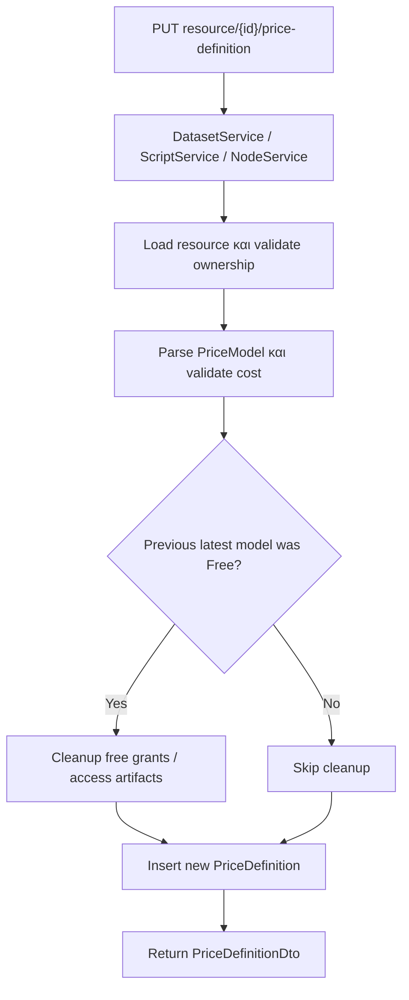

---
categories:
  - "[[Documentation]]"
created: 2026-04-21
product: RAISE-HE
component:
tags:
  - documentation/auth
  - topic/credits
---
# Αλλαγές PR σε Domain και Business Logic
​
## Πεδίο σύγκρισης
​
Το παρόν αρχείο συνοψίζει τις αλλαγές του PR `feature/RAI-329_Implement_Credit_System` σε σχέση με το `origin/develop`, με έμφαση στο domain model, στους επιχειρησιακούς κανόνες και στις ροές χρήσης. Δεν εστιάζει σε καθαρά τεχνικά/infrastructure θέματα, εκτός όταν επηρεάζουν άμεσα τη συμπεριφορά του συστήματος.
​
## Σκοπός
​
Το credit system προσθέτει εμπορική και λογιστική συμπεριφορά πάνω στην υπάρχουσα πλατφόρμα experiments.
​
Πρακτικά εισάγει:
​
- wallets για users και organizations,
- pricing σε datasets, scripts και nodes,
- access flows που μπορεί να απαιτούν approval, πληρωμή ή και τα δύο,
- cost preview πριν από την εκτέλεση experiment,
- escrow πριν το run,
- οριστικό settlement μόνο μετά από επιτυχημένη ολοκλήρωση,
- καθολική καταγραφή των κινήσεων σε ledger.
​
## 1. Νέο credits domain
​
Το PR εισάγει πλήρες υποσύστημα credits με νέα domain entities:
​
- `Wallet`: πορτοφόλι credits για έναν κάτοχο.
- `CreditEscrow`: κράτηση credits πριν την οριστική χρέωση.
- `CreditLedger`: λογιστική καταγραφή κινήσεων.
- `PriceDefinition`: ορισμός τιμολόγησης για dataset, script ή node.
- `AccessGrant`: δικαίωμα πρόσβασης/χρήσης που έχει αποκτηθεί μέσω free, one-time purchase ή lease.
​
Νέες enums και έννοιες:
​
- `CreditPayerType`: πληρωτής μπορεί να είναι `User` ή `Organization`.
- `CreditRecipientType`: αποδέκτης μπορεί να είναι `User`, `Organization` ή `Platform`.
- `CreditEscrowStatus`: `Held`, `Committed`, `Released`.
- `CreditTransactionType`: ξεχωρίζονται experiment charges, access purchases, admin grants κ.λπ.
- `CreditReferenceType`: διακριτό reference για experiment, dataset, script, node, price definition, access grant.
- `BillableResourceType`: dataset, script, node.
- `PriceModel`: `Free`, `PermanentAccess`, `Lease`, `UsageBased`.
​
## 2. Τιμολόγηση πόρων
​
Datasets, scripts και nodes αποκτούν versioned price definitions. Το ενεργό pricing δεν ενημερώνεται in-place, αλλά προκύπτει από το πιο πρόσφατο `PriceDefinition`.
​
Κανόνες:
​
- `Free`: μηδενική χρέωση.
- `PermanentAccess`: αγορά μόνιμου δικαιώματος.
- `Lease`: αγορά χρονικά περιορισμένου δικαιώματος.
- `UsageBased`: χρέωση ανά χρήση/εκτέλεση.
​
Σημαντικές επιχειρησιακές συμπεριφορές:
​
- Για `Lease` απαιτείται `LeaseDays > 0`.
- Σε experiment billing χρησιμοποιείται πάντα το τελευταίο `PriceDefinition`.
- Υφιστάμενο ενεργό `AccessGrant` μπορεί να μηδενίζει μελλοντική χρέωση ακόμη και αν ο owner δημοσιεύσει αργότερα `UsageBased` pricing.
- Σε νέο dataset/script/node δημιουργείται αυτόματα αρχικό free price definition.
- Στα nodes απαγορεύεται `PermanentAccess`. Επιτρέπονται πρακτικά `Free`, `Lease`, `UsageBased`.
​
### APIs τιμολόγησης
​
Οι ορισμοί τιμολόγησης διαχειρίζονται μέσω:
​
- `PUT dataset/{id}/price-definition`
- `PUT script/{id}/price-definition`
- `PUT node/{id}/price-definition`
​
Το request περιλαμβάνει:
​
- `Model`
- `Cost`
- προαιρετικό `LeaseDays`
​
Κάθε update δημιουργεί νέα γραμμή `PriceDefinition`. Δεν γίνεται overwrite της προηγούμενης.
​
### Configuration και runtime settings
​
Οι βασικές ρυθμίσεις βρίσκονται στο `Credits` section του `appsettings.json`:
​
- `BaseExperimentCost`: σταθερό platform fee που προστίθεται στην τιμολόγηση experiment
- `CommissionRate`: commission που αφαιρείται από τα allocations μη-platform recipients στο settlement
​
Στο lifecycle επηρεάζουν επίσης:
​
- `ExperimentSchedulingRunPollingSeconds`
- `RegistrationPollingSeconds`
- `SkipBlockchainRegistration`
​
## 3. Wallets, escrows και ledger
​
Η οικονομική ροή αλλάζει ουσιαστικά:
​
- Κάθε user ή organization έχει ένα μοναδικό wallet.
- Το διαθέσιμο υπόλοιπο δεν είναι μόνο το balance, αλλά `balance - held escrows`.
- Για χρεώσεις που δεν πρέπει να εκτελούνται άμεσα, το σύστημα πρώτα κρατά credits σε escrow.
- Η τελική χρέωση και πίστωση καταγράφεται σε ledger entries.
​
Επιπλέον κανόνες:
​
- Δεν μπορεί να δεσμευτεί escrow αν το διαθέσιμο υπόλοιπο δεν επαρκεί.
- Escrow γίνεται `Committed` μόνο όταν ολοκληρωθεί η αντίστοιχη επιχειρησιακή πράξη.
- Αν η πράξη αποτύχει ή ακυρωθεί, το escrow γίνεται `Released` και τα credits ξαναγίνονται διαθέσιμα.
​
### Διάγραμμα 1: Lifecycle credits / escrow / settlement
​

​
## 4. Νέα λογική κόστους experiment
​
Προστίθεται cost engine για experiments και νέο endpoint υπολογισμού κόστους.
​
Το συνολικό κόστος experiment αποτελείται από:
​
- `BaseCost` πλατφόρμας.
- χρέωση datasets,
- χρέωση script,
- χρέωση node.
​
Κανόνες υπολογισμού:
​
- Αν ο payer είναι και owner του resource, δεν χρεώνεται για αυτό το resource.
- Αν owner του resource είναι μέλος του ίδιου project, η χρέωση επίσης μηδενίζεται.
- Ενεργό `AccessGrant` μηδενίζει αντίστοιχη χρέωση όταν το μοντέλο το υποστηρίζει.
- Για resources με `Free` ή `UsageBased` και approval requirement, απαιτείται εγκεκριμένο access request πριν χρησιμοποιηθούν σε experiment.
- Ο υπολογισμός γίνεται και για user payer και για organization payer.
​
Νέα συμπεριφορά scheduling:
​
- Αν το experiment έχει κόστος > 0, ο payer είναι υποχρεωτικός.
- Το σύστημα κρατά escrow κατά το scheduling.
- Αν η αποθήκευση του experiment αποτύχει, το escrow απελευθερώνεται.
- Αν participant του project τρέξει το experiment με user payer, χρεώνεται το δικό του wallet και όχι του project owner.
​
Υπάρχει πλέον και ασφαλές `experiment/cost` preview:
​
- Μπορεί να υπολογίσει κόστος και για resources που δεν έχουν ακόμη συνδεθεί στο project.
- Το preview δεν λειτουργεί σαν "oracle" για ξένα private ids: ελέγχονται ownership, approved requests, grants και project membership.
​
## 5. Settlement experiment και commission
​
Η οριστική οικονομική εκκαθάριση του experiment γίνεται όταν το experiment φτάσει σε `Registered`.
​
Συμπεριφορά:
​
- Σε επιτυχημένη ολοκλήρωση, το escrow δεσμεύεται οριστικά.
- Το σύστημα μοιράζει το ποσό σε platform, dataset owners, script owner και node owner.
- Για μη-platform αποδέκτες εφαρμόζεται commission.
- Το commission δεν αυξάνει το estimated cost του experiment, αλλά αφαιρείται από το ποσό που τελικά πιστώνεται στον recipient.
​
Κανόνες αστοχίας:
​
- Αν το experiment αποτύχει σε στάδια όπως script error, execution error, registration error ή dataset transfer failure, δεν γίνεται charge και το escrow απελευθερώνεται.
- Αν στο ενδιάμεσο έχουν αυξηθεί οι τιμές και το recalculated settlement ξεπερνά το held escrow, το σύστημα κάνει αναλογικό scaling ώστε να μη χρεώσει πάνω από το ποσό που είχε ήδη κρατηθεί.
​
## 6. Νέα access purchase flows για datasets και scripts
​
Το PR αντικαθιστά το απλό access-request μοντέλο με εμπορικές ροές.
​
### Access APIs
​
Κύρια endpoints:
​
- `POST dataset/{id}/access`
- `POST script/{id}/access`
- cancel endpoints για dataset/script access requests
​
Οι βασικές εκβάσεις των flows είναι:
​
- `PendingApproval`
- `PendingPaymentAndApproval`
- `InstantGrant`
​
Η ακριβής έκβαση εξαρτάται από:
​
- το τρέχον `PriceModel`,
- το αν απαιτείται approval,
- το αν χρειάζεται payer wallet,
- το αν υπάρχει ήδη ενεργό grant.
​
### Διάγραμμα 2: Ροή initiate access για dataset / script
​

​
Νέα συμπεριφορά κατά το initiate access:
​
- `Free`
  - αν δεν απαιτείται approval, δίνεται άμεσα grant,
  - αν απαιτείται approval, δημιουργείται pending request.
- `UsageBased`
  - δεν αγοράζεται grant,
  - μπορεί να απαιτείται approval για να επιτραπεί η χρήση σε experiment.
- `PermanentAccess` / `Lease`
  - απαιτείται συγκεκριμένο `PriceDefinitionId`,
  - γίνεται είτε instant purchase είτε pending payment + approval,
  - τα credits κρατούνται σε escrow μέχρι owner approval ή τελική ολοκλήρωση.
​
Στα access requests προστίθενται νέα business fields:
​
- σύνδεση με `PriceDefinition`,
- σύνδεση με `CreditEscrow`,
- σύνδεση με `AccessGrant`,
- δυνατότητα cancellation,
- δυνατότητα reset/reuse του ίδιου request record σε νέα προσπάθεια.
​
Νέοι κανόνες owner approval:
​
- Όταν εγκρίνεται paid request, δημιουργείται `AccessGrant` και γίνεται μεταφορά credits στον owner.
- Όταν απορρίπτεται paid pending request, απελευθερώνεται το escrow.
- Δεν επιτρέπεται revoke ενεργού paid grant (`PermanentAccess` ή ενεργού `Lease`).
- Επιτρέπεται revoke free grant.
​
Νέα δυνατότητα και για τον requester:
​
- pending access request μπορεί πλέον να ακυρωθεί,
- η ακύρωση απελευθερώνει τυχόν escrow.
​
## 7. Repricing και cleanup παλιών free grants
​
Υπάρχει νέα business λογική για αλλαγή τιμολόγησης από `Free` σε πληρωμένο μοντέλο.
​
Για datasets και scripts:
​
- όταν το προηγούμενο ενεργό pricing ήταν `Free` και το νέο δεν είναι `Free`, αφαιρούνται stale free grants.
- σε μετάβαση `Free -> PermanentAccess/Lease`, διαγράφονται και pending free-path requests ώστε να μη δοθεί αργότερα δωρεάν πρόσβαση σε κάτι που πλέον είναι επί πληρωμή.
- αν υπάρχει escrow πάνω σε τέτοια requests, γίνεται release.
- σε μετάβαση `Free -> UsageBased`, δεν διαγράφονται απαραίτητα όλα τα requests, αλλά αποσυνδέονται τα free grants ώστε να μη συνεχίσουν να δίνουν δωρεάν δικαίωμα.
​
## 8. Νέα λογική "experiment permitted" για datasets και scripts
​
Οι λίστες των resources που μπορεί να χρησιμοποιήσει κάποιος σε experiment γίνονται πιο έξυπνες.
​
Πλέον λαμβάνονται υπόψη όχι μόνο:
​
- owned resources,
- approved access requests,
​
αλλά και:
​
- active paid grants,
- pooled grants σε επίπεδο project,
- οργανωσιακά grants όταν το organization συμμετέχει στο project context.
​
Άρα ένα resource μπορεί να είναι experiment-permitted επειδή:
​
- το έχει αγοράσει ο ίδιος ο χρήστης,
- το έχει αγοράσει organization του project,
- υπάρχει ενεργό lease ή permanent grant για μέλος του project,
- υπάρχει approved access request από κάποιο μέλος του project.
​
## 9. Οργανισμοί, membership και ρόλοι
​
Το PR εισάγει οργανισμούς ως κανονικό domain concept.
​
Νέα entities και κανόνες:
​
- `Organization`
- `OrganizationMember`
- ρόλοι organization (`Admin`, `Member`, `Manager`)
- δικαίωμα `CanSpendOrganizationCredits`
​
Νέα συμπεριφορά:
​
- platform administrators μπορούν να δημιουργούν, να βλέπουν, να ενημερώνουν και να διαγράφουν organizations.
- organization admins μπορούν να ενημερώνουν το δικό τους organization.
- απλά μέλη μπορούν να βλέπουν organization details και τα credit στοιχεία του organization τους, αλλά όχι να το ενημερώνουν ή να το διαγράφουν.
- strangers δεν βλέπουν organization οικονομικά στοιχεία.
​
Ιδιαίτερα σημαντικός κανόνας:
​
- organization wallet μπορεί να χρησιμοποιηθεί ως payer μόνο αν ο τρέχων user έχει `CanSpendOrganizationCredits = true`.
​
## 10. User role και συγχρονισμός organization membership από claims
​
Ο `User` αποκτά:
​
- `UserRole` (`Administrator`, `Researcher`)
- σύνδεση με `OrganizationMembership`
​
Το `RequestUserProvider` πλέον:
​
- διαβάζει `role_id`,
- διαβάζει `organization_id` / `org_id`,
- συγχρονίζει role και organization membership κατά το request,
- δημιουργεί membership αν ο χρήστης δεν έχει και εμφανιστεί organization claim.
​
Νέος επιχειρησιακός κανόνας κατά το organization switch:
​
- αν ο χρήστης αλλάξει active organization μέσω claim, το membership αλλάζει organization,
- ο ρόλος του μέσα στο νέο organization επανέρχεται σε `Member`,
- το `CanSpendOrganizationCredits` μηδενίζεται.
​
Αυτό αποτρέπει μεταφορά admin/spending δικαιωμάτων από έναν οργανισμό σε άλλον.
​
## 11. Node ownership και billing recipient
​
Το `Node` παύει να θεωρείται αποκλειστικά user-owned.
​
Νέα business λογική:
​
- node μπορεί να είναι `UserOwned` ή `OrganizationOwned`,
- ο recipient των node charges προκύπτει από τον ιδιοκτήτη του node,
- οι χρεώσεις node μηδενίζονται όταν payer ή project member ταυτίζεται με τον owner user ή owner organization.
​
Σημείωση:
​
- το PR εισάγει το domain support και το billing support για organization-owned nodes,
- δεν φαίνεται να εισάγει πλήρη δημόσια ροή διαχείρισης ownership, αλλά το μοντέλο και το settlement logic είναι έτοιμα να το υποστηρίξουν.
​
## 12. Admin οικονομικές ενέργειες
​
Προστίθεται admin flow για μαζική πίστωση wallets.
​
Συμπεριφορά:
​
- μόνο `Administrator` μπορεί να δώσει credits.
- η ενέργεια είναι atomic σε επίπεδο request.
- αν κάποιος recipient είναι invalid, αποτυγχάνει όλο το bulk grant.
- κάθε grant γράφεται στο ledger ως `AdminGrant`.
- υποστηρίζονται τόσο user wallets όσο και organization wallets.
​
### Visibility APIs
​
Προστίθενται επίσης endpoints ορατότητας wallet/ledger:
​
- `POST admin/credits/add`
- `GET user/credits/balance`
- `GET user/credits/ledger`
- `GET organization/{id}/credits/balance`
- `GET organization/{id}/credits/ledger`
​
Στον τρέχοντα κώδικα:
​
- τα admin endpoints απαιτούν `UserRole.Administrator`,
- τα organization finance endpoints επιτρέπονται μόνο σε platform admin ή μέλος του συγκεκριμένου organization,
- τα user finance endpoints επιστρέφουν στοιχεία μόνο για τον authenticated user.
​
## 13. Εμπλουτισμός domain-facing DTOs
​
Τα API responses αρχίζουν να εκθέτουν περισσότερη domain πληροφορία:
​
- `DatasetDto` και `ScriptDto` επιστρέφουν ενεργό `PriceDefinition` και active `AccessGrant` του caller.
- `NodeDto`/`NodeDetailsDto` επιστρέφουν ownership και price definition.
- `DatasetAccessRequestDto` / `ScriptAccessRequestDto` επιστρέφουν price definition, escrow, cancellation στοιχεία.
- `ExperimentDto` δέχεται payer context για cost estimation και scheduling.
- προστίθενται balance/ledger DTOs για user και organization credits.
​
### Σύνοψη data model
​
Κύριες οντότητες που προστίθενται ή επεκτείνονται:
​
- `Wallet`
- `CreditEscrow`
- `CreditLedger`
- `PriceDefinition`
- `AccessGrant`
- `Organization`
- `OrganizationMember`
- `User.UserRole`
- `Experiment.PayerType`
- `Experiment.PayerOrganizationId`
- `Experiment.EscrowId`
- access request links προς `PriceDefinition`, `CreditEscrow`, `AccessGrant` και cancellation metadata
​
Σε επίπεδο βάσης δεδομένων το migration του credits προσθέτει:
​
- wallets
- escrows
- ledgers
- organizations
- organization members
- price definitions
- access grants
​
## 14. Συνολικό λειτουργικό αποτέλεσμα του PR
​
Σε επίπεδο business capability, το PR μετατρέπει το σύστημα από απλό approval-based access model σε υβριδικό commercial model με:
​
- αγορές πρόσβασης,
- usage-based billing,
- wallet/escrow/ledger accounting,
- cost estimation πριν την εκτέλεση,
- settlement μετά την επιτυχή ολοκλήρωση,
- organization-aware πληρωμές,
- project-level pooling πρόσβασης και grants,
- αυστηρότερο access control σε preview και execution flows.
​
## 15. Διάγραμμα experiment billing
​

​
## 16. Πρόσθετα διαγράμματα ροών
​
### Διάγραμμα 4: Cost preview και run lifecycle
​

​

​
### Διάγραμμα 5: Organization-based authorization
​

​
### Διάγραμμα 6: Finance endpoint visibility
​

​
### Διάγραμμα 7: Price definition update flow
​

​
## 17. Προτεινόμενη σειρά ανάγνωσης
​
Αν θέλεις να αντιστοιχίσεις το κείμενο με την υλοποίηση, η πιο χρήσιμη σειρά είναι:
​
1. Τα διαγράμματα ροών του παρόντος αρχείου
2. `Raise.APIGateway/CoreServices/CreditService.cs`
3. `Raise.APIGateway/CoreServices/ExternalRequestService.cs`
4. `Raise.APIGateway/Services/DatasetService.cs`
5. `Raise.APIGateway/Services/ScriptService.cs`
6. `Raise.APIGateway/Services/NodeService.cs`
​
## 18. Σύντομη end-to-end ροή
​
Στο happy path η ακολουθία είναι:
​
1. ο owner δημοσιεύει pricing για dataset, script ή node
2. user ή organization αποκτά τα απαραίτητα access rights
3. ο client καλεί `GET experiment/cost`
4. ο client καλεί `POST experiment/run`
5. τα credits μπαίνουν σε escrow
6. το experiment εκτελείται
7. αν αποτύχει, το escrow απελευθερώνεται
8. αν φτάσει σε `Registered`, γίνεται settlement και γράφονται ledger rows
​