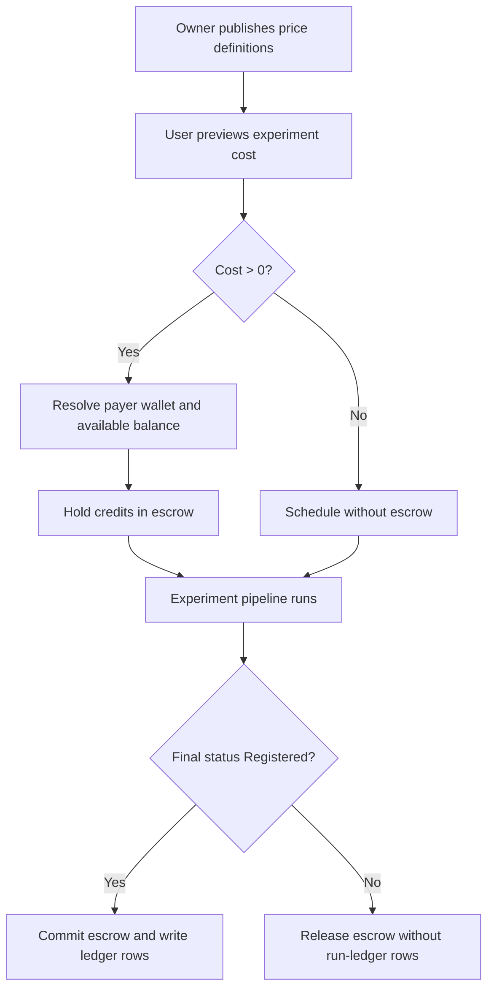

---
categories:
  - "[[Work]]"
  - "[[Documentation]]"
created: 2026-04-27
updated: 2026-04-27
product: RAISE
component: Credits
tags:
  - documentation/raise
  - topic/domain
---

# Credit System

## Overview
The credit system models how RAISE prices resource usage, holds funds, settles experiment runs, and grants durable resource access.

## Current Behavior
- Wallets exist per payer identity and back all credit movements.
- Price definitions drive experiment cost estimation and access flows.
- Escrow is used to hold value before experiment settlement or owner-approved paid access.
- Access can be represented by grants or by approved access-request rows, depending on pricing model.

## Business Meaning
- Allows a project to preview cost before execution and settle fairly after execution.
- Keeps pricing separate from access ownership while still supporting paid dataset and script access.

## Rules
- [[Wallet Owner Uniqueness]]
- [[Experiment Cost Estimation]]
- [[Credit Settlement Commission]]
- [[Escrow Release On Failed Experiment]]
- [[Price Drift Escrow Cap]]
- [[Free To Paid Access Cleanup]]
- [[Public Usage-Based Access Persistence]]

## Risks
- [[Migration History Rewrite Risk]]
- [[Nullable Wallet Owner Type Under Unique Index]]
- [[Documentation Drift Risk]]

## Related PRs
- [[PR-209 Credit System Foundations]]
- [[PR-214 Usage-Based Access Request Persistence]]

## Experiment Settlement Flow

