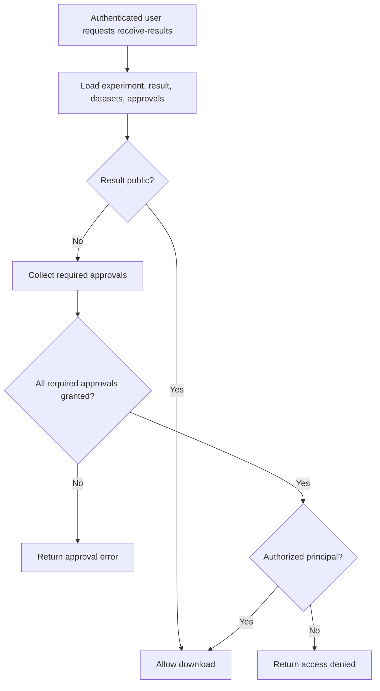

---
categories:
  - "[[Work]]"
  - "[[Documentation]]"
created: 2026-04-27
updated: 2026-04-27
product: RAISE
component: Experiments
tags:
  - documentation/raise
  - topic/domain
---

# Experiment Result Access Control

## Overview
Experiment result access control distinguishes between visibility of experiment metadata and access to the actual result payload.

## Current Behavior
- Authorized users may read experiment details while `HasResultAccess` remains `false`.
- Private result download stays blocked until all required dataset approvals are granted.
- The receive-results endpoint currently evaluates approval state before its final unauthorized-user branch.

## Rules
- [[All Required Dataset Approvals Must Pass]]
- [[HasResultAccess Contract]]
- [[Receive Results Error Ordering]]

## Risks
- [[Authorization Check Ordering In Receive-Results]]
- [[Approval Policy Test Gaps]]
- [[Duplicated Approval Logic]]

## Related PRs
- [[PR-216 Experiment Result Approval Gate]]

## Result Download Gate

