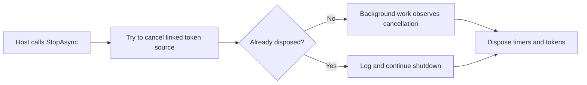

---
categories:
  - "[[Work]]"
  - "[[Documentation]]"
created: 2026-04-27
updated: 2026-04-27
product: RAISE
component: API Gateway
tags:
  - documentation/raise
  - topic/domain
---

# Hosted Service Lifecycle

## Overview
Hosted services in the API Gateway must tolerate cancellation, repeated shutdown calls, and disposal ordering during application stop.

## Current Behavior
- `StopAsync` now guards against `ObjectDisposedException` from already-disposed cancellation sources.
- Services continue shutdown instead of surfacing lifecycle exceptions to the host.
- The pattern is applied across several long-running timer or queue services.

## Rules
- None currently documented as durable business rules.

## Risks
- [[Hosted Service Stop-Dispose Ordering]]

## Related PRs
- [[PR-213 Hosted Service Shutdown Hardening]]

## Shutdown Tolerance Flow

