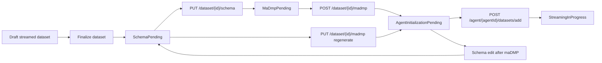

---
categories:
  - "[[Work]]"
  - "[[Documentation]]"
created: 2026-06-22
updated: 2026-06-22
product: RAISE
component: Datasets
tags:
  - documentation/raise
  - topic/domain
---

# Streamed Dataset Lifecycle

## Overview
Streamed datasets now move through explicit contract-definition stages before a streaming agent can begin delivering or consuming them.

## Current Behavior
- A streamed dataset can be finalized only from `Draft`.
- Finalization moves the dataset to `SchemaPending`.
- Saving a non-empty schema advances the dataset to `MaDmpPending` when no maDMP exists yet.
- Creating or regenerating a valid maDMP advances the dataset to `AgentInitializationPending`.
- Linking the dataset to a streaming agent moves it to `StreamingInProgress`.
- Editing schema after maDMP creation rolls the dataset back to `SchemaPending` until the maDMP is regenerated.
- `StreamingInProgress` locks further schema and maDMP mutations.

## Rules
- [[Streamed Dataset Finalization Starts Schema Phase]]
- [[Schema Required Before maDMP Creation]]
- [[maDMP Required Before Agent Initialization]]
- [[Streaming Agent Dataset Link Eligibility]]

## Risks
- [[Grouped maDMP Schema Required Paths May Not Match Nested Fields]]

## Related PRs
- [[PR-343 Streaming Agents and maDMP Workflow]]

## Lifecycle Diagram

