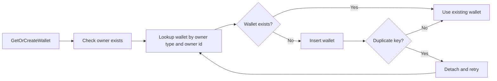

---
categories:
  - "[[Work]]"
  - "[[Documentation]]"
created: 2026-04-27
updated: 2026-04-27
product: RAISE
component: Credits
tags:
  - documentation/raise
  - topic/domain
---

# Wallet Ownership

## Overview
Wallet ownership maps a credit wallet to a single payer identity such as a user or organization.

## Current Behavior
- The system documents one wallet per `(OwnerType, OwnerId)`.
- The uniqueness guarantee is enforced by a database index in the main credits migration.
- Concurrent wallet creation is expected to converge by duplicate-key retry behavior.

## Business Meaning
- Prevents fragmented balances for the same payer and keeps settlement/accounting predictable.

## Rules
- [[Wallet Owner Uniqueness]]

## Risks
- [[Nullable Wallet Owner Type Under Unique Index]]
- [[Migration History Rewrite Risk]]

## Related PRs
- [[PR-209 Credit System Foundations]]

## Wallet Resolution Flow

