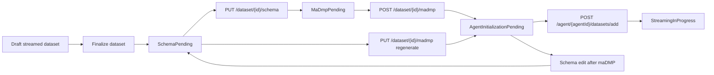
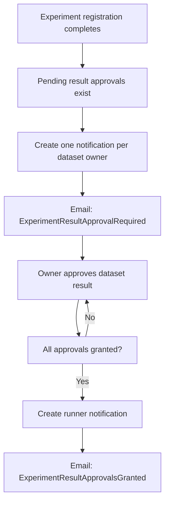

---
categories:
  - "[[Work]]"
  - "[[Documentation]]"
created: 2026-06-22
source: PR Analysis
pr: 343
task: RAI-343_Implement_RSN_Agent_support_and_maDMPs
tags:
  - topic/pr
  - topic/business-logic
  - topic/domain
---

# PR-343 Engineering Analysis

## Flow Diagrams

### Streamed Dataset Lifecycle

### Result Approval Notification Flow

## Summary
- Adds a new `StreamingAgent` aggregate with API-key authentication, owner/admin access control, dataset linking, and an agent self endpoint.
- The `StreamedDataset` lifecycle becomes explicitly multi-phase: `Draft -> SchemaPending -> MaDmpPending -> AgentInitializationPending -> StreamingInProgress`.
- Adds `maDMP` support with persisted JSON content, field schema definition, transformation validation, and regeneration from dataset schema.
- Extends the notification/email subsystem for approvals, sample-required reminders, and experiment result approval flows.
- Functional tests expand significantly to cover lifecycle behavior, notifications, and isolated test databases per build/process.

## Domain Changes
- New `StreamingAgent` concept owned by `User`, with `SecretHash`, `Enabled`, `LastUsedAt`, and a many-dataset association through `StreamingAgentDataset`.
- New `MaDmp` concept in a one-to-one relation with `Dataset`, with persisted JSON `Content` and a `Transformations` list.
- `DatasetMetadata` gains a structured field schema (`Fields`) instead of remaining only descriptive metadata.
- Streamed datasets gain explicit intermediate statuses `SchemaPending` and `MaDmpPending`.
- The domain now treats a streamed dataset as not ready for agent initialization unless both schema and maDMP exist.

## Business Logic Changes
- Streamed dataset finalization is allowed only from `Draft` and now moves to `SchemaPending`, not directly to `AgentInitializationPending`.
- The schema endpoint normalizes and validates field names, field types, and uniqueness before persistence.
- maDMP creation is allowed only for a streamed dataset in `MaDmpPending` with a non-empty schema.
- A schema change after an existing maDMP pushes the streamed dataset back to `SchemaPending` until maDMP regeneration.
- maDMP regeneration prunes transformations that no longer match schema fields.
- Linking a dataset to an agent is allowed only when:
- the dataset is a streamed type
- it belongs to the same owner as the agent
- it is in `AgentInitializationPending`
- Linking a dataset to an agent moves the dataset to `StreamingInProgress`.
- `agent/self` returns agent datasets together with maDMP JSON, stream topic, and anonymization targets.
- Dataset/script access approvals create approval notifications/emails only when the request is actually granted.
- When an experiment completes with pending dataset result approvals, one notification is created per dataset owner.
- When the final required approval is granted, the experiment runner is notified that results are now available.
- When dataset upload completes without a sample, a sample-required notification/email is created.
- Self-owned datasets with a result-approval requirement auto-approve so the same runner is not blocked.

## Behavioral Changes
- New API surface:
- `GET /agent`
- `GET /agent/self`
- `GET /agent/{agentId}`
- `POST /agent`
- `POST /agent/{id}/regenerate-key`
- `POST /agent/{agentId}/datasets/add`
- `PUT /agent/{agentId}/datasets/{datasetId}/allowed-to-stream`
- `GET|PUT /dataset/{datasetId}/schema`
- `GET|POST|PUT|DELETE /dataset/{datasetId}/madmp`
- Adds a second auth scheme for agents using a bearer API key instead of a user JWT.
- The experiment success email changes wording when results are not yet accessible because approvals are still pending.
- The notification mailer starts sending approval/sample-required flows that did not exist before.
- Functional tests run against an isolated per-process or per-build database instead of a shared test schema.

## Data Model Changes
- New tables/entities:
- `StreamingAgents`
- `StreamingAgentDatasets`
- `MaDmps`
- `Dataset.Metadata.Fields` is stored as JSON.
- `MaDmp.Content` and `MaDmp.Transformations` are stored as JSON.
- `Dataset` gains navigation to `MaDmp` and `StreamingAgentDatasets`.
- `User` gains navigation to `StreamingAgents`.
- Added enum values:
- `DatasetStatus.SchemaPending`
- `DatasetStatus.MaDmpPending`
- Added notification message types:
- `DatasetAccessRequestApproved`
- `ScriptAccessRequestApproved`
- `DatasetSampleUploadRequired`
- `ExperimentResultApprovalRequired`
- `ExperimentResultApprovalsGranted`
- There are four migrations for streaming agents, agent datasets, allowed-to-stream, and maDMP support, plus a migration that moves transformations into `MaDmp`.

## Risks
- `AgentAuthenticationHandler` loads all enabled agents and performs bcrypt verification sequentially on every `agent/self` request. This is an O(n) CPU-cost authentication path and will scale poorly with many agents.
- `MaDmpSchemaCompiler.BuildPayloadSchema` sets root-level `required` with raw field names, even when a field belongs to a nested `Group`. For grouped fields this appears to produce a schema whose required paths do not match the nested JSON structure.
- The branch combines two large themes, agent/maDMP lifecycle and notification expansion. That increases rollback and regression surface if a partial revert is needed.
- The default AIR JSON template is embedded as a large static artifact (`StreamingAgentMaDmpDefaults.cs`), which makes review, versioning, and selective updates harder.
- `UseTemplate` on `MaDmpCreateDto` does not appear to affect any execution path, so there is API surface without observable behavior.

## Edge Cases
- An empty schema list keeps a streamed dataset in `SchemaPending` and does not advance it.
- A schema edit after maDMP creation keeps the existing maDMP persisted but returns the dataset to `SchemaPending` until explicit regenerate.
- Regeneration after a schema rename removes orphaned transformations instead of failing.
- `StreamingInProgress` locks both schema and maDMP updates.
- Regular datasets are rejected from maDMP creation and agent linking.
- A dataset not owned by the agent owner is rejected even if the caller owns the agent.
- Partial experiment approvals do not notify the runner until all approvals are granted.
- Upload completion does not send a sample-required notification when a sample already exists.

## Evidence
- `Raise.APIGateway/Controllers/AgentController.cs`
- `Raise.APIGateway/Services/AgentService.cs`
- `Raise.APIGateway/Helpers/AgentAuthenticationHandler.cs`
- `Raise.APIGateway/Helpers/RequestStreamingAgentProvider.cs`
- `Raise.APIGateway/Services/DatasetService.cs`
- `Raise.APIGateway/Controllers/DatasetController.cs`
- `RaiseServices.Domain/Aggregates/StreamingAgent/StreamingAgent.cs`
- `RaiseServices.Domain/Aggregates/StreamingAgent/StreamingAgentDataset.cs`
- `RaiseServices.Domain/Aggregates/MaDmp/MaDmp.cs`
- `RaiseServices.Domain/Aggregates/MaDmp/MaDmpBuilder.cs`
- `RaiseServices.Domain/Aggregates/MaDmp/MaDmpSchemaCompiler.cs`
- `RaiseServices.Domain/Aggregates/MaDmp/DatasetSchemaValidator.cs`
- `RaiseServices.Domain/Aggregates/MaDmp/DatasetFieldTransformationValidator.cs`
- `RaiseServices.Domain/Aggregates/Dataset/Dataset.cs`
- `RaiseServices.Infrastructure/EntityConfigs/MaDmpConfig.cs`
- `RaiseServices.Infrastructure/EntityConfigs/StreamingAgentConfig.cs`
- `RaiseServices.Infrastructure/EntityConfigs/StreamingAgentDatasetConfig.cs`
- `RaiseServices.Infrastructure/Migrations/20260528125912_AddStreamingAgents.cs`
- `RaiseServices.Infrastructure/Migrations/20260528130529_AddStreamingAgentDatasets.cs`
- `RaiseServices.Infrastructure/Migrations/20260528135405_AddStreamingAgentDatasetAllowedToStream.cs`
- `RaiseServices.Infrastructure/Migrations/20260604171455_AddMaDMPSupport.cs`
- `RaiseServices.Infrastructure/Migrations/20260612141351_MoveFieldTransformationsToMaDmp.cs`
- `Raise.APIGateway/CoreServices/NotificationService.cs`
- `Raise.APIGateway/CoreServices/NotificationMailerService.cs`
- `Raise.APIGateway/CoreServices/EmailService.cs`
- `Raise.APIGateway/CoreServices/RegistrationService.cs`
- `Raise.APIGateway/Services/ExperimentService.cs`
- `Raise.APIGateway/Services/NodeService.cs`
- `Raise.APIGateway/Services/ScriptService.cs`
- `Raise.FunctionalTests/AgentTests.cs`
- `Raise.FunctionalTests/DatasetTests.cs`
- `Raise.FunctionalTests/NotificationTests.cs`
- `Raise.FunctionalTests/CreditTests.cs`
- `Raise.FunctionalTests/ExperimentTests.cs`
- `Raise.FunctionalTests/Helpers/FunctionalTestDatabase.cs`
- `Raise.FunctionalTests/Helpers/RaiseWebApplicationFactory.cs`

## Candidate Domain Notes
- Create: `Streaming Agent`
- Scope: ownership, API-key auth, dataset linking, allowed-to-stream flag, self endpoint contract.
- Create: `Streamed Dataset Lifecycle`
- Scope: finalize path, schema phase, maDMP phase, agent initialization phase, streaming-in-progress lock semantics.
- Create: `maDMP for Streamed Dataset`
- Scope: generated JSON, transformation storage, regeneration semantics, anonymization targets.
- Update: `Experiment Result Approval`
- Scope: notification timing and runner access unlock behavior.
- Update: `Dataset Upload Lifecycle`
- Scope: sample-required notification after upload completion.

## Candidate Business Rule Notes
- Create: `Streamed dataset must be finalized from Draft before schema setup`
- Suggested action: Create
- Create: `Schema is mandatory before maDMP creation`
- Suggested action: Create
- Create: `maDMP is mandatory before agent initialization`
- Suggested action: Create
- Create: `Only owner/admin can manage agent datasets, but the linked dataset must belong to the agent owner`
- Suggested action: Create
- Update: `Experiment results requiring dataset-owner approval notify owners on registration and the runner on final approval`
- Suggested action: Update
- Update: `Upload without sample triggers an explicit follow-up notification`
- Suggested action: Update

## Candidate Tech Debt Notes
- `AgentAuthenticationHandler` sequential bcrypt scan over all enabled agents per request.
- Risk level: High
- `StreamingAgentMaDmpDefaults.cs` stores a very large JSON template inline in code.
- Risk level: Medium
- `MaDmpCreateDto.UseTemplate` is exposed but currently unused by the service path.
- Risk level: Low
- Notification expansion and agent/maDMP domain changes ship in the same branch, increasing blast radius for support and rollback.
- Risk level: Medium

## Suggested Obsidian Links
- [[Streaming Agent]]
- [[Streamed Dataset Lifecycle]]
- [[maDMP]]
- [[Dataset Schema]]
- [[Dataset Result Approval]]
- [[Dataset Sample Upload Required]]
- [[Dataset Access Request Approval]]
- [[Script Access Request Approval]]
- [[Notification Mailer]]
