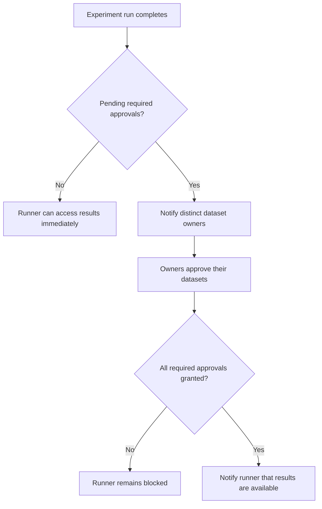

---
categories:
  - "[[Work]]"
  - "[[Documentation]]"
created: 2026-04-27
updated: 2026-06-22
product: RAISE
component: Experiments
tags:
  - documentation/raise
  - topic/domain
---

# Experiment Result Approvals

## Overview
Experiment result approvals allow dataset owners to control access to private experiment results when their datasets require result approval.

## Current Behavior
- Every approval-required dataset in an experiment must approve before the private result becomes accessible.
- The gate applies uniformly to experiment owners, dataset owners, and project members.
- Public results still bypass the approval gate.
- Self-owned approval-required datasets auto-approve at approval-row creation time and do not stay pending.
- Registration completion creates one `ExperimentResultApprovalRequired` notification per distinct dataset owner with pending approvals.
- The runner receives `ExperimentResultApprovalsGranted` only when the last outstanding required approval becomes `true`.

## Rules
- [[All Required Dataset Approvals Must Pass]]
- [[HasResultAccess Contract]]
- [[Self-Owned Result Approvals Auto-Approve]]
- [[Distinct Owner Approval Notifications]]

## Risks
- [[Authorization Check Ordering In Receive-Results]]
- [[Approval Policy Test Gaps]]
- [[Duplicated Approval Logic]]
- [[Notification Deduplication Relies On Application Checks]]
- [[Result Auto-Approval Depends On Hydrated Navigation Properties]]

## Related PRs
- [[PR-216 Experiment Result Approval Gate]]
- [[PR-340 Extend Notifications]]

## Approval Lifecycle

