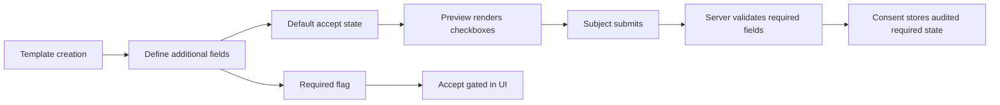

---
categories:
  - "[[Work]]"
  - "[[Documentation]]"
created: 2026-06-18
updated: 2026-06-18
product: e-Consent
component: Consents
tags:
  - documentation/e-consent
  - topic/domain
---

# Consent Template Additional Fields

## Overview
Consent templates can define additional per-field consent checkboxes that are rendered to the subject during consent preview and later persisted with the final consent record.

## Current Behavior
- Each additional field includes `id`, `title`, `description`, `accept`, and `required`.
- In the template context, `accept` means the default pre-checked UI state in the preview page.
- `required=true` means the subject must accept that specific field before an overall positive consent submission is allowed.
- The preview page marks required fields and disables the Accept button until all required fields are checked.
- On submission, stored consent data keeps the submitted additional fields together with whether each field was required at signing time.

## Business Meaning
These fields support durable sub-consent capture inside a single consent workflow, including cases where some optional acknowledgements remain optional while others are mandatory for participation.

## Rules
- [[Required Additional Consent Before Acceptance]]
- [[Consent Audit Payload]]

## Risks
- [[Unknown Additional Field Submission Validation]]

## Related PRs
- [[PR-feature-EC-122_Add_Optional_and_Required_additional_fields Additional Fields and Consent Validation]]

## Diagram

