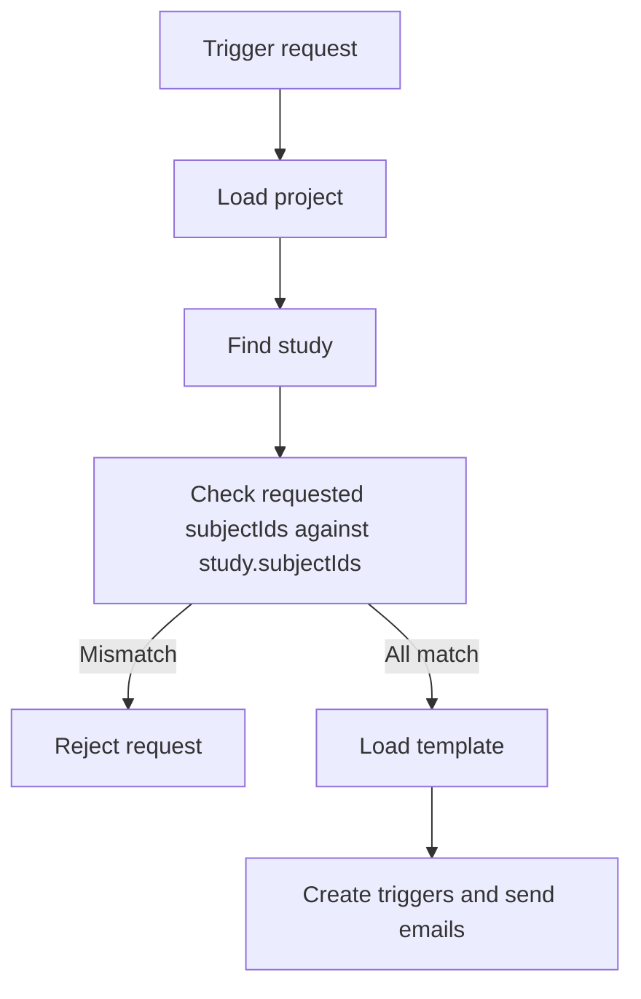

---
categories:
  - "[[Work]]"
  - "[[Documentation]]"
created: 2026-06-18
updated: 2026-06-18
product: e-Consent
component: Studies
tags:
  - documentation/e-consent
  - topic/domain
---

# Study Enrollment

## Overview
Study enrollment is represented by `study.subjectIds` and is now an authoritative gate for which subjects may receive consent trigger emails.

## Current Behavior
- Consent trigger requests are resolved against the project and then the target study.
- Every requested `subjectId` must already be present in `study.subjectIds`.
- If any requested subject is missing from that list, the trigger request fails with `400 BadRequest` and no trigger records are created.
- Triggering a strict subset of enrolled subjects is allowed.
- Studies with empty or missing `subjectIds` effectively block consent triggering.

## Business Meaning
The study enrollment list is no longer just descriptive metadata. It now defines who is eligible to enter the consent collection flow for that study.

## Rules
- [[Consent Trigger Eligibility]]

## Risks
- [[Legacy Study SubjectIds Backfill]]

## Related PRs
- [[PR-feature-EC-122_Add_Optional_and_Required_additional_fields Additional Fields and Consent Validation]]

## Diagram

