---
categories:
  - "[[Interests]]"
created: 2026-07-21
domain: []
tags: 
  - tech/tokens
  - topic/trading
  - topic/pump-fun
---

# Deshred Pump.fun Execution Engine

## Full Engineering Documentation και Ποιοτική Ανάλυση

**Αντικείμενο:** Στατική ανάλυση του standalone Go module που περιέχεται στο `deshred.zip`  
**Modes:** `shadow`, `live`  
**Ημερομηνία ανάλυσης:** 21 Ιουλίου 2026  
**Βάση τεκμηρίωσης:** πηγαίος κώδικας, configuration files, tests και υπάρχον `README.md`

> Η παρούσα τεκμηρίωση περιγράφει τη συμπεριφορά που προκύπτει από τον κώδικα. Η εκτέλεση `go test` και `go vet` δεν ολοκληρώθηκε στο απομονωμένο περιβάλλον, επειδή δεν υπήρχε δικτυακή πρόσβαση για λήψη των Go dependencies. Όπου γίνεται ποιοτική εκτίμηση ή εμπειρική υπόθεση, επισημαίνεται ρητά.

---

## Περιεχόμενα

1. [Executive summary](#1-executive-summary)
2. [Σκοπός και όρια εφαρμογής](#2-σκοπός-και-όρια-εφαρμογής)
3. [Αρχιτεκτονική](#3-αρχιτεκτονική)
4. [Κύρια modules](#4-κύρια-modules)
5. [Πηγές δεδομένων και authoritative state](#5-πηγές-δεδομένων-και-authoritative-state)
6. [Κοινό processing pipeline](#6-κοινό-processing-pipeline)
7. [Entry strategy και συνθήκες αγοράς](#7-entry-strategy-και-συνθήκες-αγοράς)
8. [Exit strategy και συνθήκες πώλησης](#8-exit-strategy-και-συνθήκες-πώλησης)
9. [Shadow mode](#9-shadow-mode)
10. [Live mode](#10-live-mode)
11. [Μαθηματικό μοντέλο](#11-μαθηματικό-μοντέλο)
12. [Position, order και candidate state machines](#12-position-order-και-candidate-state-machines)
13. [Sequence diagrams](#13-sequence-diagrams)
14. [Failure handling και retries](#14-failure-handling-και-retries)
15. [Persistence και observability](#15-persistence-και-observability)
16. [Configuration comparison](#16-configuration-comparison)
17. [Ασφάλεια](#17-ασφάλεια)
18. [Ποιοτική ανάλυση](#18-ποιοτική-ανάλυση)
19. [Προτεινόμενο remediation plan](#19-προτεινόμενο-remediation-plan)
20. [Συμπέρασμα live readiness](#20-συμπέρασμα-live-readiness)

---

# 1. Executive summary

Η εφαρμογή είναι ένας ανεξάρτητος execution engine για Pump.fun `buy_v2` και `sell_v2`, σχεδιασμένος για πολύ γρήγορη είσοδο και έξοδο με δύο διαφορετικές ροές δεδομένων:

- **Triton Deshred:** προεκτελεστικό intent/prediction stream.
- **Yellowstone:** authoritative account, block, slot και wallet transaction stream.

Η βασική αρχή είναι σωστή: το Deshred χρησιμοποιείται για πρόβλεψη και άμεση αντίδραση, αλλά όχι ως επιβεβαίωση. Η επιβεβαίωση live συναλλαγών και το πραγματικό PnL βασίζονται σε Yellowstone transaction events.

Τα δύο modes χρησιμοποιούν την ίδια strategy και τα ίδια μαθηματικά:

- Το `shadow` ανοίγει και κλείνει εικονικές θέσεις χωρίς υπογραφή ή αποστολή συναλλαγών.
- Το `live` δημιουργεί, υπογράφει και στέλνει την ίδια συναλλαγή παράλληλα σε Jito και Triton RPC, και περιμένει Yellowstone reconciliation.

Η εφαρμογή έχει αρκετά ισχυρά τεχνικά στοιχεία:

- integer curve math με `big.Int`,
- generation-based cache invalidation,
- fail-closed entry checks,
- fork/dead-slot reconciliation,
- position-level PnL,
- explicit manual-resolution state,
- αρκετά εκτεταμένο test suite.

Δεν θεωρείται όμως ακόμη κατάλληλη για **unattended production live trading** με ουσιαστικό κεφάλαιο, κυρίως λόγω:

1. μη ανάκτησης ανοικτών θέσεων και orders μετά από restart,
2. ενός κοινού σειριακού FIFO execution worker για buy, sell και ATA close,
3. πιθανής απώλειας κρίσιμων SQLite writes όταν γεμίσει η ουρά,
4. dead configuration για fee freshness και confirmation timeout,
5. σημαντικής απόστασης μεταξύ shadow fills και πραγματικής live εκτελεσιμότητας,
6. broad/noisy Deshred `sell all` trigger,
7. αποκλίσεων μεταξύ README και πραγματικού execution code.

---

# 2. Σκοπός και όρια εφαρμογής

## 2.1 Τι κάνει

Η εφαρμογή:

1. Παρακολουθεί νέα Pump.fun tokens μέσω Deshred `create_v2`.
2. Παρακολουθεί Pump `buy_v2` και `sell_v2` intents.
3. Διατηρεί local predicted bonding curve.
4. Εφαρμόζει entry filters.
5. Υπολογίζει exact integer quotes και fees.
6. Ανοίγει virtual ή live position.
7. Παρακολουθεί exit signals από Deshred και Yellowstone curve state.
8. Πουλά ολόκληρη τη θέση.
9. Στο live, συμφιλιώνει το αποτέλεσμα από Pump `TradeEvent`.
10. Κλείνει χωριστά το token ATA ώστε να ανακτήσει rent.

## 2.2 Τι δεν κάνει

Δεν υπάρχουν στον συγκεκριμένο κώδικα:

- ML model ή probability model,
- δεύτερο momentum stage μετά το initial selection,
- historical creator scoring,
- normalized excess filter,
- GoodBuys observation window όπως στο κύριο bot,
- unique-buyer minimum ως entry requirement,
- partial exits,
- PumpSwap execution μετά το graduation,
- USDC-paired curves,
- startup recovery ενεργών positions,
- multi-wallet ή wallet rotation,
- guarantee για same-slot ordering ή landing.

## 2.3 Υποστηριζόμενο πρωτόκολλο

- Pump program: `6EF8rrecthR5Dkzon8Nwu78hRvfCKubJ14M5uBEwF6P`.
- `create_v2`, `buy_v2`, `sell_v2`.
```
- SOL / wrapped SOL quote pair.
```
- SPL Token και Token-2022 mint token program.
- Μη completed bonding curves.

---

# 3. Αρχιτεκτονική

## 3.1 [Component diagram](https://mermaid.live/view#pako:eNplVNty2jAQ_RWNntoZkmIwAfzQGXzJ1Jk4EKzSpCYPii1AEyMxspRLk_x7ZTnGGPwi7-rs2d2zkt5hyjMCHbjK-Uu6wUIC5C7FkgH9-XGCBJWcgVg9Fqmgj8QnxUaQ7AGcnf0EfuAlXw7gk5JIPOxjA89gggVKIiyeiAyeCZNmv8bcx8k9yXXiQucgTZKKfeJ5ySRNuWIS_ABxzsvFzXn6pFf0epJR402cN_F-BUnwSlIlqa7dw-mGFKew6c2lbg-zAqcGN9d8LKU5xaXZKlQ30VAfO2M0n6AklgJLsn4DAVtTRvbpTEiDq90onCVXWlqA6A7oWIK3uqt5EKOqeeQl5Y6pfc-FvDZR7TcOszWbxsmMF9Q0FGGG1wcC7WEfxQZn_OUDLMI5ShZUSIVz4HG2omLbdN-Oyekz-QDBnZ55pS0X4DK8nIJbRRRpy3X3NXz3d3jtt0R2Fc0Ph9bIY7BHnbZ8xqgECKNkuiv5dNkx3ar8qOgwMrirEE0rlQvCMlexLCcnoPnMq095iToottVTyWXw0fSm4owllqoAEWfaajrSfPvz1Rz0E1f5X4_sMI82q7vlJt_i22sqCfgzuf5-OhCNONH7wLU4BtXn3ndhB64FzaAjhSIduCV66KUJ30vkEsoN2ZIldPRvRlZY5XIJl-xTh-0w-8v5to4UXK030FnhvNCW2mX6BvgUrwVuIFpSIrzyEkNn3DMU0HmHr9CxrMF53xpaA3vYH_eHPcvqwDfo2Nb5hT20x-NRbzS-6A66g88O_GeyWud9u9e9GHVHw6E1su3uqANJVqofVY-Yecs-_wNHPHe4)

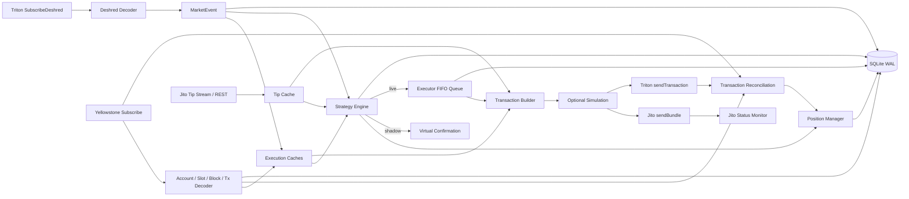

## 3.2 Βασικές αρχές σχεδιασμού

1. **Intent και state διαχωρίζονται.**  
   Deshred σημαίνει «η συναλλαγή παρατηρήθηκε πριν από replay», όχι ότι εκτελέστηκε.

2. **Το Yellowstone είναι authoritative.**  
   Curve accounts, blockhash, wallet transaction result και dead slots προέρχονται από Yellowstone.

3. **Το hot path είναι cache-first.**  
   Δεν γίνεται RPC fetch για curve, global, fee state ή blockhash κατά το buy/sell hot path.

4. **Τα caches είναι generation-scoped.**  
   Με Yellowstone reconnect αυξάνεται generation και τα παλαιά snapshots δεν επιτρέπονται για νέα execution.

5. **Το live broadcast είναι διπλό.**  
   Το ίδιο signed raw transaction αποστέλλεται ταυτόχρονα σε Jito και Triton RPC.

6. **Η επιβεβαίωση δεν βασίζεται στο Jito bundle ID.**  
   Το bundle ID είναι telemetry. Το order επιβεβαιώνεται από το wallet transaction stream.

---

# 4. Κύρια modules

| Αρχείο | Ευθύνη |
|---|---|
| `main.go` | CLI entry point και φόρτωση config/environment. |
| `app.go` | Composition root, lifecycle, goroutines, graceful shutdown. |
| `streams.go` | Raw gRPC clients για Deshred και Yellowstone. |
| `decoder.go` | Decode versioned transactions και Pump instructions. |
| `protocol.go` | Program IDs, discriminators και event DTOs. |
| `cache.go` | Global, FeeConfig, curves, blockhash, priority observations. |
| `strategy.go` | Candidate state, entry και exit policy. |
| `curve.go` | Exact bonding-curve και fee calculations. |
| `costs.go` | Jito tip policy και execution cost model. |
| `positions.go` | In-memory position state machine και realized PnL. |
| `execution.go` | Queue, build, sign, simulation, broadcast, retry, reconciliation. |
| `simulation.go` | Solana JSON-RPC methods. |
| `jito.go` | Tip stream, tip floor, bundle send και status. |
| `storage.go` | SQLite schema, async writer, views και retention. |
| `logging.go` | Console και debug logging. |
| `env.go` | Προαιρετικό local `.env` loading. |
| `core_test.go` | Unit/integration-style tests για κύρια invariants. |

---

# 5. Πηγές δεδομένων και authoritative state

## 5.1 Deshred stream

Το request φιλτράρει το Pump program και αποκωδικοποιεί:

- `create_v2`,
- `buy_v2`,
- `sell_v2`,
- compute-unit price που δηλώθηκε στη συναλλαγή,
- static και resolved ALT accounts.

Versioned transaction με ελλιπή loaded ALT addresses απορρίπτεται fail-closed.

### Deshred event semantics

`MarketEvent` περιλαμβάνει:

- mint,
- bonding curve,
- user,
- creator,
- token program,
- token amount,
- max/min limit,
- slot,
- signature,
- instruction index,
- `is_mayhem`,
- compute-unit price.

Δεν περιλαμβάνει authoritative transaction meta, πραγματικό balance delta ή finality.

## 5.2 Yellowstone stream

Το subscription περιλαμβάνει:

- exact Pump Global account,
- exact FeeConfig account,
- όλα τα Pump bonding curves μέσω owner/discriminator filter,
- dynamic SharingConfig accounts,
- block metadata,
- slot lifecycle,
- execution wallet transactions μόνο στο live.

## 5.3 Cache generation

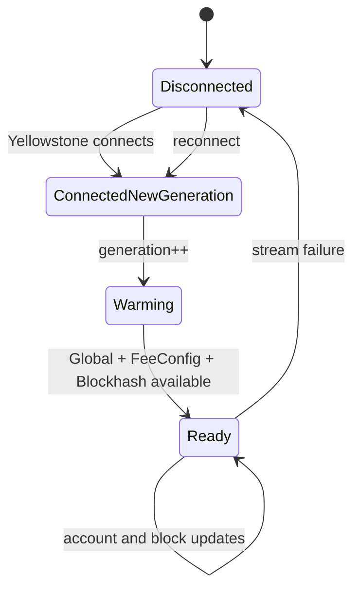

Τα snapshots προηγούμενου generation παραμένουν στη μνήμη, αλλά απορρίπτονται από τα strict cache reads.

## 5.4 Freshness policy

| Cache | Entry | Exit |
|---|---:|---:|
| Curve | Υποχρεωτικό `curve_max_age_ms`, εκτός predicted fallback | Δεν εφαρμόζεται wall-clock age, αλλά απαιτείται ενεργό generation |
| Blockhash | `blockhash_max_age_ms` και safety blocks | Ίδιο |
| Tip | `tip_max_age_seconds` | Ίδιο |
| FeeConfig / Global | Απαιτείται current generation | Το configured `fee_state_max_age_seconds` δεν εφαρμόζεται από τον κώδικα |

---

# 6. Κοινό processing pipeline

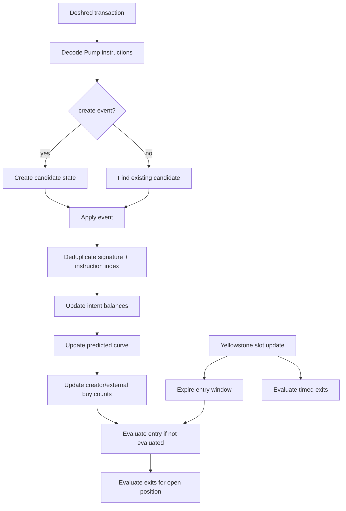

## 6.1 Event deduplication

Για buy/sell δημιουργείται event ID:

```text
signature:instruction_index:event_kind
```

Duplicate event δεν επηρεάζει ξανά:

- intent count,
- predicted curve,
- creator balances,
- recent flow.

## 6.2 Predicted curve

Η predicted curve αρχικοποιείται από:

1. authoritative curve snapshot, αν υπάρχει, αλλιώς
2. Pump Global initial reserves.

Στη συνέχεια εφαρμόζονται τοπικά τα Deshred buy/sell intents με τη σειρά άφιξης.

Αυτό είναι **πρόβλεψη**, όχι εκτελεσμένο state. Μπορεί να περιέχει intents που τελικά δεν θα γίνουν landed.

---

# 7. Entry strategy και συνθήκες αγοράς

## 7.1 Entry window

Για create slot `S0` και `expiry_slots = N`:

```math
S_{end} = S_0 + N - 1
```

Το παράθυρο είναι inclusive:

```text
S0, S0+1, ..., S0+N-1
```

Με τις δύο supplied configurations:

```text
expiry_slots = 10
```

άρα εξετάζονται τα slots `S0 ... S0+9`.

## 7.2 Prior buy intent count


$$I_{\text{prior}} = I_{\text{external}} + \begin{cases} I_{\text{creator}}, & \text{when } initial\_buy.enabled = true \\ 0, & \text{when } initial\_buy.enabled = false \end{cases}$$

Σημαντικό:

- Με `initial_buy.enabled: true`, το creator buy **μετρά** στο `maximum_competing_buy_intents`.
- Δεν απαιτείται ξεχωριστός external buyer.
- Το πρώτο έγκυρο creator buy μπορεί μόνο του να ενεργοποιήσει entry.
- Κάθε intent μετρά χωριστά, ακόμη και από το ίδιο wallet.

## 7.3 Entry conditions

Η επιλογή είναι έτοιμη όταν ισχύουν όλα:

```text
HasCreateInfo
AND NOT rejected Mayhem
AND NOT creator sell before entry
AND 1 <= PriorBuyIntents <= MaximumCompetingBuyIntents
AND creator buy observed, if initial_buy is enabled
AND creator buy quote available
AND creator buy source allowed
AND creator buy gross SOL belongs to an allowed interval
```

Με τα supplied configs:

```text
creator buy gross ∈ [0.5, 5] SOL
maximum competing intents = 2
```

Άρα:

- 0 prior intents: αναμονή.
- 1 intent: μπορεί να γίνει άμεσα entry.
- 2 intents: παραμένει αποδεκτό.
- 3+ intents: reject.

## 7.4 Creator buy amount

Το creator buy amount δεν λαμβάνεται από `maxSolCost`. Υπολογίζεται με local exact quote:

```text
creator_buy_lamports = curve_cost + protocol_fee + creator_fee
```

Η μόνη αποδεκτή source στον συγκεκριμένο module είναι:

```text
deshred_curve_quote
```

Οι πηγές `inner_transfer` και `balance_delta` του κύριου bot δεν υπάρχουν εδώ.

## 7.5 Entry rejection reasons

| Reason | Συνθήκη |
|---|---|
| `missing_create_info` | Απουσία create metadata. |
| `mayhem_mode_token` | Mayhem token και ενεργό reject. |
| `dev_sell_detected` | Creator sell πριν από entry. |
| `competing_buy_intent_limit_exceeded` | Prior intents πάνω από το όριο. |
| `creator_buy_quote_unavailable` | Αποτυχία ή αδυναμία quote. |
| `creator_buy_source_not_allowed` | Μη αποδεκτή source. |
| `creator_buy_not_allowed` | Creator buy εκτός intervals. |
| `deshred_stream_generation_stale` | Candidate από παλαιό ή unhealthy Deshred generation. |
| `curve_cache_unavailable` | Ούτε fresh curve ούτε allowed predicted fallback. |
| `fee_cache_unavailable` | Global/FeeConfig μη διαθέσιμα. |
| `entry_tip_cache_unavailable` | Stale ή missing Jito tip sample. |
| `entry_curve_quote_failed` | Το budget δεν μπορεί να αγοραστεί. |
| `total_live_entries_limit_reached` | Έχει εξαντληθεί το live lifetime entry limit. |

## 7.6 Expiry reason priority

Όταν λήξει το entry window:

1. `entry_window_expired_missing_create_info`
2. `entry_window_expired_incomplete_slot`
3. `entry_window_expired_missing_prior_buy_intents`
4. `entry_window_expired_missing_creator_buy`
5. `entry_window_expired_waiting_for_curve`

## 7.7 Entry flow

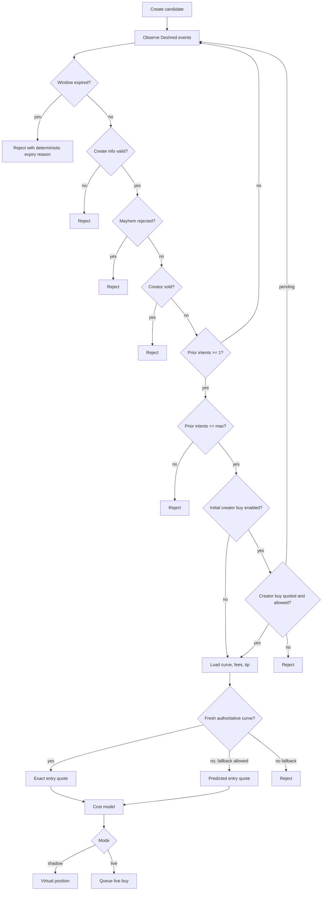

---

# 8. Exit strategy και συνθήκες πώλησης

## 8.1 Exit quote source

Για κάθε holding position:

1. Προτιμάται latest authoritative curve από current Yellowstone generation.
2. Αν δεν υπάρχει, μπορεί να χρησιμοποιηθεί predicted curve μόνο όταν:
   - το Deshred stream είναι healthy,
   - το candidate ανήκει στο current Deshred generation,
   - το curve και mint ταιριάζουν,
   - υπάρχει initialized predicted curve.

## 8.2 Event-driven prediction

Όταν υπάρχει authoritative curve και έρχεται νέο Deshred buy/sell event:

- υπολογίζεται πρώτα το current exit quote,
- το νέο intent εφαρμόζεται προσωρινά στην curve,
- υπολογίζεται το predicted post-intent exit quote,
- τα configured exits αξιολογούνται πάνω στο predicted future state.

Έτσι το bot μπορεί να αντιδρά πριν από το replay, αλλά αναλαμβάνει prediction risk.

## 8.3 Exit priority

Η πραγματική fixed προτεραιότητα του κώδικα είναι:

1. Deshred `sell all` intent.
2. Creator any sell.
3. Creator full-exit percentage.
4. 3-second sell pressure.
5. Spot-price stop loss.
6. Failed-pump exit.
7. Early-stall exit.
8. Profit lock.
9. Trailing stop.
10. Take profit.
11. Max hold.

Η σειρά δεν είναι δυναμικά configurable· μόνο το enable/threshold κάθε rule είναι configurable.

## 8.4 Deshred sell-all

Για κάθε wallet και mint διατηρείται inferred token balance από Deshred intents:

```math
B_u = \sum buys_u - \sum sells_u
```

Sell intent θεωρείται `sell all` όταν:

```math
sell\_tokens \ge B_u, \quad B_u > 0
```

Σημαντικό: το trigger δεν περιορίζεται στον creator ή σε συγκεκριμένο wallet. Οποιοδήποτε παρατηρημένο wallet που πουλά όλο το inferred balance του μετά το άνοιγμα της θέσης μπορεί να προκαλέσει emergency exit.

## 8.5 Creator exits

```math
CreatorExitPct = 100 \cdot
\frac{\min(CreatorSoldTokens, CreatorBuyTokens)}{CreatorBuyTokens}
```

Rules:

- `creator_sell`: οποιοδήποτε creator sell.
- `creator_full_exit`: `CreatorExitPct >= full_exit_pct`.

## 8.6 Sell pressure

Για rolling 3-second window:

```math
R_{sell,3s} = \frac{SellFlow}{BuyFlow + SellFlow}
```

Trigger:

```math
R_{sell,3s} \ge max\_sell\_ratio\_3s
```

Το flow βασίζεται σε local quoted lamports των Deshred intents, όχι σε confirmed trades.

## 8.7 Stop loss

Το stop loss χρησιμοποιεί αποκλειστικά spot-price change από το post-entry curve state. Δεν χρησιμοποιεί execution PnL.

Trigger:

```math
P_{current} \le P_{entry} \cdot (1 - SL/100)
```

## 8.8 Failed pump

Trigger όταν:

```text
held >= after_ms
AND max_gain_pct >= activation_gain_pct
AND current_profit_pct < exit_below_pct
```

## 8.9 Early stall

Trigger όταν:

```text
held >= after_ms
AND max_gain_pct < max_gain_below_pct
AND current_profit_pct < current_pnl_below_pct
```

## 8.10 Profit lock

Trigger όταν:

```text
max_gain_pct >= activation_pct
AND current_profit_pct <= lock_pct
```

## 8.11 Trailing stop

Με peak net sell quote `Q_peak` και trailing percentage `T`:

```math
Q_{current} \le \left\lfloor Q_{peak} \cdot (1 - T/100) \right\rfloor
```

Ενεργοποιείται μόνο αφού:

```text
max_gain_pct >= activation_pct
```

## 8.12 Take profit

Take profit αξιολογείται πάνω στο full execution-aware profit:

```math
ProfitLamports \ge TargetProfitLamports
```

Το live `minSolOutput` γίνεται guaranteed minimum και όχι απλό slippage limit.

## 8.13 Max hold

```text
now - opened_at >= max_hold.seconds
```

Δεν είναι emergency exit και χρησιμοποιεί normal exit-tip policy.

## 8.14 Exit flow

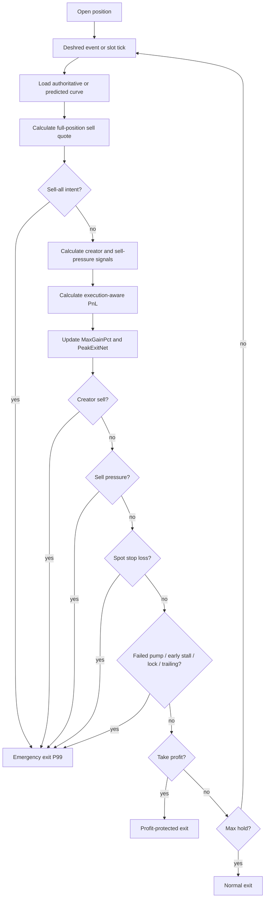

---

# 9. Shadow mode

## 9.1 Τι εκτελείται

Το shadow mode εκτελεί:

- Deshred και Yellowstone streams,
- cache logic,
- entry selection,
- exact curve quotes,
- Jito tip selection,
- priority-fee estimation,
- position cost model,
- exit rules,
- modeled PnL,
- SQLite persistence.

## 9.2 Τι δεν εκτελείται

Δεν εκτελεί:

- private-key signing,
- transaction building,
- account-layout validation κατά το runtime execution,
- send queue latency,
- simulation,
- Jito auction,
- Triton RPC send,
- blockhash expiry,
- actual fills,
- Yellowstone wallet reconciliation,
- retry/manual-resolution execution path,
- reorg impact σε virtual fills.

## 9.3 Shadow entry

Η θέση δημιουργείται ως `entry_pending` και επιβεβαιώνεται αμέσως ως `holding`.

## 9.4 Shadow exit

Η θέση κλείνει αμέσως με το local quote. Το μοντέλο προσθέτει:

- base fee,
- estimated priority fee,
- selected Jito tip,
- ATA close cost,
- rent recovery.

## 9.5 Περιορισμός αξιοπιστίας

Το shadow mode είναι κατάλληλο για:

- strategy replay,
- rule validation,
- quote/math validation,
- gross comparison μεταξύ configurations.

Δεν είναι αρκετό για να προβλέψει:

- landing probability,
- queue delay,
- auction success,
- actual slippage,
- failed sells,
- stale state κατά το submit,
- PnL distribution μετά από execution failures.

---

# 10. Live mode

## 10.1 Προϋποθέσεις

Απαιτούνται:

- `DESHRED_PRIVATE_KEY`,
- Triton gRPC endpoint,
- Triton JSON-RPC endpoint,
- Jito endpoints,
- fresh stream caches,
- wallet transaction subscription,
- valid Pump account layouts.

## 10.2 Live transaction instructions

Κάθε Pump buy/sell transaction περιέχει:

1. Compute unit limit.
2. Compute unit price.
3. Idempotent ATA creation.
4. Pump `buy_v2` ή `sell_v2`.
5. Jito tip transfer.

Το tip είναι στην ίδια transaction. Αν αποτύχει το Pump instruction, δεν πληρώνεται ξεχωριστά το tip.

## 10.3 Dual broadcast

Η ίδια signed transaction αποστέλλεται παράλληλα:

```text
Jito sendBundle(raw_tx)
Triton sendTransaction(raw_tx)
```

- Αν τουλάχιστον ένα path επιστρέψει επιτυχία, το order γίνεται `submitted`.
- Αν αποτύχουν και τα δύο, το state γίνεται `submission_unknown`.
- Το Jito response δεν θεωρείται confirmation.

## 10.4 Live confirmation

Το Yellowstone wallet transaction πρέπει να έχει:

- ίδια signature,
- επιτυχή execution,
- Pump `TradeEvent`,
- ίδιο mint,
- ίδιο wallet,
- σωστή buy/sell direction.

Αλλιώς γίνεται `confirmed_unreconciled`.

## 10.5 ATA rent recovery

Μετά από confirmed sell:

1. Η θέση κλείνει.
2. Δημιουργείται unresolved `ata_close_pending` record.
3. Με RPC `getAccountInfo` ελέγχεται ότι το ATA token balance είναι μηδέν.
4. Χτίζεται separate close-account transaction.
5. Αποστέλλεται μόνο μέσω Triton RPC.
6. Με confirmed close προστίθεται το recovered rent στο realized PnL.

---

# 11. Μαθηματικό μοντέλο

## 11.1 Μονάδες

- `1 SOL = 1,000,000,000 lamports`.
- Pump token amount: atomic units με 6 decimals.
- Όλα τα execution-critical calculations γίνονται με integers.
- Χρησιμοποιούνται explicit `floor` και `ceil` για να αντιγραφεί το on-chain behavior.

## 11.2 SOL conversion

```math
Lamports = round(SOL \cdot 10^9)
```

## 11.3 Spot price

Για virtual SOL reserves `VS` και virtual token reserves `VT`:

```math
P_{atomic} = \frac{VS}{VT}
```

Σε SOL ανά ολόκληρο token:

```math
P_{SOL/token} = \frac{VS}{VT \cdot 1000}
```

Ο παράγοντας `1000` προκύπτει από τη διαφορά 9 decimals του SOL και 6 decimals του token.

## 11.4 Relative spot-price change

```math
\Delta P\% = \left(
\frac{VS_{current}/VT_{current}}
     {VS_{entry}/VT_{entry}}
- 1\right) \cdot 100
```

## 11.5 Exact buy curve cost

Για αγορά `q` token atomic units:

```math
C_{curve} =
\left\lceil
\frac{q \cdot VS}{VT - q}
\right\rceil + 1
```

Περιορισμοί:

```text
0 < q < VT
q <= RealTokenReserves
curve.complete = false
```

## 11.6 Pump buy fees

Για protocol fee `f_p` bps και creator fee `f_c` bps:

```math
F_p^{buy} = \left\lceil \frac{C_{curve} \cdot f_p}{10000} \right\rceil
```

```math
F_c^{buy} = \left\lceil \frac{C_{curve} \cdot f_c}{10000} \right\rceil
```

```math
Debit_{buy} = C_{curve} + F_p^{buy} + F_c^{buy}
```

Στο `TradeQuote`:

```text
Buy GrossLamports = Debit_buy
Buy NetLamports   = C_curve
```

## 11.7 Curve μετά την αγορά

```math
VT' = VT - q
```

```math
RT' = RT - q
```

```math
VS' = VS + C_{curve}
```

Τα Pump fees δεν αυξάνουν τα virtual SOL reserves.

## 11.8 Buy with fixed budget

Για budget `B`, γίνεται binary search για το μεγαλύτερο `q` ώστε:

```math
Debit_{buy}(q) \le B
```

Το μη χρησιμοποιημένο υπόλοιπο budget δεν μετατρέπεται σε token.

## 11.9 Exact sell gross output

Για πώληση `q` token atomic units:

```math
G_{sell} =
\left\lfloor
\frac{q \cdot VS}{VT + q}
\right\rfloor
```

## 11.10 Pump sell fees

```math
F_p^{sell} = \left\lceil \frac{G_{sell} \cdot f_p}{10000} \right\rceil
```

```math
F_c^{sell} =
\begin{cases}
\left\lceil \frac{G_{sell} \cdot f_c}{10000} \right\rceil, & creator\ known \\
0, & creator\ unknown
\end{cases}
```

```math
Credit_{sell,net} = G_{sell} - F_p^{sell} - F_c^{sell}
```

Στο `TradeQuote`:

```text
Sell GrossLamports = G_sell πριν από fees
Sell NetLamports   = Credit_sell,net
```

Άρα το `GrossLamports` έχει διαφορετική σημασία στο buy και στο sell και πρέπει να χρησιμοποιείται με προσοχή.

## 11.11 Curve μετά την πώληση

```math
VT' = VT + q
```

```math
RT' = RT + q
```

```math
VS' = VS - G_{sell}
```

## 11.12 Fee tier market cap

```math
MarketCapLamports =
\frac{VS \cdot MintSupply}{VT}
```

Για normal tokens χρησιμοποιείται hardcoded:

```text
MintSupply = 1,000,000,000,000,000 atomic units
```

Για Mayhem χρησιμοποιείται το curve `TotalSupply`.

## 11.13 Buy slippage limit

Για quoted buy debit `Q_b` και slippage `s_b` bps:

```math
MaxSolCost =
\left\lceil
Q_b \cdot \frac{10000+s_b}{10000}
\right\rceil
```

## 11.14 Sell slippage limit

Για quoted net sell output `Q_s` και slippage `s_s` bps:

```math
MinSolOutput =
\left\lfloor
Q_s \cdot \frac{10000-s_s}{10000}
\right\rfloor
```

## 11.15 Priority fee

Από τα τελευταία έως 512 observed Deshred compute-unit prices:

1. Τα values ταξινομούνται.
2. Επιλέγεται index:

```math
i = \left\lfloor \frac{(n-1) \cdot percentile}{100} \right\rfloor
```

3. Για `u` micro-lamports/CU και compute limit `CU`:

```math
PriorityFee =
\left\lceil
\frac{u \cdot CU}{10^6}
\right\rceil
```

4. Εφαρμόζεται `max_priority_fee_lamports`.
5. Αν δεν υπάρχουν samples, χρησιμοποιείται το fallback.

Εμπειρικός περιορισμός: τα samples προέρχονται από observed intents και όχι αποκλειστικά από landed ανταγωνιστικές συναλλαγές.

## 11.16 Compute-unit price instruction

Από επιλεγμένο total priority fee:

```math
MicroLamportsPerCU =
\left\lceil
\frac{PriorityFee \cdot 10^6}{CU}
\right\rceil
```

## 11.17 Jito tip target

Για percentile tip sample σε SOL:

```math
TipTargetLamports = round(TipPercentileSOL \cdot 10^9)
```

Basic clamp:

```math
Tip = \min(\max(TipTarget, TipMin), TipMax)
```

### Entry

```text
purpose = entry percentile
profit cap = none
```

### Normal exit

Πριν από tip:

```math
ExpectedProfit =
\max(0, SellNet - EntryCost - PreTipSellCosts)
```

Profit cap:

```math
TipProfitCap =
\left\lfloor
ExpectedProfit \cdot TipProfitCapPct / 100
\right\rfloor
```

```math
Tip = \min(Tip, TipProfitCap)
```

Αν το profit cap είναι μικρότερο από το minimum Jito tip, το exit metric calculation επιστρέφει error.

### Emergency exit

- Χρησιμοποιεί configured emergency percentile, συνήθως P99.
- Δεν εφαρμόζει profitability cap.
- Εφαρμόζει μόνο min/max absolute cap.

### Sell retry

Κάθε δεύτερο ή τρίτο sell attempt ανανεώνει tip με P99 χωρίς profitability cap, ακόμη και αν το αρχικό exit ήταν normal take-profit ή max-hold.

## 11.18 Initial position cost model

Ορισμοί:

```math
EntryExecution = EntryBaseFee + EntryPriorityFee + EntryTip
```

```math
ExitExecution = ExitBaseFee + ExitPriorityFee + ExitTip + ATACloseCost
```

```math
InitialTargetProfit =
\left\lceil
ConfiguredBuyAmount \cdot TP\% / 100
\right\rceil
```

```math
Required_0 =
EntryCurveDebit + EntryExecution + ExitExecution + InitialTargetProfit
```

Execution uncertainty buffer:

```math
Buffer =
\left\lceil
Required_0 \cdot ExecutionUncertaintyBPS / 10000
\right\rceil
```

```math
RequiredProceeds = Required_0 + Buffer
```

Στο αρχικό entry calculation, το `ExitTip` περνά ως μηδέν. Το stored `RequiredProceeds` δεν είναι αυτό που χρησιμοποιείται τελικά από το live take-profit trigger· το live exit επανυπολογίζεται δυναμικά.

## 11.19 Dynamic exit cost model

Πραγματικό entry cost που χρησιμοποιείται στο trigger:

```math
B = EntryCurveDebit + EntryBaseFee + EntryPriorityFee + EntryTip
```

Estimated sell costs:

```math
C_s = ExitBaseFee + ExitPriorityFee + ExitTip + ATACloseCost
```

Current executable profit:

```math
\Pi = SellNetQuote - B - C_s
```

```math
ProfitPct = 100 \cdot \frac{\Pi}{B}
```

Take-profit target:

```math
\kappa =
\left\lceil B \cdot TP\% / 100 \right\rceil
```

Guaranteed minimum output:

```math
MinOutput_{TP} = B + C_s + \kappa
```

Το take-profit transaction δημιουργείται μόνο όταν:

```math
SellNetQuote \ge MinOutput_{TP}
```

## 11.20 Realized PnL

### Debits

```math
EntryDebits =
EntryCurveDebit + EntryBaseFee + EntryPriorityFee + EntryTip + ATARentLocked
```

```math
ExitDebits =
ExitBaseFee + ExitPriorityFee + ExitTip + ATARentCloseCost
```

### Credits

```math
Credits = SellNetCredit + ATARentRecovered
```

### Final

```math
RealizedPnL = Credits - EntryDebits - ExitDebits
```

Σε expanded form:

```math
RealizedPnL =
SellNetCredit
+ ATARentRecovered
- EntryCurveDebit
- EntryNetworkFee
- EntryTip
- ATARentLocked
- ExitNetworkFee
- ExitTip
- ATARentCloseCost
```

Όταν το ATA close επιβεβαιωθεί:

```math
ATARentRecovered = ATARentLocked
```

και το locked rent ουσιαστικά ακυρώνεται, εκτός από το κόστος της close transaction.

## 11.21 Stop-loss exact integer inequality

Για stop loss `L` bps, ο κώδικας αποφεύγει floating-point comparison:

```math
VS_c \cdot VT_e \cdot 10000
\le
VS_e \cdot VT_c \cdot (10000-L)
```

όπου:

- `e`: post-entry state,
- `c`: current/predicted state.

## 11.22 Required external VSOL movement

Το helper `requiredDeltaVSOL` βρίσκει με exponential search και binary search το ελάχιστο net external buy SOL `ΔVS` ώστε:

```math
SellNetQuote(PositionTokens, CurveAfterExternalBuys)
\ge RequiredExitProceeds
```

Το σχετικό required movement είναι:

```math
RequiredMovePct = 100 \cdot \frac{\Delta VS}{VS_{after-entry}}
```

Το helper χρησιμοποιείται κυρίως από tests και όχι από το current runtime strategy.

---

# 12. Position, order και candidate state machines

## 12.1 Candidate state

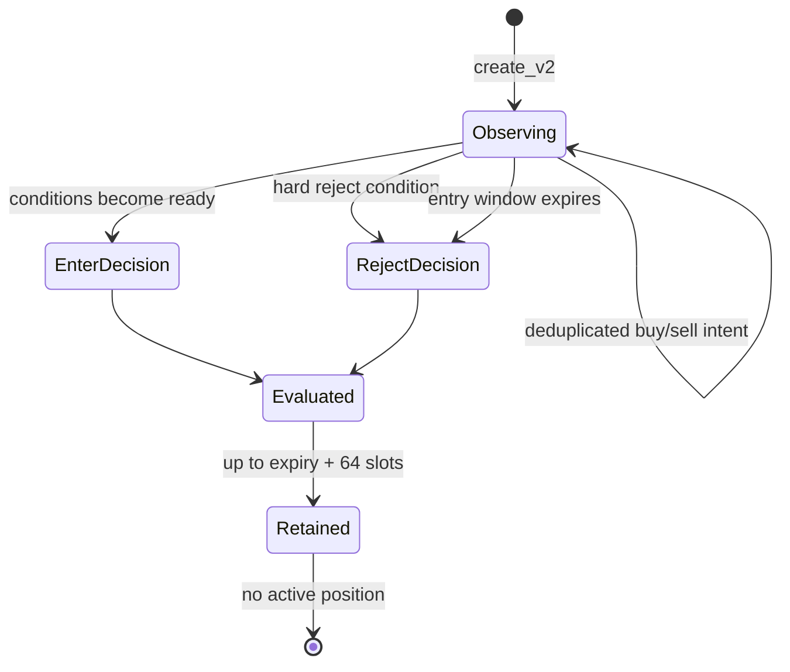

Το candidate αξιολογείται μία φορά. Μετά το `Evaluated=true` δεν μπορεί να ξαναγίνει entry.

## 12.2 Position state

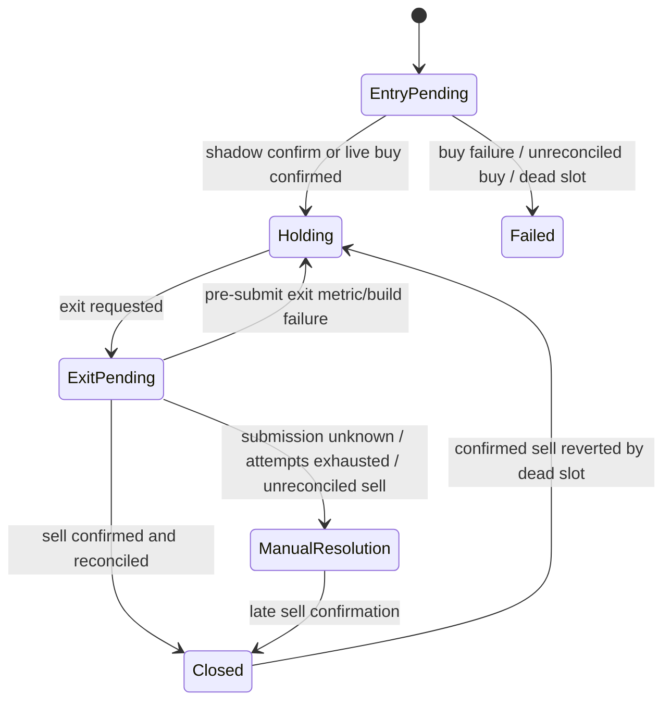

## 12.3 Order state

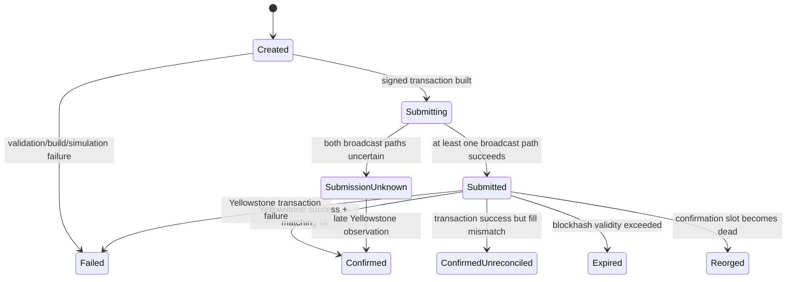

---

# 13. Sequence diagrams

## 13.1 Shadow entry και exit

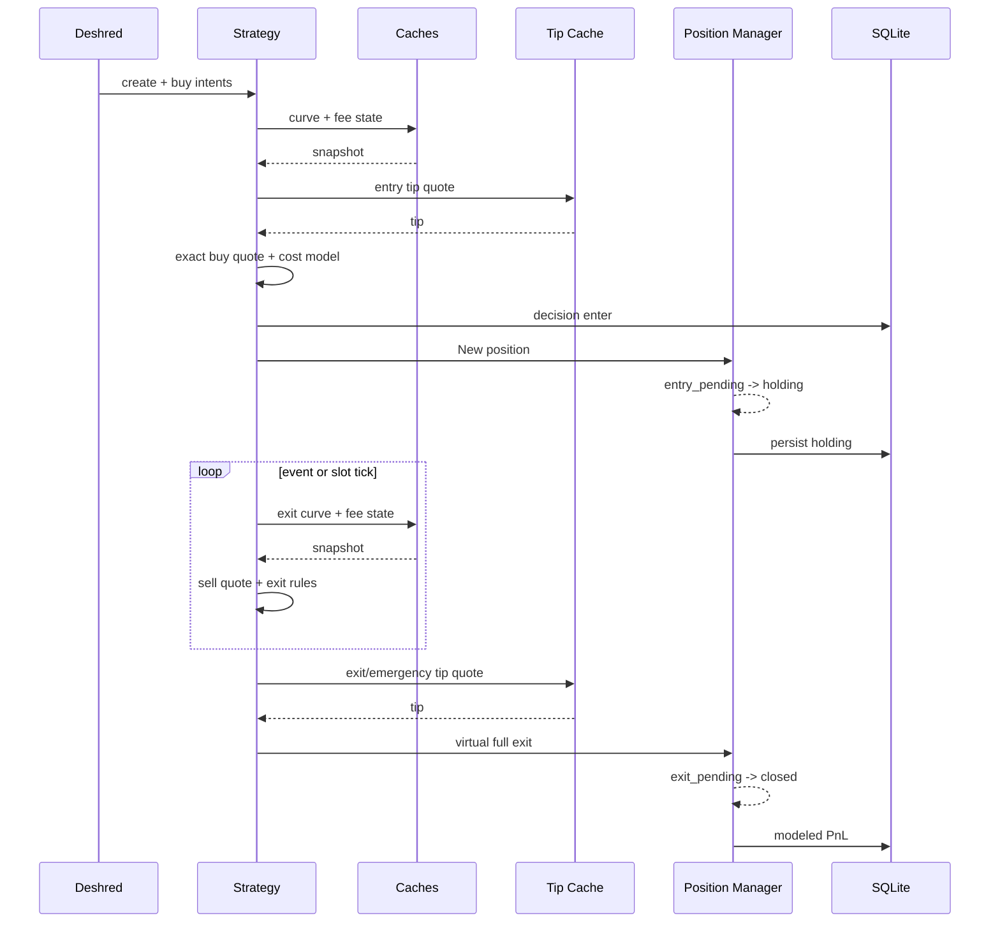

## 13.2 Live buy

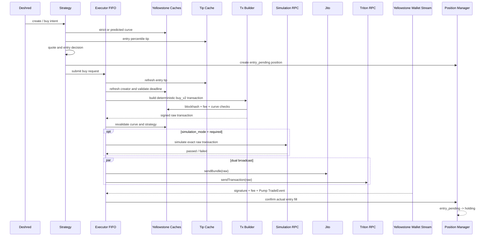

## 13.3 Live exit και ATA close

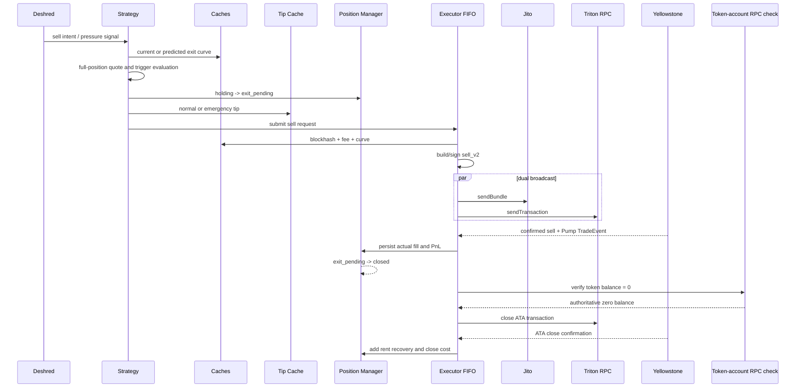

## 13.4 Sell failure και manual resolution

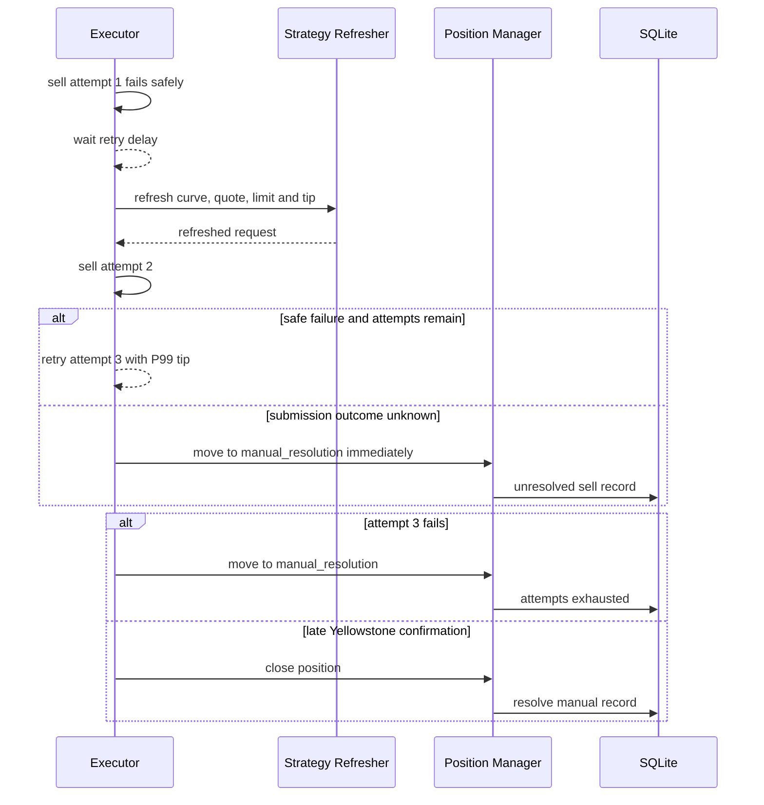

---

# 14. Failure handling και retries

## 14.1 Failure matrix

| Failure | Buy | Sell | ATA close |
|---|---|---|---|
| Execution queue full | Position failed | Retry έως 3 ή manual | Retry έως 3 ή unresolved ATA close |
| Entry deadline expired | Failed, reservation released πριν από submit | N/A | N/A |
| Strategy revalidation failed | Failed | N/A | N/A |
| Curve/blockhash/fee unavailable | Failed | Retry έως 3 | Retry έως 3 |
| Simulation failed | Failed | Retry έως 3 | Not used in same path |
| Και τα δύο broadcast paths uncertain | Buy failed, order remains submission-unknown | Άμεσο manual resolution | Submission-unknown ATA record |
| Yellowstone transaction failed | Failed | Retry έως 3 | Retry έως 3 |
| Confirmed χωρίς matching Pump fill | Failed | Manual resolution | N/A |
| Blockhash expired χωρίς confirmation | Failed | Retry έως 3 | Retry έως 3 |
| Jito Invalid και signature absent | Failed, επειδή max buy attempts = 1 | Retry έως max attempts | N/A |
| Dead slot μετά από confirmation | Buy revert σε failed | Sell revert σε holding | Rent recovery revert |

## 14.2 Buy retries

Το live buy έχει:

```text
MaxAttempts = 1
```

Άρα δεν γίνεται automatic buy retry. Αυτό είναι σωστό για να μη γίνει late entry μετά από missed window.

## 14.3 Sell retries

```text
MaxAttempts = 3
RetryDelay = 300 ms
```

Σε κάθε retry:

- ανανεώνεται position exit quote,
- ανανεώνεται limit,
- ανανεώνεται priority fee,
- χρησιμοποιείται P99 Jito tip,
- ξαναχτίζεται και ξαναυπογράφεται η transaction με νέο blockhash.

## 14.4 Unknown submission

Όταν δεν είναι γνωστό αν η transaction έφτασε στο δίκτυο, δεν γίνεται blind retry στο sell. Η θέση γίνεται `manual_resolution`, επειδή δεύτερη πώληση μπορεί να συγκρουστεί με delayed landing της πρώτης.

## 14.5 Fork handling

Με `SLOT_DEAD`:

- confirmed buy: position γίνεται failed,
- confirmed sell: position επιστρέφει σε holding,
- confirmed ATA close: αφαιρείται το rent recovery και ανοίγει ξανά unresolved ATA close.

## 14.6 Graceful shutdown

Κατά το shutdown:

1. Απενεργοποιούνται νέα entries.
2. Ζητείται emergency full exit για holding positions.
3. Περιμένει έως `graceful_shutdown_seconds`.
4. Μετά κλείνει streams, database και logger.

Πρόβλημα: το `Active()` περιλαμβάνει `manual_resolution`, αλλά το shutdown exit loop επεξεργάζεται μόνο `holding`. Επομένως οποιαδήποτε manual position οδηγεί αναγκαστικά σε shutdown timeout.

---

# 15. Persistence και observability

## 15.1 SQLite mode

- WAL journal.
- `synchronous=NORMAL`.
- Μία DB connection.
- Single asynchronous writer goroutine.
- Non-blocking enqueue.

## 15.2 Κύριοι πίνακες

| Πίνακας | Περιεχόμενο |
|---|---|
| `runs` | Mode, start/end, status. |
| `runtime_events` | Lifecycle, errors και diagnostics. |
| `market_events` | Deshred replay events. |
| `account_snapshots` | Global, fee, curve, sharing config. |
| `slot_updates` | Slot lifecycle και dead slots. |
| `tip_samples` | P25/P50/P75/P95/P99 tip samples. |
| `decisions` | Entry decisions και cost model. |
| `positions` | Position state, actual/modeled costs και PnL. |
| `orders` | Execution attempts, signatures, bundle, simulation και errors. |
| `trade_manual_resolutions` | Unknown ή exhausted operations. |

## 15.3 Views

- `v_run_results`: run-level wins/losses/PnL.
- `v_execution_failures`: observed failure και suspected cause.

## 15.4 Write-loss behavior

Αν η write queue γεμίσει ή ένα async SQL statement αποτύχει:

```text
database.dropped++
```

Δεν γίνεται:

- retry,
- process failure,
- synchronous fallback,
- guaranteed persistence για critical position/order transition.

Το heartbeat εμφανίζει μόνο το συνολικό `db_dropped`.

## 15.5 Retention

Default:

```text
retention = 48 hours
cleanup interval = 48 hours
```

Open positions, related orders και unresolved manual records προστατεύονται από cleanup. Αυτό δεν σημαίνει ότι φορτώνονται ξανά στη μνήμη κατά το restart.

---

# 16. Configuration comparison

## 16.1 Διαφορές supplied modes

| Setting | `config.yaml` shadow | `config.live-canary.yaml` live |
|---|---:|---:|
| Mode | shadow | live |
| Buy amount | 0.075 SOL | 0.01 SOL |
| Total live entries | ignored / disabled | enabled, limit 3 |
| Reject Mayhem | false | true |
| Priority percentile | P75 | P95 |
| Entry Jito percentile | P95 | P99 |
| Entry tip cap | 5,000,000 lamports | 1,500,000 lamports |
| Exit tip cap | 5,000,000 lamports | 1,500,000 lamports |
| Compute unit limit | 160,000 | 125,000 |
| Simulation | off | off |

## 16.2 Κοινές strategy ρυθμίσεις

| Setting | Value |
|---|---:|
| Creator buy enabled | true |
| Creator buy range | `[0.5, 5] SOL` |
| Creator source | `deshred_curve_quote` |
| Maximum competing intents | 2, creator included |
| Require create info | true |
| Reject creator sell before entry | true |
| Entry expiry | 10 slots |
| Predicted curve fallback | enabled |
| Sell-all exit | enabled |
| Take profit | +2% |
| Stop loss | -20% spot price |
| Max hold | 15 seconds |
| Trailing stop | disabled |
| Profit lock | disabled |
| Early stall | disabled |
| Failed pump | disabled |
| Creator sell exits | disabled |
| Sell pressure | disabled |
| Sell attempts | 3 |
| Retry delay | 300 ms |
| Buy slippage | 500 bps = 5% |
| Sell slippage | 500 bps = 5% |
| Execution uncertainty | 50 bps = 0.5% |
| Base fee model | 5,000 lamports/signature |

## 16.3 Σημασία `total_live_entries`

Η υλοποίηση μετρά συνολικά reserved/submitted live entries για τη διάρκεια του process. Δεν είναι `max_open_positions`.

- Reservation απελευθερώνεται μόνο σε pre-submission buy failure.
- Δεν απελευθερώνεται μετά από submitted buy, ακόμη και αν αργότερα αποτύχει.
- Με restart ο counter μηδενίζεται, επειδή δεν αποκαθίσταται από τη βάση.

---

# 17. Ασφάλεια

## 17.1 Θετικά

- Το private key λαμβάνεται από environment και δεν βρίσκεται στο YAML.
- Τα SQL statements χρησιμοποιούν parameters.
- Η transaction υπογράφεται τοπικά.
- Jito και RPC λαμβάνουν το ίδιο signed payload.
- Δεν γίνεται δυναμική εκτέλεση arbitrary code.
- ALT resolution failure απορρίπτεται αντί να γίνει unsafe decode.

## 17.2 Κίνδυνοι

1. Το private key σε process environment μπορεί να διαβαστεί από άλλο privileged process.
2. Δεν υπάρχει external signer/HSM support.
3. Δεν υπάρχει balance guard πριν από buy ή sell fees.
4. Δεν υπάρχει startup wallet/ATA reconciliation.
5. Δεν υπάρχει spending cap σε συνολικό SOL ανά run πέρα από το entry count.
6. Τα custom RPC URLs και tokens πρέπει να προστατεύονται από logs και source control.
7. Το `.env` είναι πρακτικό για local use, αλλά όχι ιδανικό για production secrets.

## 17.3 Προτεινόμενα controls

- Dedicated low-balance hot wallet.
- OS secret store ή external signer.
- Maximum daily/run loss.
- Maximum aggregate exposure.
- Minimum wallet SOL reserve.
- Kill switch ανεξάρτητο από graceful shutdown.
- Startup reconciliation πριν ενεργοποιηθούν entries.

---

# 18. Ποιοτική ανάλυση

## 18.1 Ενδεικτική στατική αξιολόγηση

| Τομέας | Εκτίμηση | Σχόλιο |
|---|---:|---|
| Αρχιτεκτονική separation | 8/10 | Καθαρός διαχωρισμός intent, authoritative state, strategy και execution. |
| Μαθηματική ορθότητα | 8/10 | Integer rounding, overflow guards και exact quotes. |
| Entry safety | 8/10 | Πολλά fail-closed revalidations και deadline checks. |
| Exit resilience | 6/10 | Retries/manual resolution σωστά, αλλά single FIFO και recovery gaps. |
| Persistence durability | 5/10 | Καλό schema, αλλά non-blocking dropped writes. |
| Restart resilience | 2/10 | Δεν ανακτώνται active positions/orders. |
| Observability | 8/10 | Orders, fills, errors, tips και failure diagnostics καταγράφονται. |
| Shadow/live parity | 5/10 | Ίδια rules/math, αλλά όχι ίδια execution reality. |
| Testability | 8/10 | Μεγάλο test suite, χωρίς runtime επαλήθευση στην παρούσα ανάλυση. |
| Production readiness | 5/10 | Κατάλληλο για controlled canary, όχι unattended capital. |

Οι βαθμοί είναι ποιοτική στατική εκτίμηση, όχι μετρημένο benchmark.

## 18.2 Ισχυρά σημεία

### 1. Σωστός διαχωρισμός Deshred και Yellowstone

Το Deshred δεν θεωρείται execution confirmation. Αυτό είναι θεμελιώδες και αποφεύγει fabricated fills.

### 2. Exact integer math

Οι `floor`, `ceil`, overflow checks και `big.Int` μειώνουν αποκλίσεις από το on-chain program.

### 3. Revalidation πριν από submit

Το live buy ελέγχει επανειλημμένα:

- entry deadline,
- current strategy state,
- curve completeness,
- Mayhem state,
- exact quote έναντι slippage limit,
- blockhash freshness.

### 4. Position-level reconciliation

Το PnL δεν βασίζεται σε wallet delta, το οποίο θα μπερδευόταν από rent, tips και παράλληλες κινήσεις.

### 5. Dual broadcast χωρίς διπλή υπογραφή

Η ίδια signature αποστέλλεται σε δύο paths, άρα δεν δημιουργούνται δύο διαφορετικά competing orders.

### 6. Fork handling

Το `SLOT_DEAD` μπορεί να αναστρέψει confirmed state. Αυτό είναι πιο ώριμο από απλή processed confirmation.

### 7. Explicit manual resolution

Unknown sell outcome δεν οδηγεί σε τυφλό retry. Είναι συντηρητική και σωστή επιλογή.

### 8. Deterministic Pump V2 builder

Δεν αντιγράφεται τυφλά observed transaction template. Τα accounts παράγονται από protocol invariants και ελέγχεται το count.

---

## 18.3 P0 ευρήματα — πριν από ουσιαστικό live capital

### P0.1 Δεν υπάρχει startup recovery ενεργών θέσεων

Το `newPositionManager` δημιουργεί κενά in-memory maps. Δεν υπάρχει query που να φορτώνει:

- `entry_pending`,
- `holding`,
- `exit_pending`,
- `manual_resolution`,
- submitted ή submission-unknown orders.

Συνέπεια:

- μετά από crash/restart το bot μπορεί να έχει tokens στο wallet αλλά να τα αγνοεί,
- μπορεί να ανοίξει νέα θέση στο ίδιο mint,
- δεν θα συνεχίσει max-hold, stop-loss ή sell retry,
- το live-entry counter μηδενίζεται.

Αυτό είναι το σοβαρότερο reliability gap.

### P0.2 Single synchronous FIFO execution worker

Το `Executor.Start` έχει έναν worker που εκτελεί κάθε request σειριακά. Το `execute` μπορεί να περιμένει:

- cache checks,
- build,
- simulation retries,
- έως `submit_timeout_ms`,
- και τις δύο broadcast απαντήσεις.

Συνέπεια:

- emergency sell μπορεί να περιμένει πίσω από buy,
- ATA close μπορεί να καθυστερεί urgent sell,
- ένα αργό RPC path δημιουργεί head-of-line blocking.

Για sniper exit, αυτή η αρχιτεκτονική είναι ανεπαρκής χωρίς priority scheduling.

### P0.3 Critical DB state μπορεί να χαθεί σιωπηλά

Η async queue είναι non-blocking. Όταν γεμίσει ή αποτύχει SQL:

- αυξάνεται counter,
- το process συνεχίζει,
- δεν υπάρχει durable fallback.

Μπορεί να χαθεί transition από `exit_pending` σε `manual_resolution` ή actual order signature. Για οικονομική εφαρμογή αυτό δεν είναι αποδεκτό.

### P0.4 README και execution code δεν συμφωνούν πλήρως

Το README αναφέρει ότι, όταν φτάσει fresh Yellowstone curve μετά από predicted build, επανυπολογίζονται `token_amount` και `limit_lamports` και ξαναχτίζεται η transaction.

Ο κώδικας που αναλύθηκε:

- δεν επανυπολογίζει token amount,
- δεν ξαναχτίζει request quote από fresh curve,
- ελέγχει μόνο αν το ίδιο token amount εξακολουθεί να χωρά στο υπάρχον slippage limit.

Αυτό πρέπει να διορθωθεί είτε στον κώδικα είτε στην τεκμηρίωση. Σε trading engine η documentation drift είναι operational risk.

---

## 18.4 P1 ευρήματα — υψηλή προτεραιότητα

### P1.1 `fee_state_max_age_seconds` δεν εφαρμόζεται

Η ρύθμιση υπάρχει και γίνεται validate, αλλά το `FeeState(now)` δεν ελέγχει `ObservedAt` ή max age.

Συνέπεια: stale Global/FeeConfig μπορεί να χρησιμοποιηθεί όσο το stream θεωρείται connected και το generation δεν αλλάζει.

### P1.2 `confirmation_timeout_slots` δεν χρησιμοποιείται

Η ρύθμιση γίνεται validate αλλά δεν συμμετέχει σε timeout logic. Το expiry βασίζεται μόνο στο derived `LastValidHeight`.

Αυτό είναι dead configuration και δημιουργεί ψευδή αίσθηση προστασίας.

### P1.3 Graceful shutdown μπλοκάρει σε manual positions

`Active()` περιλαμβάνει manual positions, ενώ το shutdown exit loop επεξεργάζεται μόνο holding positions. Άρα manual state οδηγεί πάντα σε timeout.

### P1.4 Sell-all trigger είναι υπερβολικά ευρύ

Οποιοδήποτε wallet που πουλά όλο το inferred Deshred balance του μπορεί να προκαλέσει emergency exit.

Πιθανά false positives:

- μικρός buyer αγοράζει και πουλά αμέσως,
- test transaction,
- intent που δεν θα land,
- wallet balance inference που αποκλίνει λόγω missing event.

Χρειάζεται wallet role, minimum size ή corroboration.

### P1.5 Predicted curve fallback επιτρέπεται μέχρι live submit

Όταν το initial decision έγινε με predicted curve, η απουσία fresh authoritative curve δεν μπλοκάρει απαραίτητα το submit.

Αυτό μειώνει latency αλλά αυξάνει:

- slippage/failure risk,
- wrong fee-tier risk,
- divergence από πραγματικό ordering,
- simulation/RPC bank visibility risk.

Για canary είναι αποδεκτό μόνο με αυστηρά limits και telemetry.

### P1.6 Shadow mode υποεκτιμά execution risk

Το shadow κλείνει θέση αμέσως στο local quote και θεωρεί deterministic:

- tip payment,
- priority fee,
- full fill,
- ATA rent recovery.

Δεν μοντελοποιεί missed landing, failed sell ή manual resolution. Άρα το shadow PnL είναι αισιόδοξο σε volatile exits.

### P1.7 Take-profit υποθέτει επιτυχή rent recovery

Το dynamic TP αφαιρεί estimated ATA close cost, αλλά δεν χρεώνει μόνιμα το locked rent, επειδή υποθέτει ότι θα ανακτηθεί. Αν το ATA close δεν επιβεβαιωθεί, το realized PnL μπορεί να πέσει κάτω από το target.

### P1.8 Priority-fee sample quality

Το percentile προέρχεται από Deshred compute-unit-price intents, όχι από landed same-leader competition. Είναι χρήσιμο signal, αλλά εμπειρικό και πιθανώς biased.

### P1.9 Δεν υπάρχει global exposure ή wallet reserve guard

Αν `total_live_entries` είναι disabled, δεν υπάρχει:

- max open positions,
- max aggregate SOL,
- minimum wallet SOL,
- daily loss cap.

---

## 18.5 P2 ευρήματα — βελτιώσεις

### P2.1 Idempotent ATA create και στο sell

Κάθε sell περιλαμβάνει create-ATA idempotent instruction, παρότι το ATA πρέπει ήδη να υπάρχει. Προσθέτει accounts, bytes και compute.

### P2.2 Mixed basis στο trailing stop

- Activation: `MaxGainPct` μετά από estimated execution costs.
- Trailing threshold: raw `quote.NetLamports` πριν από network fee/tip.

Η ανάμιξη βάσεων μπορεί να δώσει μη διαισθητικό trailing behavior.

### P2.3 Sell-pressure flow asymmetry

- Buy flow αποθηκεύει `quote.NetLamports`, δηλαδή curve cost.
- Sell flow αποθηκεύει `quote.GrossLamports`, δηλαδή pre-fee output.

Το ratio είναι σχεδόν συγκρίσιμο, αλλά όχι απόλυτα συμμετρικό.

### P2.4 Hardcoded protocol layout invariant

Το account layout είναι version-specific. Υπάρχουν tests, αλλά απαιτείται automated fixture check όταν αλλάξει Pump protocol.

### P2.5 Total live entries naming

Το όνομα μοιάζει με concurrency limit, αλλά είναι lifetime process limit. Χρειάζεται σαφέστερη ονομασία, π.χ. `max_submitted_entries_per_run`.

---

# 19. Προτεινόμενο remediation plan

## 19.1 P0 — υποχρεωτικά

### 1. Startup recovery και reconciliation

Κατά την εκκίνηση live:

1. Load unresolved positions/orders από SQLite.
2. Query wallet token accounts και SOL balance.
3. Query signature statuses για submitted/unknown orders.
4. Reconstruct holding token amounts από chain state.
5. Μην επιτρέπεις νέα entries έως ότου μηδενιστούν τα unknown states.
6. Συνέχισε exit monitoring ή πέρασε σε explicit operator-required halt.

### 2. Priority execution scheduler

Αντικατάσταση του single FIFO με:

- emergency sell high-priority queue,
- normal sell queue,
- buy queue,
- ATA maintenance low-priority queue,
- per-position serialization,
- bounded concurrent network sends.

Προτεραιότητα:

```text
emergency sell > sell retry > normal sell > buy > ATA close
```

### 3. Durable critical persistence

Critical transitions να γράφονται:

- synchronous transaction, ή
- append-only durable journal πριν από network send.

Critical records:

- signed signature,
- raw transaction hash,
- state `submitting`,
- state `submission_unknown`,
- confirmed fill,
- manual resolution.

### 4. Documentation/code parity test

Δημιουργία tests που αποδεικνύουν:

- predicted-to-authoritative re-quote behavior,
- exact submit-time token amount,
- README examples έναντι actual functions.

## 19.2 P1

1. Εφάρμοσε πραγματικά `fee_state_max_age_seconds`.
2. Εφάρμοσε ή αφαίρεσε `confirmation_timeout_slots`.
3. Μην περιλαμβάνεις manual positions στον graceful closable count.
4. Πρόσθεσε max open positions και max aggregate exposure.
5. Πρόσθεσε wallet reserve και run loss limit.
6. Κάνε sell-all configurable ανά:
   - creator only,
   - minimum tokens/SOL,
   - minimum ownership percentage,
   - multiple wallets,
   - confirmation από curve update.
7. Κατέγραψε predicted-vs-authoritative quote divergence.
8. Για live entry, εξέτασε policy:

```text
predicted curve for decision
fresh authoritative curve mandatory for submit
```

ή bounded fallback:

```text
abs(predicted_quote - authoritative_quote) <= configured_bps
```

## 19.3 P2

1. Αφαίρεσε ATA-create instruction από sell όταν το ATA είναι γνωστό.
2. Ενοποίησε trailing-stop basis σε execution-aware net proceeds.
3. Ενοποίησε buy/sell pressure values στην ίδια fee basis.
4. Μετονόμασε dead ή παραπλανητικές settings.
5. Πρόσθεσε metrics:
   - queue wait by side,
   - build latency,
   - sign-to-wire,
   - wire-to-confirm,
   - predicted/actual curve divergence,
   - tip target ratio,
   - sell attempts per reason,
   - manual-resolution rate.

## 19.4 Tests που πρέπει να τρέξουν πριν από live

```bash
go test -race ./...
go vet ./...
staticcheck ./...
```

Επιπλέον:

- replay από recorded Deshred + Yellowstone stream,
- crash ακριβώς πριν και μετά το send,
- crash με `submission_unknown`,
- restart με holding position,
- Yellowstone reconnect κατά το entry,
- Jito success / RPC timeout και αντίστροφα,
- queue saturation με emergency sell,
- dead-slot μετά από buy και sell,
- ATA close failure,
- Pump account-layout fixture από πραγματικό live transaction.

---

# 20. Συμπέρασμα live readiness

Η εφαρμογή έχει σοβαρή και αρκετά προσεγμένη βάση για low-latency Pump.fun execution. Η διάκριση Deshred intent από Yellowstone confirmation, τα integer curve calculations, τα repeated entry checks και το manual-resolution model είναι σωστές engineering επιλογές.

Η τρέχουσα έκδοση είναι κατάλληλη για:

- shadow validation,
- replay,
- live dry runs,
- μικρό supervised canary με περιορισμένο wallet,
- συλλογή latency και predicted-vs-actual telemetry.

Δεν είναι ακόμη κατάλληλη για unattended live operation με σημαντικό κεφάλαιο. Τα τρία blockers είναι:

1. startup recovery,
2. priority execution αντί single FIFO,
3. durable persistence κρίσιμων order transitions.

Μετά τη διόρθωσή τους, ακολουθούν fee-state freshness, confirmation timeout, stricter predicted-curve policy και πιο συγκεκριμένα exit-intent signals.

---

# Appendix A — Code truth map

| Θέμα | Κύριος κώδικας |
|---|---|
| Candidate και entry rules | `strategy.go:149-630` |
| Predicted curve updates | `strategy.go:270-386` |
| Exit signal order | `strategy.go:970-1043` |
| Live exit request | `strategy.go:1112-1232` |
| Curve formulas | `curve.go:46-318` |
| Jito tip formula | `costs.go:51-145` |
| Position cost model | `costs.go:179-229` |
| Realized PnL | `positions.go:547-556` |
| FIFO executor | `execution.go:194-231` |
| Live execution flow | `execution.go:233-456` |
| Failure/retry logic | `execution.go:1056-1129` |
| Transaction builder | `execution.go:1141-1417` |
| Yellowstone reconciliation | `execution.go:1483-1552` |
| Cache generation/freshness | `cache.go:146-418` |
| SQLite async writer | `storage.go:608-628` |
| Application lifecycle | `app.go:78-189` |

# Appendix B — Terminology

| Όρος | Σημασία |
|---|---|
| Intent | Παρατηρημένη προεκτελεστική συναλλαγή που μπορεί να μην εκτελεστεί. |
| Authoritative state | State που προέρχεται από Yellowstone account/transaction stream. |
| Predicted curve | Local curve μετά την εφαρμογή Deshred intents. |
| Gross buy debit | Curve cost συν Pump fees. |
| Gross sell output | Curve output πριν από Pump fees. |
| Net sell credit | Gross sell output μείον Pump fees. |
| Emergency exit | Exit με P99 tip και χωρίς profitability cap. |
| Profit-protected exit | Take-profit με exact guaranteed `minSolOutput`. |
| Manual resolution | Θέση όπου το bot δεν μπορεί να γνωρίζει ή να διορθώσει αυτόματα την τελική κατάσταση. |
| ATA rent | SOL που κλειδώνεται για το associated token account και ανακτάται με close. |


