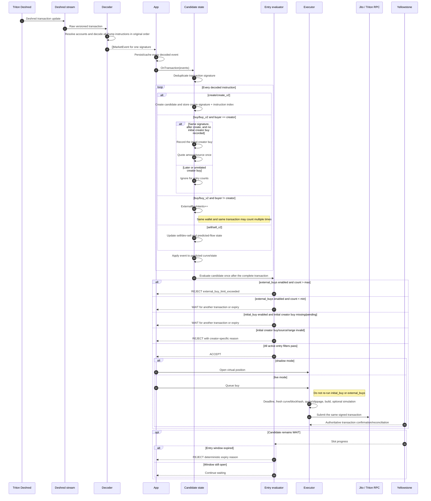

---
categories:
  - "[[Home]]"
created: 2026-07-22
domain: []
tags:
  - tech/tokens
  - topic/trading
  - topic/pump-fun
---

## Notes# Deshred transaction-batch entry sequence

## Classification rules

- `initial creator buy`: the first creator `buy/buy_v2` instruction after `create` in the same transaction signature.
- `external buy intent`: every decoded `buy/buy_v2` instruction where `buyer != creator`.
- Later creator buys never count as external and do not alter the initial creator amount.
- Transaction replay is deduplicated by signature; buy/sell events are also deduplicated by signature and instruction index.
- Deshred observations are predictive intents, not proof that the transaction landed.
