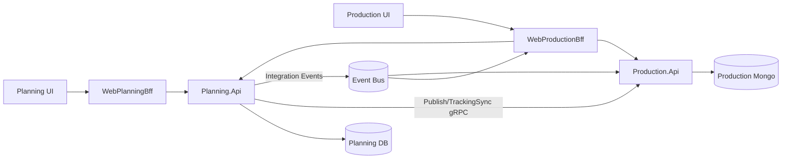
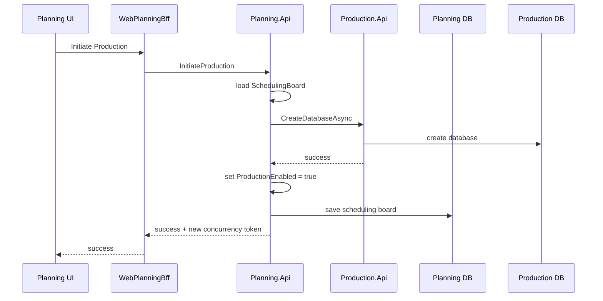
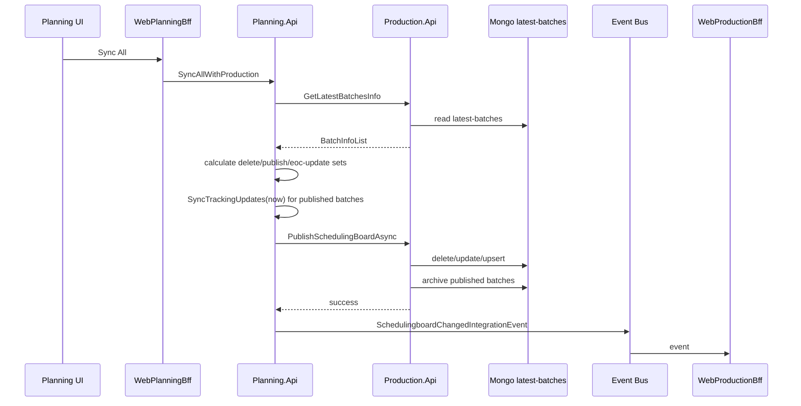
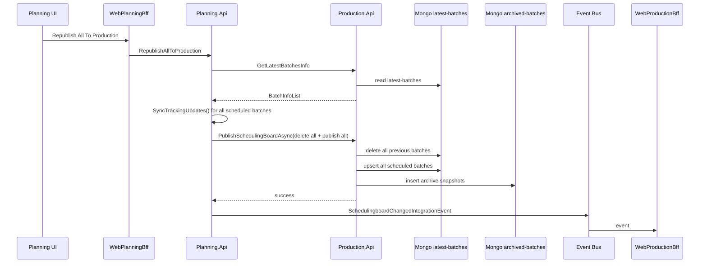
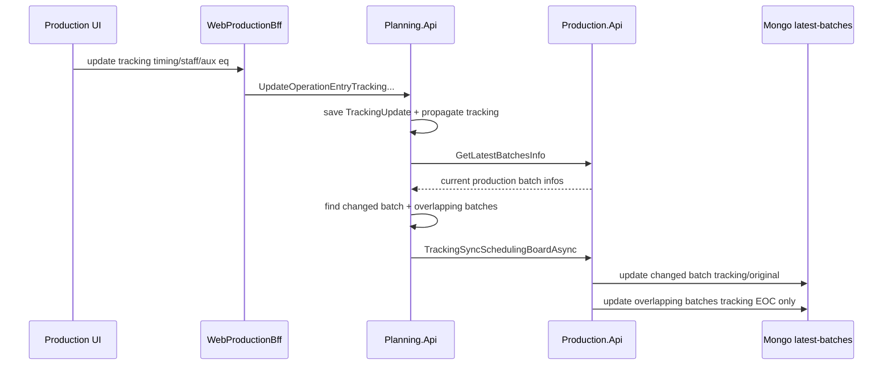
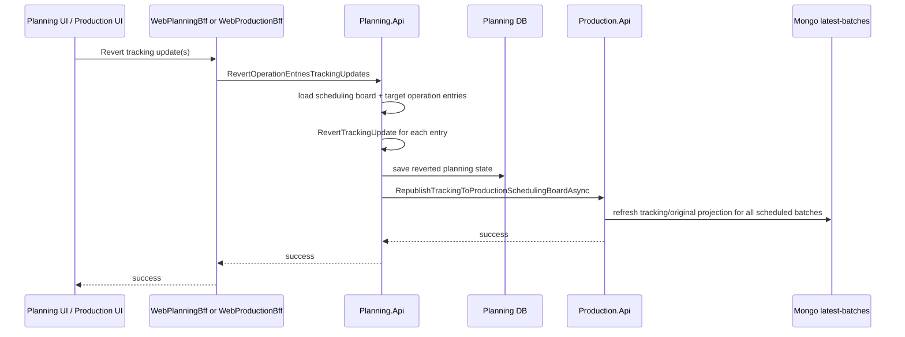
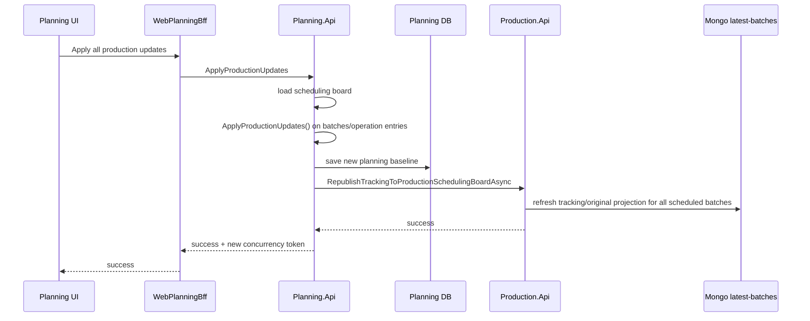
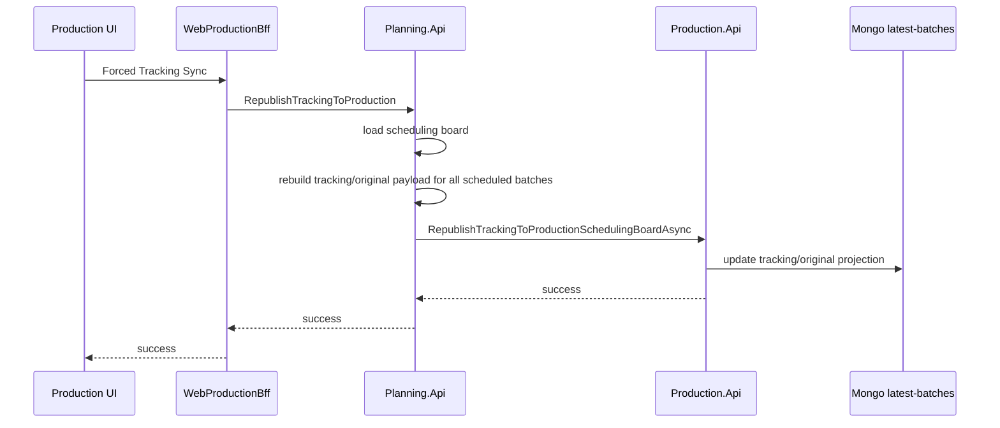
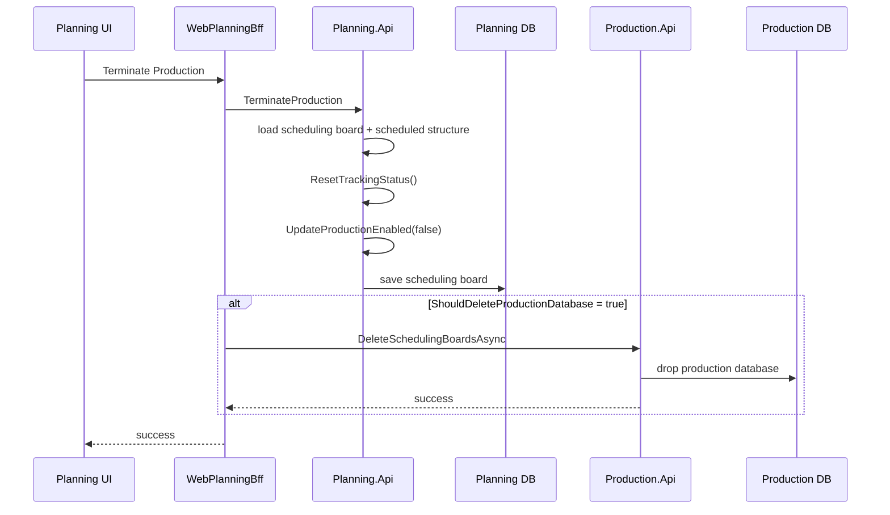

---
categories:
  - "[[Documentation]]"
created: 2026-04-30
product: scpCloud
component:
tags:
  - documentation/intelligen
  - topic/business-logic
---

# Batch Sync Business Logic Analysis
## Scope

Αυτό το note χαρτογραφεί το business logic του sync των `batches` ανάμεσα σε:
- `Planning` ως source of truth για scheduling + tracking state
- `Production` ως read-optimized projection για το production UI
- `WebPlanningBff` / `WebProductionBff` ως user entry points
- event bus consumers μόνο όπου όντως επηρεάζουν το lifecycle του sync
Η έμφαση είναι στη ροή και στα invariants, όχι στην πλήρη απογραφή domain classes.
## Navigation

- [Main Entry Points](#main-entry-points)
- [Sync Levels](#sync-levels)
- [Flow 1: Initiate Production](#flow-1-initiate-production)
- [Flow 2: Full Sync All With Production](#flow-2-full-sync-all-with-production)
- [Flow 3: Full Republish All To Production](#flow-3-full-republish-all-to-production)
- [Flow 4: Incremental Tracking Sync After Production Edit](#flow-4-incremental-tracking-sync-after-production-edit)
- [Flow 5: Revert Tracking Updates](#flow-5-revert-tracking-updates)
- [Flow 6: Apply Production Updates Back Into Planning](#flow-6-apply-production-updates-back-into-planning)
- [Flow 7: Forced Tracking Sync From Production UI](#flow-7-forced-tracking-sync-from-production-ui)
- [Flow 8: Terminate Production](#flow-8-terminate-production)
- [Event Consumers That Matter](#event-consumers-that-matter)
- [The Three Timing Views](#the-three-timing-views)
- [Key Files](#key-files)
## Executive Summary

Το σύστημα δεν δουλεύει με συμμετρικό bidirectional replication.
- Το `Planning` είναι το canonical write model.
- Το `Production` κρατά κυρίως Mongo projection (`latest-batches`, `archived-batches`) για γρήγορο read-side rendering.
- Οι αλλαγές tracking που γίνονται από το production UI γράφονται πρώτα στο `Planning`, και μετά ξαναπροβάλλονται πίσω στο `Production`.
- Υπάρχουν 4 διαφορετικά επίπεδα sync:
  - `full publish` από Planning προς Production
  - `full republish` από Planning προς Production
  - `incremental tracking sync` για ένα changed batch και τα overlap-affected batches
  - `full tracking republish` όταν πρέπει να ξαναγραφτεί όλο το tracking/original snapshot στο Production
- Τα integration events δεν είναι ο βασικός μηχανισμός data sync. Χρησιμοποιούνται κυρίως για:
  - live notification προς production clients
  - cleanup όταν διαγράφεται scheduling board / workspace
## High-Level Architecture

## Core Rule Set
- Το `Planning DB` είναι το μοναδικό authoritative state για planning και tracking updates.
- Το `Production Mongo` δεν αποφασίζει. Απλώς προβάλλει snapshots.
- Κάθε production-side user edit περνά από `Planning.Api` handlers, όχι από write handlers του `Production.Api`.
- Το `Production.Api` γράφει κυρίως Mongo documents, όχι domain logic για rescheduling.
- Το sync είναι batch-oriented, όχι operation-entry-oriented, ακόμα κι όταν το trigger είναι ένα μόνο operation entry.
- Τα resource overlap effects αντιμετωπίζονται ως cross-batch concern. Γι’ αυτό ένα τοπικό tracking edit μπορεί να προκαλέσει EOC recalculation και σε άλλα batches.
## Main Entry Points
### Planning-driven sync entry points
- `POST /planning/{workspaceId}/scheduling-board/{id}/sync-all-with-production`
- `POST /planning/{workspaceId}/scheduling-board/{id}/republish-all-to-production`
- `POST /planning/{workspaceId}/scheduling-board/{id}/apply-production-updates`
- `POST /planning/{workspaceId}/scheduling-board/{id}/revert-tracking-updates`
- `POST /planning/{workspaceId}/scheduling-board/{id}/initiate-production`
- `POST /planning/{workspaceId}/scheduling-board/{id}/terminate-production`
### Production-driven tracking entry points
- `POST /workspace/{workspaceId}/scheduling-board/{schedulingBoardId}/operation-entry/{id}/update-tracking-timing`
- `POST /workspace/{workspaceId}/scheduling-board/{schedulingBoardId}/operation-entry/{id}/update-tracking-aux-equipment`
- `POST /workspace/{workspaceId}/scheduling-board/{schedulingBoardId}/operation-entry/{id}/update-tracking-staff`
- `POST /workspace/{workspaceId}/scheduling-board/{schedulingBoardId}/republish-tracking-to-production`
- `POST /workspace/{workspaceId}/scheduling-board/{schedulingBoardId}/operation-entry/{id}/revert-tracking-update`
## Sync Levels

| Level                     | Trigger                                                                                           | Direction                                                               | Payload shape                                                            | Main effect                                     |                        |                                         |                                                             |
| ------------------------- | ------------------------------------------------------------------------------------------------- | ----------------------------------------------------------------------- | ------------------------------------------------------------------------ | ----------------------------------------------- | ---------------------- | --------------------------------------- | ----------------------------------------------------------- |
| Full publish              | [[#Flow 2 Full Sync All With Production\|SyncAllWithProduction]]                                  | Planning -> Production                                                  | delete + publish + EOC-only updates                                      | Aligns production projection to planning diff   |                        |                                         |                                                             |
| Full republish            | [[#Flow 3 Full Republish All To Production\|RepublishAllToProduction]]                            | Planning -> Production                                                  | delete all + publish all scheduled batches                               | Hard reset of projection                        |                        |                                         |                                                             |
| Incremental tracking sync | [[#Flow 4 Incremental tracking sync after production edit\|tracking edit on one operation entry]] | Planning -> Production                                                  | one batch full tracking/original + overlapping batches EOC tracking only | Cheap propagation after direct production edits |                        |                                         |                                                             |
| Full tracking republish   | [[#Flow 6 Apply Production Updates Back Into Planning\| apply/revert/forced tracking sync]] / [[#Flow 5 Revert Tracking Updates\|Flow 5]] / [[#Flow 7 Forced Tracking Sync From Production UI\|Flow 7]]\|                                      | Planning -> Production | all scheduled batches tracking/original | Rebuilds tracking projection after broader tracking changes |
## Flow 1: Initiate Production
### Intent
Ανοίγει production για scheduling board, αλλά δεν στέλνει ακόμη batches.
### Endpoints
- Planning HTTP:
  - `POST /planning/{workspaceId}/scheduling-board/{id}/initiate-production`
- Planning gRPC:
  - `ISchedulingBoardServiceContract.InitiateSchedulingBoardProductionAsync`
- Production gRPC:
  - `IInfrastructureServiceContract.CreateDatabaseAsync`
### Diagram

### Flow
1. Planning UI καλεί `InitiateProduction`.
2. `Planning.Api` καλεί `Production.Infrastructure.CreateDatabaseAsync`.
3. Αν πετύχει, θέτει `SchedulingBoard.ProductionEnabled = true`.
4. Αποθηκεύει concurrency update στο planning DB.
5. Δεν κάνει publish batches από μόνο του.
### Business meaning
- Το initiation είναι environment enablement, όχι data sync.
- Μετά το initiate χρειάζεται explicit publish path για να γεμίσει το `latest-batches`.
## Flow 2: Full Sync All With Production
### Intent
Κάνει selective reconciliation του planning schedule με ό,τι υπάρχει ήδη στο production projection.
### Endpoints
- Planning HTTP:
  - `POST /planning/{workspaceId}/scheduling-board/{id}/sync-all-with-production`
- Planning gRPC:
  - `ISchedulingBoardServiceContract.SyncAllWithProductionAsync`
- Production gRPC:
  - `IBatchServiceContract.GetLatestBatchesInfoAsync`
  - `ISchedulingBoardServiceContract.PublishSchedulingBoardAsync`
### Main handler chain
- `WebPlanningBff -> Planning.Api SyncAllWithProductionCommandHandler`
- `Planning.Api -> Production.Api GetLatestBatchesInfoAsync`
- `Planning.Api SyncService.CalculateBatchActions`
- `Planning.Api SyncService.PublishSchedulingBoardBatchesAsync`
- `Production.Api PublishSchedulingBoardCommandHandler`
### Business logic
1. Το Planning φορτώνει το scheduling board.
2. Ρωτά το Production για sorted info από `latest-batches`.
3. Τρέχει compare algorithm πάνω σε δύο sorted lists:
   - scheduled planning batches
   - production latest batch infos
4. Παράγει τρία sets:
   - `BatchIdsForDelete`
   - `BatchesForPublish`
   - `BatchesForUpdateEocData`
5. Για κάθε batch που θα δημοσιευθεί, κάνει `batch.SyncTrackingUpdates(now)`.
6. Σώζει το planning state.
7. Στέλνει στο Production:
   - batches προς διαγραφή
   - batches προς full upsert
   - batches που χρειάζονται μόνο EOC refresh
8. Αν πετύχει, εκπέμπει `SchedulingboardChangedIntegrationEvent`, το οποίο καταναλώνεται από το `WebProductionBff` και προωθείται στο production UI μέσω SignalR.
### Compare algorithm rules
- Ίδιο `Batch.Id` + διαφορετικό `ConcurrencyToken`:
  - full republish αυτού του batch
- Ίδιο `Batch.Id` + ίδιο token αλλά overlap impact:
  - EOC-only update
- Υπάρχει στο planning αλλά όχι στο production:
  - publish
- Υπάρχει στο production αλλά όχι στο planning:
  - delete
### Why overlap matters
Το overlap δεν αλλάζει απαραίτητα το ίδιο το batch content, αλλά αλλάζει τις resource occupancy charts. Άρα μπορεί να απαιτείται EOC recompute και για batches που δεν είχαν άμεση domain αλλαγή.
### Production-side effect
Το `PublishSchedulingBoardCommandHandler`:
- διαγράφει obsolete docs από `latest-batches`
- κάνει update μόνο στα EOC fields για `BatchesToUpdateEocData`
- κάνει upsert full batch documents στο `latest-batches`
- γράφει published versions στο `archived-batches`
- θέτει `PublishedAt`
### Diagram

## Flow 3: Full Republish All To Production
### Intent
Hard reset του production projection από planning, χωρίς diff-based reconciliation.
### Endpoints
- Planning HTTP:
  - `POST /planning/{workspaceId}/scheduling-board/{id}/republish-all-to-production`
- Planning gRPC:
  - `ISchedulingBoardServiceContract.RepublishAllToProductionAsync`
- Production gRPC:
  - `IBatchServiceContract.GetLatestBatchesInfoAsync`
  - `ISchedulingBoardServiceContract.PublishSchedulingBoardAsync`
### Diagram

### Business logic
1. Φορτώνει scheduling board.
2. Παίρνει όλα τα production batch ids από `latest-batches`.
3. Καλεί `schedulingBoard.SyncTrackingUpdates()`.
4. Στέλνει:
   - `BatchesToDelete = όλα τα current production batch ids`
   - `BatchesToPublish = όλα τα scheduled planning batches`
   - `BatchesToUpdateEocData = []`
5. Αν πετύχει, εκπέμπει `SchedulingboardChangedIntegrationEvent`.
### When it is used
- manual forced sync από planning app
- recovery path όταν το projection θεωρείται ύποπτο ή out-of-sync
## Flow 4: Incremental Tracking Sync After Production Edit
### Intent
Να περάσει μια production-side tracking αλλαγή στο canonical planning model και μετά να ενημερωθεί το production projection μόνο όσο χρειάζεται.
### Endpoints
- Production HTTP:
  - `POST /workspace/{workspaceId}/scheduling-board/{schedulingBoardId}/operation-entry/{id}/update-tracking-timing`
  - `POST /workspace/{workspaceId}/scheduling-board/{schedulingBoardId}/operation-entry/{id}/update-tracking-staff`
  - `POST /workspace/{workspaceId}/scheduling-board/{schedulingBoardId}/operation-entry/{id}/update-tracking-aux-equipment`
- Planning gRPC:
  - `IOperationEntryServiceContract.UpdateOperationEntryTrackingTimingAsync`
  - `IOperationEntryServiceContract.UpdateOperationEntryTrackingStaffAsync`
  - `IOperationEntryServiceContract.UpdateOperationEntryTrackingAuxEquipmentAsync`
- Production gRPC:
  - `IBatchServiceContract.GetLatestBatchesInfoAsync`
  - `ISchedulingBoardServiceContract.TrackingSyncSchedulingBoardAsync`
### User actions that trigger it
- update tracking timing
- update tracking staff
- update tracking auxiliary equipment
### Important architectural point
Το production UI δεν γράφει απευθείας στο `Production.Api` write model.
- `WebProductionBff.OperationEntryController`
- `WebProductionBff.OperationEntryService`
- proxy προς `Planning.Api` operation entry handlers
### Business flow
1. Ο χρήστης αλλάζει tracking info στο production UI.
2. Το request φτάνει σε handler του `Planning.Api`.
3. Ο handler:
   - φορτώνει scheduling board
   - εντοπίζει operation entry
   - ενημερώνει `TrackingUpdate`
   - σώζει αλλαγές στο planning DB
4. Μετά ζητά από το Production τα current `BatchInfoDto`.
5. Καλεί `SyncService.SyncTrackingWithProductionAsync`.
6. Το service:
   - βρίσκει το batch του changed operation entry
   - υπολογίζει planning overlap batches
   - υπολογίζει production overlap batch ids
   - ενώνει τα δύο sets
   - φτιάχνει:
     - ένα full update για το changed batch:
       - `BatchContentsTracking`
       - `EocResourceDataTracking`
       - `BatchContentsOriginal`
       - `EocResourceDataOriginal`
     - EOC tracking updates μόνο για τα overlap-affected batches
7. Το `Production.Api.TrackingSyncSchedulingBoardCommandHandler` ενημερώνει μόνο το `latest-batches`.
### Business meaning
- Το changed batch παίρνει full tracking/original refresh.
- Τα overlap-affected batches δεν ξαναγράφονται ολόκληρα, μόνο το tracking EOC.
- Δεν γράφεται archive snapshot.
- Δεν εκπέμπεται integration event.
### Diagram

## Flow 5: Revert Tracking Updates
Υπάρχουν δύο UX variants με κοινή business ουσία.
- Production UI: revert ενός operation entry
- Planning UI updates tab: revert selected production updates
### Endpoints
- Production HTTP:
  - `POST /workspace/{workspaceId}/scheduling-board/{schedulingBoardId}/operation-entry/{id}/revert-tracking-update`
- Planning HTTP:
  - `POST /planning/{workspaceId}/scheduling-board/{id}/revert-tracking-updates`
- Planning gRPC:
  - `ISchedulingBoardServiceContract.RevertOperationEntriesTrackingUpdatesAsync`
- Production gRPC:
  - `ISchedulingBoardServiceContract.RepublishTrackingToProductionSchedulingBoardAsync`
### Diagram

### Business logic
1. `Planning.Api` φορτώνει scheduling board.
2. Εντοπίζει τα target operation entries.
3. Για κάθε ένα:
   - `batch.RevertTrackingUpdate(operationEntry, schedulingConfiguration)`
4. Σώζει τις αλλαγές.
5. Κάνει `RepublishTrackingToProductionAsync` για όλα τα scheduled batches.
### Why full tracking republish here
Το revert μπορεί να αλλάξει ευρύτερα auto-tracking propagation μέσα στο batch. Άρα επιλέγεται full tracking projection refresh αντί incremental patch.
## Flow 6: Apply Production Updates Back Into Planning
### Intent
Να μετατραπούν production-originated tracking updates σε νέο canonical planning baseline.
### Endpoints
- Planning HTTP:
  - `POST /planning/{workspaceId}/scheduling-board/{id}/production-updates`
  - `POST /planning/{workspaceId}/scheduling-board/{id}/apply-production-updates`
- Planning gRPC:
  - `ISchedulingBoardServiceContract.GetSchedulingBoardProductionUpdates`
  - `ISchedulingBoardServiceContract.ApplyProductionUpdates`
- Production gRPC:
  - `ISchedulingBoardServiceContract.RepublishTrackingToProductionSchedulingBoardAsync`
### Diagram

### Business logic
1. Planning UI ζητά `production updates`.
2. Το `Planning.Api` επιστρέφει operation entries που έχουν:
   - `TrackingUpdate != null`
   - `TrackingUpdateType == Production`
3. Ο χρήστης επιλέγει `Apply all`.
4. `ApplyProductionUpdatesCommandHandler`:
   - φορτώνει scheduling board
   - παίρνει scheduling configuration
   - καλεί `schedulingBoard.ApplyProductionUpdates(...)`
5. Για κάθε batch:
   - βρίσκει operation entries με production update
   - `batch.ApplyTrackingUpdate(...)`
   - μετά `batch.RecalculateAutoTrackingUpdates(...)`
6. Σώζει το νέο planning baseline.
7. Κάνει `RepublishTrackingToProductionAsync` για όλα τα scheduled batches.
### Business meaning
- Με το apply, η tracking κατάσταση παύει να είναι “pending external update”.
- Η planning baseline μετακινείται ώστε να ενσωματώσει την παραγωγική πραγματικότητα.
- Μετά το apply χρειάζεται full tracking republish για να ευθυγραμμιστεί το production projection με το νέο canonical state.
## Flow 7: Forced Tracking Sync From Production UI
### Intent
Manual repair path από production side.
### Endpoints
- Production HTTP:
  - `POST /workspace/{workspaceId}/scheduling-board/{schedulingBoardId}/republish-tracking-to-production`
- Planning gRPC:
  - `ISchedulingBoardServiceContract.RepublishTrackingToProductionAsync`
- Production gRPC:
  - `ISchedulingBoardServiceContract.RepublishTrackingToProductionSchedulingBoardAsync`
### Diagram

### Flow
1. Production UI καλεί `republish-tracking-to-production`.
2. `WebProductionBff` το προωθεί στο `Planning.Api`.
3. Το `Planning.Api` φορτώνει scheduling board.
4. Το `SyncService.RepublishTrackingToProductionAsync`:
   - μαζεύει όλα τα scheduled batches
   - ξαναφτιάχνει `BatchContentsTracking`, `BatchContentsOriginal`
   - ξαναφτιάχνει tracking/original EOC
5. Το `Production.Api.RepublishTrackingToProductionSchedulingBoardCommandHandler` ενημερώνει `latest-batches`.
### Important note
- Δεν γίνεται archive write.
- Δεν εκπέμπεται `SchedulingboardChangedIntegrationEvent`.
## Flow 8: Terminate Production
### Intent
Να κλείσει το production mode και να μη θεωρείται πλέον ότι υπάρχει ενεργό tracking sync lifecycle.
### Endpoints
- Planning HTTP:
  - `POST /planning/{workspaceId}/scheduling-board/{id}/terminate-production`
- Planning gRPC:
  - `ISchedulingBoardServiceContract.TerminateProductionAsync`
- Optional production cleanup path:
  - `ISchedulingBoardServiceContract.DeleteSchedulingBoardsAsync`
  - ή event-driven cleanup μέσω `SchedulingBoardsDeletedIntegrationEvent`
### Diagram

### Flow
1. `TerminateProductionCommandHandler`:
   - φορτώνει scheduling board με batches/procedure entries/operation entries
   - `schedulingBoard.ResetTrackingStatus()`
   - `schedulingBoard.UpdateProductionEnabled(false)`
   - αποθηκεύει
2. Στο `WebPlanningBff`, αν το request έχει `ShouldDeleteProductionDatabase = true`:
   - καλείται production delete path για drop database
### Business meaning
- Το terminate καθαρίζει planning-side tracking sync state.
- Η φυσική παραγωγική projection cleanup είναι ξεχωριστή ενέργεια.
## Event Consumers That Matter
## 1. Production cleanup consumer
- Event: `SchedulingBoardsDeletedIntegrationEvent`
- Consumer: `Production.Api.IntegrationEvents.EventHandlers.SchedulingBoardsDeletedIntegrationEventHandler`
- Effect:
  - μετατρέπει event σε `DeleteSchedulingBoardsCommand`
  - κάνει `DropDatabaseAsync` για κάθε scheduling board id
Αυτό δεν είναι sync batch contents. Είναι lifecycle cleanup.
## 2. Production UI live notification consumer
- Event: `SchedulingboardChangedIntegrationEvent`
- Consumer: `WebProductionBff.IntegrationEvents.EventHandlers.SchedulingboardChangedIntegrationEventHandler`
- Effect:
  - στέλνει SignalR message στην ομάδα `scheduling-board-{id}`
### Important observation
Το event αυτό εκπέμπεται μόνο από:
- `SyncAllWithProduction`
- `RepublishAllToProduction`
Δεν εκπέμπεται από:
- incremental tracking syncs
- `RepublishTrackingToProductionAsync`
- `ApplyProductionUpdates`
- `RevertOperationEntriesTrackingUpdates`
Άρα οι production clients δεν ενημερώνονται live για κάθε projection update path.
## The Three Timing Views
Related note: [timing-info-type-domain.md](/abs/c:/Users/michael/developer/scpCloud/.local/documentation/timing-info-type-domain.md)
Το sync κουβαλάει τρεις διαφορετικές χρονικές “όψεις” του batch:
- `Planning`
  - το τρέχον canonical planning πρόγραμμα
- `Tracking`
  - η τρέχουσα operational πραγματικότητα, μετά από manual ή auto tracking updates
- `Original`
  - snapshot της baseline κατάστασης πριν αποκλίνει το tracking
Business use:
- σύγκριση planned vs tracked
- διατήρηση baseline για apply/revert semantics
- σωστή απεικόνιση tracking/original timing στο production read model
## Overlap Logic Is The Real Heart Of The Sync
Το πιο ουσιαστικό business rule δεν είναι το “αν άλλαξε token”.
Είναι το ότι ένα batch επηρεάζει γειτονικά batches μέσω shared resources.
Γι’ αυτό βλέπουμε δύο overlap checks:
- planning-side overlap με `batch.OverlapsWith` και `batch.TrackingOverlapsWith`
- production-side overlap με `PlanningStart/End` και `TrackingStart/End` από `BatchInfoDto`
Αυτό σημαίνει:
- ένα batch μπορεί να μη χρειάζεται full republish
- αλλά να χρειάζεται EOC refresh επειδή άλλαξε το occupancy picture γύρω του
## Direct Triggers vs Indirect Triggers
### Direct user triggers
- Planning UI:
  - [`Sync All With Production`](#flow-2-full-sync-all-with-production)
  - [`Republish All To Production`](#flow-3-full-republish-all-to-production)
  - [`Apply all` production updates](#flow-6-apply-production-updates-back-into-planning)
  - [`Revert` production updates](#flow-5-revert-tracking-updates)
  - [`Initiate Production`](#flow-1-initiate-production)
  - [`Terminate Production`](#flow-8-terminate-production)
- Production UI:
  - [tracking timing edit](#flow-4-incremental-tracking-sync-after-production-edit)
  - [tracking staff edit](#flow-4-incremental-tracking-sync-after-production-edit)
  - [tracking auxiliary equipment edit](#flow-4-incremental-tracking-sync-after-production-edit)
  - [single-update revert](#flow-5-revert-tracking-updates)
  - [`Forced Tracking Sync`](#flow-7-forced-tracking-sync-from-production-ui)
### Indirect user triggers
- Ο χρήστης αλλάζει planning schedule αλλού στην εφαρμογή:
  - schedule
  - reschedule
  - unschedule
  - resolve conflicts
- Αυτές οι ενέργειες αλλάζουν το canonical planning state αλλά δεν κάνουν αυτόματο publish.
- Το sync έρχεται αργότερα όταν ο χρήστης εκτελέσει explicit publish action.
### Event-driven indirect triggers
- Διαγραφή scheduling board ή workspace στο planning side προκαλεί cleanup στο production side μέσω event consumer.
## What Does Not Automatically Sync
- `InitiateProduction` δεν στέλνει batches.
- `UpdateSchedulingBoardProductionOptions` αλλάζει planning config μόνο.
- `ResetBatchOperationEntriesCompletionStatus` δεν κάνει publish προς production.
- schedule/reschedule/unschedule/resolve flows δεν κάνουν αυτόματο production publish.
## Design Observations
### 1. Planning owns the truth
Ακόμη και το production UI, στην πράξη, είναι write-through client προς το `Planning.Api`.
### 2. Production is mostly a projection store
Το `Production.Api` εφαρμόζει projection updates σε Mongo, όχι rescheduling decisions.
### 3. Archive exists only on full publish paths
- `PublishSchedulingBoardCommandHandler` γράφει και `archived-batches`
- tracking-only sync paths δεν γράφουν archive
### 4. Live refresh coverage is partial
Το SignalR event path καλύπτει full publish flows, όχι όλα τα tracking refresh flows.
### 5. Sync granularity is intentionally mixed
- full snapshot για strong repair paths
- delta patch για cheap operational edits
- EOC-only update όταν το content δεν άλλαξε αλλά άλλαξε το overlap impact
## Practical Mental Model
Αν θέλουμε να σκεφτόμαστε σωστά το σύστημα:
- Το planning app “σχεδιάζει” και “αποφασίζει”.
- Το production app “εκτελεί” αλλά οι execution updates ξαναγράφονται πρώτα στο planning truth.
- Το production Mongo είναι το projection που χρειάζεται το production UI για γρήγορα charts, operations tables και filters.
- Το sync δεν είναι simple copy. Είναι projection rebuild με overlap-aware side effects.
## Key Files
- [SyncService.cs](/abs/c:/Users/michael/developer/scpCloud/Services/Planning/Planning.Api/Services/SyncService.cs)
- [SyncAllWithProductionCommandHandler.cs](/abs/c:/Users/michael/developer/scpCloud/Services/Planning/Planning.Api/Application/Commands/SchedulingBoardCommands/SyncAllWithProductionCommandHandler.cs)
- [RepublishAllToProductionCommandHandler.cs](/abs/c:/Users/michael/developer/scpCloud/Services/Planning/Planning.Api/Application/Commands/SchedulingBoardCommands/RepublishAllToProductionCommandHandler.cs)
- [ApplyProductionUpdatesCommandHandler.cs](/abs/c:/Users/michael/developer/scpCloud/Services/Planning/Planning.Api/Application/Commands/SchedulingBoardCommands/ApplyProductionUpdatesCommandHandler.cs)
- [RevertOperationEntriesTrackingUpdatesCommandHandler.cs](/abs/c:/Users/michael/developer/scpCloud/Services/Planning/Planning.Api/Application/Commands/SchedulingBoardCommands/RevertOperationEntriesTrackingUpdatesCommandHandler.cs)
- [UpdateOperationEntryTrackingTimingCommandHandler.cs](/abs/c:/Users/michael/developer/scpCloud/Services/Planning/Planning.Api/Application/Commands/OperationEntryCommands/UpdateOperationEntryTrackingTimingCommandHandler.cs)
- [UpdateOperationEntryTrackingStaffCommandHandler.cs](/abs/c:/Users/michael/developer/scpCloud/Services/Planning/Planning.Api/Application/Commands/OperationEntryCommands/UpdateOperationEntryTrackingStaffCommandHandler.cs)
- [UpdateOperationEntryTrackingAuxEquipmentCommandHandler.cs](/abs/c:/Users/michael/developer/scpCloud/Services/Planning/Planning.Api/Application/Commands/OperationEntryCommands/UpdateOperationEntryTrackingAuxEquipmentCommandHandler.cs)
- [PublishSchedulingBoardCommandHandler.cs](/abs/c:/Users/michael/developer/scpCloud/Services/Production/Production.Api/Application/Commands/SchedulingBoardCommands/PublishSchedulingBoardCommandHandler.cs)
- [TrackingSyncSchedulingBoardCommandHandler.cs](/abs/c:/Users/michael/developer/scpCloud/Services/Production/Production.Api/Application/Commands/SchedulingBoardCommands/TrackingSyncSchedulingBoardCommandHandler.cs)
- [RepublishTrackingToProductionSchedulingBoardCommandHandler.cs](/abs/c:/Users/michael/developer/scpCloud/Services/Production/Production.Api/Application/Commands/SchedulingBoardCommands/RepublishTrackingToProductionSchedulingBoardCommandHandler.cs)
- [BatchServer.cs](/abs/c:/Users/michael/developer/scpCloud/Services/Production/Production.Api/GrpcServers/BatchServer.cs)
- [SchedulingBoardsDeletedIntegrationEventHandler.cs](/abs/c:/Users/michael/developer/scpCloud/Services/Production/Production.Api/IntegrationEvents/EventHandlers/SchedulingBoardsDeletedIntegrationEventHandler.cs)
- [SchedulingboardChangedIntegrationEventHandler.cs](/abs/c:/Users/michael/developer/scpCloud/ApiGateways/WebProductionBff/IntegrationEvents/EventHandlers/SchedulingboardChangedIntegrationEventHandler.cs)
## Bottom Line
Το sync των batches είναι ουσιαστικά projection orchestration γύρω από ένα canonical planning model.
- Full planning syncs λύνουν structural divergence.
- Incremental tracking syncs λύνουν operational divergence.
- Apply/Revert paths αποφασίζουν αν το production reality θα μείνει external update ή θα ενσωματωθεί στο planning baseline.
- Overlap-aware EOC recomputation είναι το κεντρικό business constraint που εξηγεί γιατί το sync δεν είναι απλό copy ανά batch.
​

## Links
