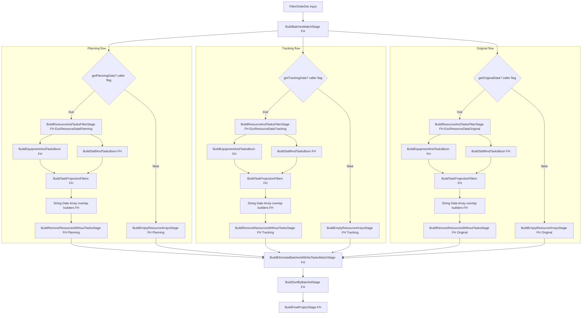
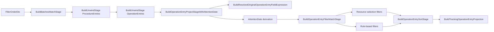

---
categories:
  - "[[Documentation]]"
created: 2026-05-19
product: scpCloud
component:
tags:
  - documentation/intelligen
---
### Production FilterHelpers Mapping
​
Αυτό το αρχείο χαρτογραφεί το `FilterHelpers` και δείχνει:
​
- ποιος το χρησιμοποιεί
- σε ποια ροή καλείται
- ποια public sections ενεργοποιούνται
- ποια private builders συνθέτουν το τελικό Mongo aggregation
​
Source file:
​
- `Services/Production/Production.Api/Helpers/FilterHelpers.cs`
​
Primary callers:
​
- `Services/Production/Production.Api/GrpcServers/SchedulingBoardServer.cs`
- `Services/Production/Production.UnitTests/Api/EOCFilterUnitTests.cs`
- `Services/Production/Production.UnitTests/Api/OperationEntryFilterUnitTests.cs`
​
#### 1. High-Level Usage Map
​
```mermaid
flowchart LR
    A[SchedulingBoardServer] --> B[FilterHelpers]
    T1[EOCFilterUnitTests] --> B
    T2[OperationEntryFilterUnitTests] --> B
​
    B --> C[Batch/EOC pipeline helpers]
    B --> D[OperationEntry pipeline helpers]
    B --> E[Shared private filter builders]
​
    C --> C1[BuildBatchesMatchStage]
    C --> C2[BuildResourceAndTasksFilterStage]
    C --> C3[BuildRemoveResourcesWithoutTasksStage]
    C --> C4[BuildEmptyResourceArraysStage]
    C --> C5[BuildEliminateBatchesWithNoTasksMatchStage]
    C --> C6[BuildSortByBatchIdStage]
    C --> C7[BuildFinalProjectStage]
​
    D --> D1[BuildUnwindStage]
    D --> D2[BuildOperationEntryProjectStageWithAttentionDate]
    D --> D3[BuildOperationEntryFilterMatchStage]
    D --> D4[BuildOperationEntrySortStage]
    D --> D5[BuildTrackingOperationEntryProjection]
​
    E --> E1[String/Integer/Array/Date builders]
    E --> E2[Resource selection builders]
    E --> E3[Projection task builders]
    E --> E4[Original timing resolver]
```
​
#### 2. Who Uses It
​
##### Production runtime
​
`SchedulingBoardServer` είναι ο βασικός production caller.
​
- `GetSchedulingBoardEocDataAsync(...)`
  - χτίζει pipeline για EOC equipment/staff data
  - calls:
    - `BuildBatchesMatchStage`
    - `BuildResourceAndTasksFilterStage`
    - `BuildRemoveResourcesWithoutTasksStage`
    - `BuildEmptyResourceArraysStage`
    - `BuildEliminateBatchesWithNoTasksMatchStage`
    - `BuildSortByBatchIdStage`
    - `BuildFinalProjectStage`
​
- `GetSchedulingBoardOperationEntriesFilteredOrderedAsync(...)`
  - χτίζει flattened pipeline για tracking operation entries
  - calls:
    - `BuildBatchesMatchStage`
    - `BuildUnwindStage`
    - `BuildOperationEntryProjectStageWithAttentionDate`
    - `BuildOperationEntryFilterMatchStage`
    - `BuildOperationEntrySortStage`
    - `BuildTrackingOperationEntryProjection`
​
- `GetSchedulingBoardLaborProfileAsync(...)`
  - χρησιμοποιεί μόνο `BuildUnwindStage`
  - εδώ το helper δεν κάνει filtering logic, μόνο flattening
​
##### Tests
​
- `EOCFilterUnitTests`
  - επαληθεύει τη λογική του EOC/task projection filtering
- `OperationEntryFilterUnitTests`
  - επαληθεύει resource selection, operation-entry filtering και projection των original dates
​
#### 3. Main Runtime Flows
​
##### 3.1 EOC data flow
​

​
Per-mode meaning:
​
- `getPlanningData` controls the full `EocResourceDataPlanning` branch
- `getTrackingData` controls the full `EocResourceDataTracking` branch
- `getOriginalData` controls the full `EocResourceDataOriginal` branch
​
Legend:
​
- `FH` = method/block from `FilterHelpers`
- `caller flag` = decision made in `SchedulingBoardServer` for that mode branch
- `Mode flags from SchedulingBoardServer` = απόφαση που γίνεται στον caller, όχι μέσα στο `FilterHelpers`
​
Τι κάνει πρακτικά:
​
1. Κόβει batches σε root level μόνο με κανόνες που έχουν νόημα σε batch scope.
2. Φιλτράρει μέσα στα `EocResourceData*.Equipment/Staff`.
3. Φιλτράρει μέσα στα tasks κάθε resource.
4. Πετάει resources που έμειναν χωρίς tasks.
5. Πετάει batches που έμειναν χωρίς κανένα resource/task.
6. Κάνει sort και τελικό projection.
​
​
**Από Εντόπισε crash στο EOC data**
​
Στο current flow του [SchedulingBoardServer.cs](C:/Users/michael/developer/scpCloud/Services/Production/Production.Api/GrpcServers/SchedulingBoardServer.cs:90), το pipeline κάνει αυτό:
​
7. `BuildBatchesMatchStage(...)`
   Στο [FilterHelpers.cs](C:/Users/michael/developer/scpCloud/Services/Production/Production.Api/Helpers/FilterHelpers.cs:17) γίνεται ένα πρώτο `$match` σε επίπεδο batch.
   Αυτό:
   - για `CampaignName`, `BatchName`, `CampaignId`, `BatchId` κοιτάει root batch fields
   - για `Task` κάνει overlap check σε `BatchContentsPlanning`, `BatchContentsTracking`, `BatchContentsOriginal` με `OR`, βλ. [FilterHelpers.cs](C:/Users/michael/developer/scpCloud/Services/Production/Production.Api/Helpers/FilterHelpers.cs:1159)
​
2. Μετά, για κάθε enabled type, κάνει resource/task filtering μέσα στο batch
   - `BuildResourceAndTasksFilterStage(...)` στο [FilterHelpers.cs](C:/Users/michael/developer/scpCloud/Services/Production/Production.Api/Helpers/FilterHelpers.cs:54)
   - αυτό φιλτράρει ξεχωριστά `EocResourceDataPlanning`, `EocResourceDataTracking`, `EocResourceDataOriginal`
   - μέσα εκεί κόβει equipment/staff και μετά κόβει και τα task arrays τους, βλ. [FilterHelpers.cs](C:/Users/michael/developer/scpCloud/Services/Production/Production.Api/Helpers/FilterHelpers.cs:608) και [676](C:/Users/michael/developer/scpCloud/Services/Production/Production.Api/Helpers/FilterHelpers.cs:676)
​
3. Μετά πετάει resources χωρίς tasks
   - `BuildRemoveResourcesWithoutTasksStage(...)` στο [FilterHelpers.cs](C:/Users/michael/developer/scpCloud/Services/Production/Production.Api/Helpers/FilterHelpers.cs:65)
​
4. Στο τέλος ξανακάνει batch-level elimination
   - `BuildEliminateBatchesWithNoTasksMatchStage(...)` στο [FilterHelpers.cs](C:/Users/michael/developer/scpCloud/Services/Production/Production.Api/Helpers/FilterHelpers.cs:123)
   - εδώ κρατάει το batch αν έχει έστω ένα non-empty match σε planning ή tracking ή original
​
Άρα η σωστή περιγραφή είναι:
​
- πρώτα γίνεται ένα γενικό batch prefilter
- μετά γίνεται filtering ανά type μέσα στο batch
- και μετά μένουν μόνο τα batches που έχουν ακόμα κάτι matching σε οποιοδήποτε type
​
Δεν κάνει δηλαδή “βρες πρώτα matching batches για planning, για tracking, για original ξεχωριστά και μετά ένωσέ τα”. Κάνει:
- global batch match
- per-type pruning
- final any-type batch keep
​
Και με το τωρινό σου `|| true` στο [SchedulingBoardServer.cs](C:/Users/michael/developer/scpCloud/Services/Production/Production.Api/GrpcServers/SchedulingBoardServer.cs:78), το tracking path τρέχει πάντα.
​
##### 3.2 Operation entries flow
​

​
Τι κάνει πρακτικά:
​
1. Ξεκινά από batch documents.
2. Τα κάνει flatten μέχρι το επίπεδο του operation entry.
3. Προσθέτει derived πεδία:
   - `AttentionDate`
   - `ResolvedOriginalStart`
   - `ResolvedOriginalEnd`
4. Εφαρμόζει:
   - resource selection filter
   - filter rules
5. Κάνει sort.
6. Προβάλει τελικό DTO shape για table/grid χρήση.
​
#### 4. Public API of FilterHelpers
​
##### Batch / EOC scope
​
- `BuildBatchesMatchStage`
  - root `$match` σε batch-level fields
  - αναγνωρίζει μόνο:
    - `CampaignName`
    - `BatchName`
    - `CampaignId`
    - `BatchId`
    - `Task` (overlap πάνω σε planning/tracking/original windows)
  - οτιδήποτε άλλο αγνοείται σε αυτό το stage
​
- `BuildResourceAndTasksFilterStage`
  - φτιάχνει νέο `$addFields`
  - αντικαθιστά:
    - `${resourceDataPath}.Equipment`
    - `${resourceDataPath}.Staff`
  - κάνει filtering και στα resources και στα inner tasks
​
- `BuildRemoveResourcesWithoutTasksStage`
  - αφαιρεί resources που μετά το filtering έχουν άδεια task arrays
​
- `BuildEmptyResourceArraysStage`
  - όταν ένα data mode δεν ζητείται, βάζει κενά arrays για ομοιόμορφο schema
​
- `BuildEliminateBatchesWithNoTasksMatchStage`
  - κρατά μόνο batches που έχουν έστω ένα μη άδειο task array σε planning/tracking/original
​
- `BuildSortByBatchIdStage`
  - sort με `CampaignOrderNumber`, `OrderNumber`
​
- `BuildFinalProjectStage`
  - τελικό `$project`
  - περιλαμβάνει μόνο τα EOC paths που έχουν ζητηθεί
​
##### OperationEntry scope
​
- `BuildUnwindStage`
  - generic helper για `$unwind`
​
- `BuildOperationEntryProjectStageWithAttentionDate`
  - enriches tracking operation entries
  - βγάζει:
    - `ResolvedOriginalStart`
    - `ResolvedOriginalEnd`
    - `AttentionDate`
​
- `BuildOperationEntryFilterMatchStage`
  - συνδυάζει:
    - resource selection conditions
    - rule-based conditions
  - το τελικό `$match` είναι:
    - μόνο resource filter, αν δεν υπάρχουν rules
    - αλλιώς `$and(resourceFilter, ruleFilter)`
​
- `BuildOperationEntrySortStage`
  - μεταφράζει UI columns σε mongo field paths
  - default sort: `AttentionDate ASC`
​
- `BuildTrackingOperationEntryProjection`
  - δίνει το flatten τελικό output του operation entry table
  - περιλαμβάνει και original timing fields
​
#### 5. Internal Sections and How They Work
​
##### A. Resource-selection builders
​
- `BuildOperationEntryEquipmentResourceFilter`
- `BuildOperationEntryStaffResourceFilter`
- `BuildEquipmentAndTasksBson`
- `BuildStaffAndTasksBson`
​
Ρόλος:
​
- μεταφράζουν το `ResourceSelectionDto`
- υποστηρίζουν:
  - `ShowEquipment` / `ShowStaff`
  - mode `allUsed`
  - mode `selected`
​
Σημαντική λεπτομέρεια:
​
- Στο operation-entry flow, το resource filter δουλεύει ως `$or` μεταξύ:
  - main equipment
  - aux equipment
  - staff
​
Αυτό σημαίνει ότι ένα operation entry περνά αν ταιριάζει σε οποιαδήποτε από τις τρεις resource κατηγορίες.
​
##### B. Task projection builder layer
​
- `BuildTaskProjectionFilters`
- `BuildDateProjectionFilter`
- `BuildStringProjectionFilter`
- `BuildArrayProjectionFilter`
- `BuildCompletionStatusProjectionFilter`
- `BuildTaskOverlapProjectionFilter`
- `BuildArrayMultiLevelProjectionFilter`
- `BuildStringMultiLevelProjectionFilter`
- `BuildAttentionCodeMultiLevelProjectionFilter`
​
Ρόλος:
​
- αυτά δεν φιλτράρουν top-level documents
- φιλτράρουν task arrays μέσα σε equipment/staff projections
- χρησιμοποιούνται μόνο στην EOC flow
​
Ιδιαίτερο σημείο:
​
- κάποια φίλτρα ελέγχουν και nested `OpEntryTasks`
- άρα το helper υποστηρίζει cases όπου ένα projected task κουβαλά nested operation-entry detail
​
##### C. Root/rule builders
​
- `BuildStringFilter`
- `BuildIntegerFilter`
- `BuildArrayFilter`
- `BuildDateFilter`
- `BuildTaskOverlapFilter`
- `BuildOperationEntryTaskOverlapFilter`
- `BuildOperationEntryTypesForOperationsFilter`
- `GetRootOperator`
- `ConvertFilterValuesToInt`
​
Ρόλος:
​
- μετατρέπουν UI filter operators σε Mongo conditions
- είναι ο πυρήνας του mapping `FilterRule -> BsonDocument`
​
##### D. Original timing resolver
​
- `BuildResolvedOriginalOperationEntryFieldExpression`
​
Ρόλος:
​
- ξεκινά από tracking procedure / tracking operation entry
- ψάχνει matching procedure στο `BatchContentsOriginal`
- μέσα σε αυτό ψάχνει matching original operation entry
- επιστρέφει το `Start` ή `End` του original operation
​
Άρα:
​
- το original timing στο table projection δεν έρχεται απευθείας από το tracking document
- γίνεται correlation tracking -> original με `_id`
​
#### 6. Column-to-Builder Mapping
​
##### Σε batch root match
​

| Column         | Builder                  | Scope                  |
| -------------- | ------------------------ | ---------------------- |
| `CampaignName` | `BuildStringFilter`      | batch                  |
| `BatchName`    | `BuildStringFilter`      | batch                  |
| `CampaignId`   | `BuildArrayFilter`       | batch                  |
| `BatchId`      | `BuildArrayFilter`       | batch                  |
| `Task`         | `BuildTaskOverlapFilter` | batch contents windows |
​
##### Σε EOC task projection
​

| Column                     | Builder                                              |
| -------------------------- | ---------------------------------------------------- |
| `TaskStart`                | `BuildDateProjectionFilter`                          |
| `TaskEnd`                  | `BuildDateProjectionFilter`                          |
| `OperationEntryType`       | `BuildArrayMultiLevelProjectionFilter`               |
| `Task`                     | `BuildTaskOverlapProjectionFilter`                   |
| `CampaignName`             | `BuildStringProjectionFilter`                        |
| `BatchName`                | `BuildStringProjectionFilter`                        |
| `CampaignId`               | `BuildArrayProjectionFilter`                         |
| `BatchId`                  | `BuildArrayProjectionFilter`                         |
| `ProcedureName`            | `BuildStringProjectionFilter`                        |
| `OperationName`            | `BuildStringMultiLevelProjectionFilter`              |
| `CompletionStatus`         | `BuildCompletionStatusProjectionFilter`              |
| `InferredCompletionStatus` | `BuildCompletionStatusProjectionFilter`              |
| `AttentionDate`            | `BuildDateProjectionFilter`                          |
| `Comment`                  | `BuildStringMultiLevelProjectionFilter`              |
| `AttentionCodeId`          | `BuildAttentionCodeMultiLevelProjectionFilter`       |
| `TaskOriginalStart`        | temporary `BuildDateProjectionFilter` on `StartDate` |
| `TaskOriginalEnd`          | temporary `BuildDateProjectionFilter` on `EndDate`   |
​
##### Σε operation-entry match
​

| Column                     | Builder                                       |
| -------------------------- | --------------------------------------------- |
| `TaskStart`                | `BuildDateFilter`                             |
| `TaskEnd`                  | `BuildDateFilter`                             |
| `OperationEntryType`       | `BuildOperationEntryTypesForOperationsFilter` |
| `Task`                     | `BuildOperationEntryTaskOverlapFilter`        |
| `CampaignName`             | `BuildStringFilter`                           |
| `BatchName`                | `BuildStringFilter`                           |
| `CampaignId`               | `BuildArrayFilter`                            |
| `BatchId`                  | `BuildArrayFilter`                            |
| `ProcedureName`            | `BuildStringFilter`                           |
| `OperationName`            | `BuildStringFilter`                           |
| `CompletionStatus`         | `BuildIntegerFilter`                          |
| `InferredCompletionStatus` | `BuildIntegerFilter`                          |
| `AttentionDate`            | `BuildDateFilter`                             |
| `UpdateType`               | `BuildIntegerFilter`                          |
| `Comment`                  | `BuildStringFilter`                           |
| `AttentionCodeId`          | `BuildArrayFilter`                            |
| `TaskOriginalStart`        | `BuildDateFilter`                             |
| `TaskOriginalEnd`          | `BuildDateFilter`                             |
​
#### 7. Exact Call Sites
​
##### `SchedulingBoardServer`
​
- EOC pipeline:
  - `BuildBatchesMatchStage`: line 90
  - `BuildResourceAndTasksFilterStage`: lines 94, 104, 114
  - `BuildRemoveResourcesWithoutTasksStage`: lines 95, 105, 115
  - `BuildEmptyResourceArraysStage`: lines 99, 109, 119
  - `BuildEliminateBatchesWithNoTasksMatchStage`: line 122
  - `BuildSortByBatchIdStage`: line 124
  - `BuildFinalProjectStage`: line 126
​
- OperationEntry pipeline:
  - `BuildBatchesMatchStage`: line 477
  - `BuildUnwindStage`: lines 480, 481
  - `BuildOperationEntryProjectStageWithAttentionDate`: line 484
  - `BuildOperationEntryFilterMatchStage`: line 487
  - `BuildOperationEntrySortStage`: line 489
  - `BuildTrackingOperationEntryProjection`: line 502
​
- Labor profile:
  - `BuildUnwindStage`: lines 521, 522, 523
​
##### Unit tests
​
- `OperationEntryFilterUnitTests`
  - line 375: `BuildBatchesMatchStage`
  - lines 377-378: `BuildUnwindStage`
  - line 380: `BuildOperationEntryProjectStageWithAttentionDate`
  - line 383: `BuildOperationEntryFilterMatchStage`
  - line 386: `BuildTrackingOperationEntryProjection`
​
- `EOCFilterUnitTests`
  - line 147: `BuildBatchesMatchStage`
  - line 149: `BuildResourceAndTasksFilterStage`
  - line 187: `BuildFinalProjectStage`
​
#### 8. Important Behavioral Notes
​
- Το helper δεν είναι generic query builder για όλο το domain.
  - Είναι πολύ στοχευμένο σε scheduling-board Mongo aggregations.
​
- Υπάρχουν ουσιαστικά δύο διαφορετικά μοντέλα filtering:
  - root document filtering
  - nested projection/task filtering
​
- Το ίδιο `FilterOrderDto` διαβάζεται διαφορετικά ανά flow.
  - Κάποια columns έχουν νόημα σε batch level.
  - Άλλα έχουν νόημα μόνο μετά από unwind ή μέσα σε projected task arrays.
​
- Τα `TaskOriginalStart` / `TaskOriginalEnd` δεν είναι πλήρως συμμετρικά σε όλες τις ροές.
  - Στο operation-entry flow βασίζονται σε resolved original fields.
  - Στο EOC projection flow είναι ακόμη προσωρινό mapping πάνω στα current task dates.
​
- Αν ένα rule column δεν υποστηρίζεται στο EOC task projection flow, πετάγεται `InvalidFilterRuleColumnError`.
- Στο `BuildBatchesMatchStage`, αντίθετα, unsupported columns απλώς δεν παράγουν condition.
​
#### 9. Read This First If You Need To Debug It
​
Αν θέλεις να καταλάβεις γρήγορα το helper, η πιο σωστή σειρά ανάγνωσης είναι:
​
1. `BuildBatchesMatchStage`
2. `BuildResourceAndTasksFilterStage`
3. `BuildTaskProjectionFilters`
4. `BuildOperationEntryFilterMatchStage`
5. `BuildOperationEntryProjectStageWithAttentionDate`
6. `BuildResolvedOriginalOperationEntryFieldExpression`
7. `SchedulingBoardServer.GetSchedulingBoardEocDataAsync`
8. `SchedulingBoardServer.GetSchedulingBoardOperationEntriesFilteredOrderedAsync`
​
#### 10. Core Mental Model
​
Το `FilterHelpers` δεν είναι ένα απλό utility class.
​
Είναι ο μεταφραστής από:
​
- `FilterOrderDto`
- `ResourceSelectionDto`
- UI column names / operators
​
προς:
​
- Mongo `$match`
- Mongo `$filter`
- Mongo `$map`
- Mongo `$project`
- Mongo `$sort`
- Mongo `$unwind`
​
Άρα ο πιο σωστός τρόπος να το σκέφτεσαι είναι:
​
`UI filters + resource selection -> Mongo aggregation pipeline fragments`
​
#### PR 566 Update
​
Validated against branch `task/566-Wrap-original-start-end-into-info-object` on 2026-05-19.
​
What changed for `FilterHelpers`:
​
- Root batch filtering already understands original overlap through `BuildTaskOverlapFilter(rule, "BatchContentsPlanning", "BatchContentsTracking", "BatchContentsOriginal")`.
- Operation-entry projection now resolves original timing by correlating tracking operations to `BatchContentsOriginal` with `_id` matching.
- The operation-entry pipeline uses:
  - `BuildOperationEntryAddResolvedPlanningMembers()`
  - `BuildOperationEntryAddResolvedOriginalMembers()`
  - `BuildTrackingOperationEntryProjection()`
- Table projection fields `OriginalStart`, `OriginalEnd`, and `OriginalDurationMs` now come from resolved original members, not from flattened legacy tracking fields.
- Operation-entry sorting also supports:
  - `TaskOriginalStart -> ResolvedOriginalStart`
  - `TaskOriginalEnd -> ResolvedOriginalEnd`
​
Important correction to the existing mental model:
​
- The EOC task-projection path does not currently support dedicated `TaskOriginalStart` / `TaskOriginalEnd` rule handling inside `BuildTaskProjectionFilters(...)`.
- Supported EOC task rules still map through generic task fields such as `$$task.StartDate`, `$$task.EndDate`, `Task`, `AttentionDate`, `Comment`, and completion-related fields.
- So original-aware filtering is stronger in:
  - root batch overlap matching
  - operation-entry table projection and sorting
- and weaker in:
  - nested EOC task rule filtering
​
Practical implication:
​
- If someone expects original-date-specific filter semantics inside the EOC nested task arrays, the current helper still does not provide that as a first-class rule path.
​

## Links
