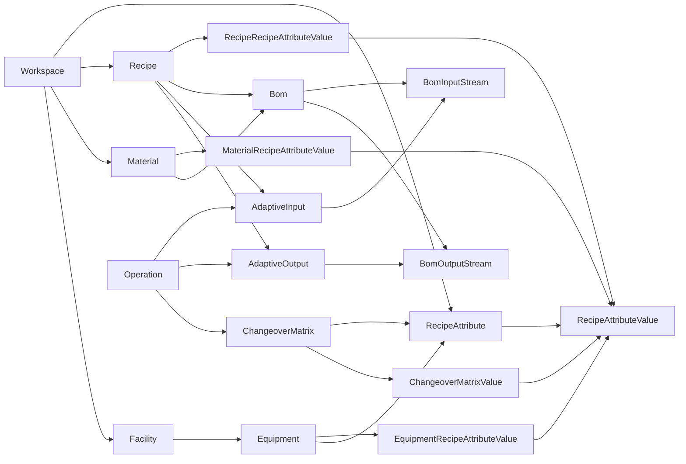
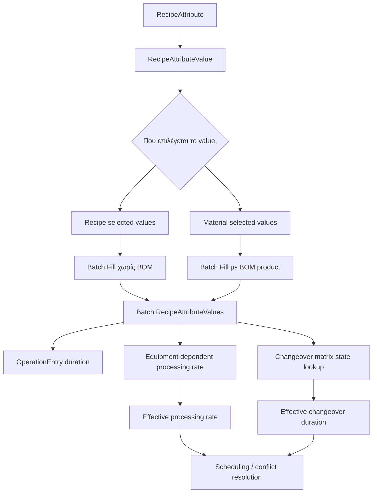
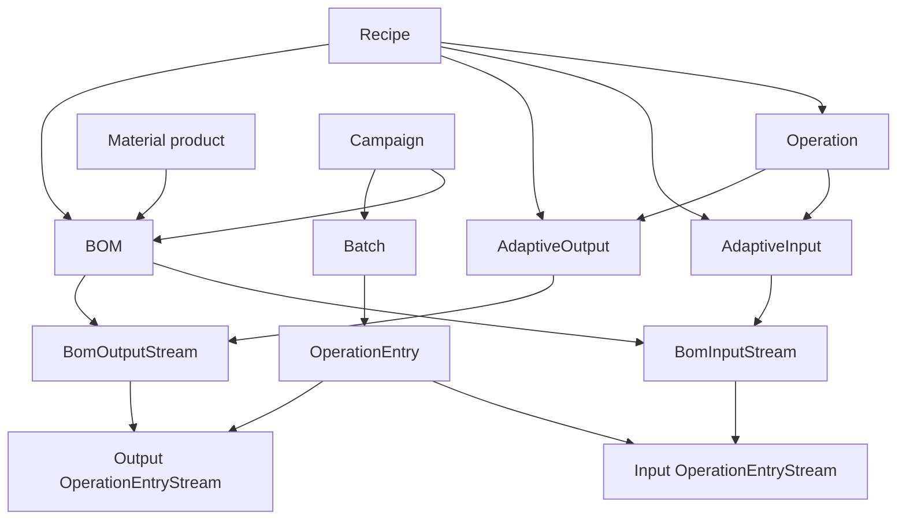
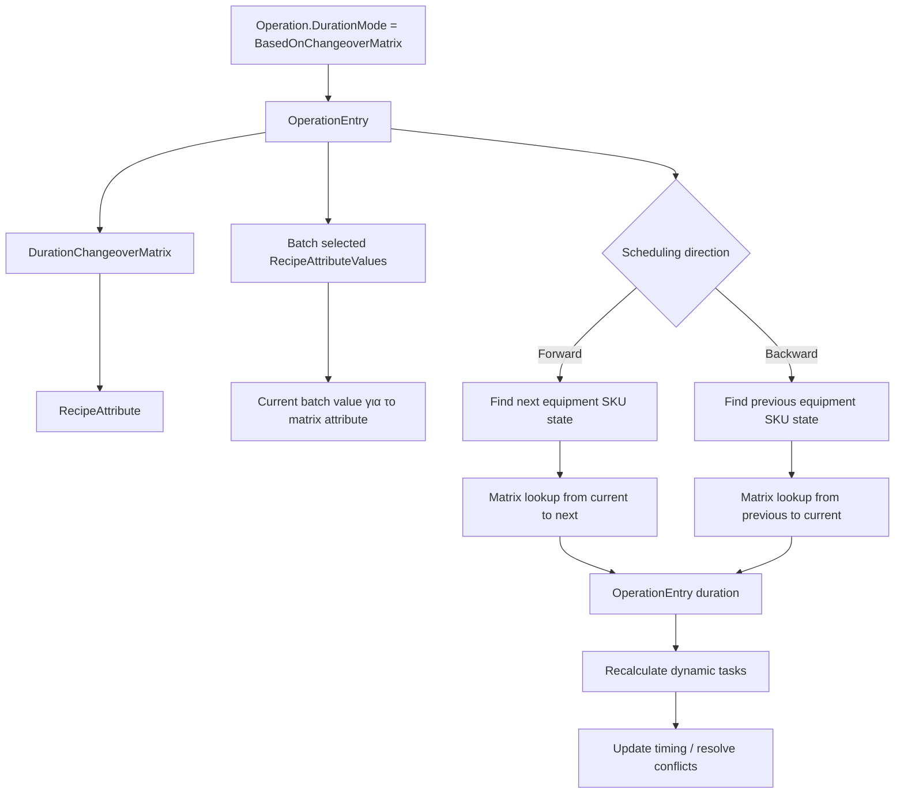
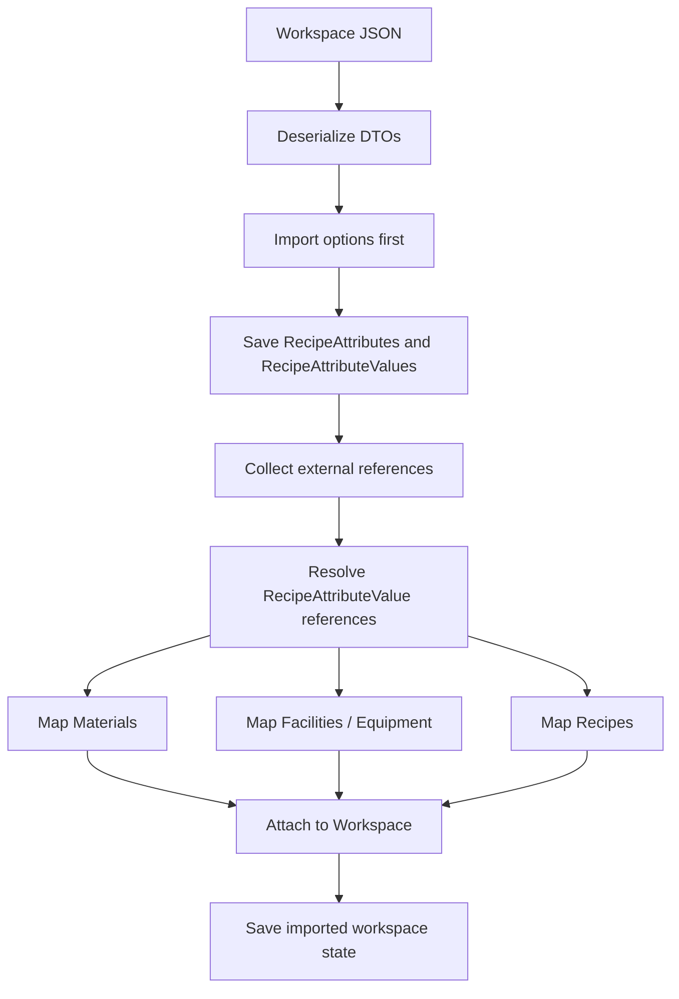

---
categories:
  - "[[Documentation]]"
created: 2026-04-23
product: ScpCloud
component:
tags:
  - documentation/intelligen
  - topic/code
  - topic/business-logic
  - topic/
task: 430
pr: 696
---
## Summary

Scope: `task/430-Implement-SKU-in-material` σε σύγκριση με `master`.

Αυτό το έγγραφο εστιάζει στο domain model, στους business rules, στη συμπεριφορά scheduling, στα import/export semantics, στα persistence mappings και στα application-level commands. Σκόπιμα δεν καλύπτει UI layout/styling λεπτομέρειες, εκτός από σημεία όπου αλλαγές σε UI/API εκθέτουν νέα business flows.

## Εκτελεστική Σύνοψη

Το PR αντικαθιστά το παλιό concept recipe classification/type με recipe attributes και recipe attribute values, και στη συνέχεια χρησιμοποιεί αυτά τα values ως SKU-like state σε recipes, materials, batches, equipment rates και changeover calculations.

Εισάγει επίσης υποστήριξη adaptive recipe/BOM, όπου ένα campaign μπορεί να συσχετιστεί με BOM και τα operation entry streams μπορούν να δημιουργηθούν από BOM stream definitions που είναι συνδεδεμένα με recipe operations.

Το scheduling model επεκτείνεται με dynamic tasks. Τα dynamic tasks πλέον περιλαμβάνουν conditional operations και operations των οποίων το duration βασίζεται σε changeover matrix. Scheduling, conflict detection, conflict resolution και slot search πρέπει πλέον να λαμβάνουν υπόψη durations που μπορούν να αλλάζουν όταν αλλάζει το γειτονικό SKU state.

## Διαγραμματική Αναπαράσταση

Τα παρακάτω Mermaid diagrams αποτυπώνουν το business logic σε διαφορετικά επίπεδα. Δεν είναι πλήρες ERD του database schema. Είναι high-level αναπαράσταση των business flows που εισάγει το PR.

### Domain Overview

### SKU State Propagation

### Adaptive Recipe και BOM Flow

### Changeover Matrix Duration

### Import / Export Reference Resolution

## Εννοιολογική Περιγραφή του Production Model

### Κεντρική Ιδέα

Η βασική ιδέα του νέου μοντέλου είναι ότι το production behavior δεν καθορίζεται πλέον μόνο από το recipe.

Καθορίζεται από συνδυασμό:

- recipe
- resolved product identity
- selected BOM
- equipment-specific attribute behavior
- transition behavior ανάμεσα σε attribute values

Γι' αυτό το PR εισάγει recipe attributes, BOM coupling, adaptive streams, attribute-aware rates και changeover matrices ως συνδεδεμένο σύνολο concepts, όχι ως απομονωμένα features.

### Scope της Περιγραφής

Το παρόν έγγραφο εξηγεί τα κύρια production-model concepts που εισάγονται και χρησιμοποιούνται από την εφαρμογή.

Ο στόχος είναι να περιγράψει πώς δουλεύει το μοντέλο:

- πώς αναπαρίσταται το product identity
- πώς ένα recipe γίνεται product-aware
- πώς συμμετέχουν τα BOMs στο scheduling
- πώς γίνεται resolve το equipment-specific behavior
- πώς υπολογίζονται τα changeovers
- πώς προκύπτει dynamic scheduling behavior από αυτά τα concepts

### Big Picture

Το μοντέλο μετακινείται από προσέγγιση τύπου "ένα recipe κάνει schedule operations" σε πιο explicit προσέγγιση τύπου "recipe plus product context κάνει schedule operations".

Το product context ορίζεται από συνδυασμό:

- recipe attributes και values
- produced material
- BOM που επιλέγεται στο campaign
- equipment-specific rates για συγκεκριμένα attribute values
- changeover behavior ανάμεσα σε διαφορετικά attribute values

Πρακτικά, αυτό σημαίνει ότι το ίδιο recipe μπορεί να συμπεριφερθεί διαφορετικά ανάλογα με το τι παράγει.

### Core Concepts ως Pipeline

Τα βασικά concepts είναι:

1. `RecipeAttribute`
2. `RecipeAttributeValue`
3. `Material`
4. `Bom`
5. `AdaptiveInput` και `AdaptiveOutput`
6. `Campaign`
7. `Batch`
8. `EquipmentRecipeAttributeValue`
9. `ChangeoverMatrix`
10. dynamic `OperationEntry` behavior

Αυτά τα concepts δεν είναι ανεξάρτητα. Σχηματίζουν pipeline από configuration μέχρι scheduling result.

### Recipe Attributes ως Product Dimensions

Ένα `RecipeAttribute` είναι configurable product dimension που επηρεάζει production behavior.

Τυπικά παραδείγματα:

- SKU
- grade
- viscosity class
- product family
- color

Το σημαντικό είναι ότι ένα recipe attribute δεν είναι απλό metadata. Μπορεί να επηρεάζει:

- equipment rates
- changeovers
- batch identity
- stream selection μέσω adaptive recipe logic

Τα recipe attributes είναι workspace-level definitions. Δηλαδή:

- το workspace ορίζει τα διαθέσιμα attributes
- κάθε attribute έχει controlled set of values
- recipes, materials, equipment και changeover rules αναφέρονται σε αυτά τα shared definitions

Χωρίς recipe attributes, το σύστημα μπορεί να αναπαραστήσει ότι υπάρχει ένα recipe, αλλά δεν μπορεί να αναπαραστήσει καθαρά product-specific differences. Τα recipe attributes δίνουν στο μοντέλο κοινό λεξιλόγιο για product variation.

### Recipe Attribute Values ως Contextual Values

Ένα `RecipeAttributeValue` είναι ένα επιτρεπτό value ενός `RecipeAttribute`.

Παραδείγματα:

- attribute `SKU` -> values `A`, `B`, `C`
- attribute `Color` -> values `White`, `Blue`, `Red`

Σημαντικός κανόνας: ένα value ανήκει ακριβώς σε ένα attribute.

Το μοντέλο θεωρεί ότι ένα value έχει νόημα μόνο στο context του parent attribute. Αυτό επιτρέπει στο σύστημα να εκφράζει business rules όπως:

- ένα material έχει `SKU A`
- ένα recipe έχει default `SKU B`
- ένα equipment τρέχει πιο γρήγορα για `SKU C`
- changeover από `SKU A` σε `SKU B` παίρνει 60 λεπτά

### Materials ως Product Identity Carriers

Το `Material` δεν είναι πλέον μόνο passive inventory/catalog entity.

Μπορεί πλέον να κουβαλά recipe attribute values. Αυτό σημαίνει ότι ένα material μπορεί να αναπαριστά συγκεκριμένο produced product configuration.

Πρακτικό παράδειγμα:

- `SKU = A`
- `Color = White`

Τότε το material εκφράζει συγκεκριμένο product identity. Όταν ένα batch χτίζεται από BOM που παράγει αυτό το material, το batch μπορεί να κληρονομήσει αυτά τα attribute values.

Αυτό είναι η γέφυρα ανάμεσα:

- στο product catalog side
- και στο scheduling side

Ο scheduler δεν χρειάζεται πλέον ειδικό one-off shortcut τύπου "campaign material name". Μπορεί να δουλεύει με structured product identity.

### Recipe Defaults

Ένα `Recipe` μπορεί να ορίζει default `RecipeAttributeValue` assignments.

Αυτά τα defaults εκφράζουν το base product context του recipe.

Χρειάζονται επειδή δεν είναι απαραίτητο κάθε scheduled batch να προκύπτει από BOM-driven product material. Μερικές φορές το recipe μόνο του πρέπει να δίνει το product context.

Σε αυτή την περίπτωση:

- το recipe παρέχει τα default attribute values
- το batch χρησιμοποιεί αυτά τα defaults απευθείας

Άρα υπάρχουν δύο πιθανές πηγές product context για ένα batch:

1. από το selected BOM και το product material του
2. από τα recipe defaults, αν δεν υπάρχει BOM override

### BOM ως Runtime Product Choice

Ένα `Bom` αναπαριστά concrete bill of materials για παραγωγή συγκεκριμένου material.

Περιέχει:

- produced product material
- optional recipe association
- input streams
- output streams

Το BOM είναι σημαντικό επειδή είναι η explicit runtime επιλογή του "τι παράγει πραγματικά αυτό το campaign".

Το recipe περιγράφει τη process structure. Το BOM περιγράφει το concrete product instance αυτού του process.

Όταν ένα BOM συσχετίζεται με recipe, αυτό σημαίνει:

- το BOM είναι valid στο context αυτού του recipe
- τα adaptive recipe streams μπορούν να δεθούν με BOM streams
- το campaign μπορεί να χρησιμοποιήσει το BOM με ασφάλεια μαζί με το recipe

Όταν ένα campaign χρησιμοποιεί BOM:

- το batch δείχνει σε αυτό το BOM
- το batch βλέπει το BOM product
- το batch κληρονομεί τα recipe attribute values του product material

Άρα το BOM είναι ο κύριος μηχανισμός που μετατρέπει ένα generic recipe σε product-specific execution.

### Adaptive Inputs και Adaptive Outputs

Σε ένα generic recipe model, τα operation streams είναι fixed. Αυτό είναι πολύ rigid όταν το ίδιο recipe μπορεί να παράγει διαφορετικά προϊόντα ή να χρησιμοποιεί διαφορετικά material mappings ανάλογα με το BOM.

Τα `AdaptiveInput` και `AdaptiveOutput` λύνουν αυτό το πρόβλημα.

Επιτρέπουν σε ένα recipe να ορίζει stream placeholders σε operation level. Αυτά τα placeholders αργότερα συνδέονται με BOM streams.

Δηλαδή:

- το recipe λέει "αυτό το operation καταναλώνει adaptive input"
- το BOM λέει σε ποιο concrete material και amount αντιστοιχεί αυτό το input

Το ίδιο ισχύει και για outputs.

Πρακτικό αποτέλεσμα:

- recipe = process logic
- BOM = material realization αυτού του logic

Το recipe παραμένει reusable και το BOM παρέχει τη συγκεκριμένη material υλοποίηση.

### Campaign ως Scheduling-Level Production Request

Ένα `Campaign` είναι το production request στο scheduling level.

Επιλέγει:

- recipe
- optional BOM
- αριθμό batches
- timing rules

Το BOM πάνω στο campaign είναι σημαντικό επειδή εκεί το σύστημα αποφασίζει το πραγματικό product context για execution.

Αν ένα campaign έχει BOM:

- δεν κάνει απλώς schedule το recipe
- κάνει schedule το recipe για συγκεκριμένο BOM-defined product

Το campaign επίσης κάνει validation κρίσιμων consistency rules πριν το scheduling, όπως:

- πρέπει να υπάρχει recipe
- το selected BOM πρέπει να ταιριάζει με το selected recipe
- reference campaigns που χρησιμοποιούνται για timing πρέπει να είναι ήδη scheduled όταν απαιτείται

### Batch ως Effective Runtime Context

Το `Batch` είναι το σημείο όπου το product context γίνεται operational.

Όταν γίνεται fill ένα batch, κάνει resolve τα effective attribute values του.

Resolution order:

1. αν υπάρχει BOM, χρησιμοποιεί τα attribute values του BOM product material
2. αλλιώς χρησιμοποιεί τα default attribute values του recipe

Από αυτό το σημείο και μετά, το batch έχει concrete product identity.

Αυτό το identity χρησιμοποιείται από:

- operation duration calculations
- equipment-dependent rates
- changeover calculations
- scheduling conflict resolution

Το batch εκθέτει clean list από resolved attribute values. Αυτή η λίστα λειτουργεί ως effective product context για scheduling logic.

### Equipment Rates by Attribute Value

Το βασικό πρόβλημα είναι ότι ένα equipment συχνά δεν επεξεργάζεται όλα τα προϊόντα με την ίδια ταχύτητα.

Χωρίς attribute-aware rates, το μοντέλο μπορεί μόνο να πει:

- αυτό το equipment τρέχει με rate X

Αυτό είναι πολύ coarse.

Η λύση είναι ότι το `Equipment` μπορεί πλέον να ορίζει rates δεμένα σε συγκεκριμένο `RecipeAttribute` και values του.

Αυτό επιτρέπει:

- ένα default equipment rate
- overrides για συγκεκριμένα attribute values

Παράδειγμα:

- default rate = 1000 kg/h
- `SKU A` = 900 kg/h
- `SKU B` = 700 kg/h

Άρα το operation duration στο ίδιο mixer εξαρτάται από το resolved attribute value του batch.

Αυτό επιτρέπει στον scheduler να ξεχωρίζει:

- ίδιο operation
- στο ίδιο equipment
- αλλά για διαφορετικό product

Αυτός είναι ένας από τους κεντρικούς λόγους ύπαρξης του branch.

### Changeover Matrix ως Product Transition Model

Ένα `ChangeoverMatrix` ορίζει το changeover duration ανάμεσα σε δύο values του ίδιου recipe attribute.

Είναι συνδεδεμένο με ένα `RecipeAttribute`.

Παράδειγμα για attribute `SKU`:

- `A -> A = 0`
- `A -> B = 60 min`
- `B -> A = 45 min`
- `null -> A = 0`

Αυτό κάνει explicit τα product-transition costs.

Το σύστημα δεν υποθέτει πλέον ένα ενιαίο constant changeover duration. Μπορεί να πει:

- το changeover εξαρτάται από το τι έτρεχε πριν
- και από το τι θα τρέξει μετά

Ένα matrix μπορεί να είναι symmetrical. Αν είναι symmetrical, τότε:

- `A -> B`
- και `B -> A`

μπορούν να μοιραστούν τον ίδιο κανόνα όταν έχει οριστεί μόνο μία κατεύθυνση.

Το matrix μπορεί επίσης να ορίζει idle-state threshold. Αυτό χρησιμοποιείται για λογική όπως:

- αν το equipment ήταν idle αρκετή ώρα, αντιμετώπισε τη μετάβαση διαφορετικά

Αυτό δίνει πιο ρεαλιστικό changeover behavior.

### Operation Duration Based on Changeover Matrix

Νέο duration mode:

- `BasedOnChangeoverMatrix`

Αυτό σημαίνει ότι το operation duration δεν είναι fixed και δεν είναι καθαρά rate-based. Προκύπτει από changeover context.

Το duration εξαρτάται από:

- το relevant recipe attribute
- την προηγούμενη τιμή
- την επόμενη τιμή
- πιθανώς idle-state rules

Άρα το ίδιο operation entry μπορεί να έχει διαφορετικά durations σε διαφορετικά schedule contexts.

Επειδή το duration εξαρτάται από surrounding schedule state, το operation γίνεται dynamic. Γι' αυτό το branch προσθέτει explicit dynamic task recalculation behavior.

### Dynamic Operations

Ένα `OperationEntry` θεωρείται dynamic όταν η συμπεριφορά του δεν είναι πλήρως static από το recipe definition μόνο.

Τέτοιες περιπτώσεις είναι:

- conditional operations
- changeover-matrix-based durations

Αν ένα operation είναι dynamic, τότε timing shift κάπου αλλού μπορεί να αναγκάσει αυτό το operation να αλλάξει duration ή activation state.

Το scheduling δεν μπορεί να υποθέσει one-time duration calculation. Πρέπει να μπορεί να:

- ξαναϋπολογίσει duration
- κάνει propagate timing ξανά
- επανεξετάσει occupancy και conflicts

### Procedure και Operation Timing Semantics

Επειδή dynamic και non-processing tasks είναι πλέον πιο explicit, το μοντέλο ξεχωρίζει διαφορετικές timing views.

Παραδείγματα:

- start excluding conditional tasks
- start excluding dynamic operations
- end excluding dynamic operations
- end excluding non-processing tasks

Αυτές οι views χρειάζονται γιατί αν χρησιμοποιείται πάντα raw procedure start/end, αναμειγνύονται:

- real processing
- changeovers
- conditional tasks
- post-processing tasks

Αυτό παράγει λάθος slot search και overlap logic.

Οι εναλλακτικές timing views επιτρέπουν στον scheduler να απαντά πιο ακριβείς ερωτήσεις, όπως:

- πότε αρχίζει το actual processing
- πόσο καταλαμβάνει το procedure το equipment εξαιρώντας dynamic changeover behavior
- ποιο είναι το stable core duration του procedure

### Πώς Χρησιμοποιεί το Scheduling Αυτά τα Concepts

Step 1: campaign validation.

- recipe validity
- BOM και recipe consistency
- timing-reference consistency

Step 2: sample batch creation.

Το recipe μπορεί να δημιουργήσει sample batch με τους ίδιους product context κανόνες:

- BOM-driven αν υπάρχει BOM
- recipe-default-driven αλλιώς

Αυτό επιτρέπει πιο ρεαλιστικό cycle-time estimation.

Step 3: batch fill.

Το actual batch:

- κάνει resolve product context
- δημιουργεί procedure entries
- δημιουργεί operation entries
- δένει adaptive operation streams με BOM streams

Step 4: duration resolution.

Τα operation durations προκύπτουν από:

- fixed duration settings
- rate-based settings
- equipment-dependent rates
- changeover matrices

Step 5: conflict resolution.

Όταν ο scheduler ψάχνει equipment slots ή λύνει conflicts, χρησιμοποιεί πιο πλούσια timing semantics.

Μπορεί να λάβει υπόψη:

- dynamic task boundaries
- changeover-induced durations
- equipment-specific product context

Αυτό κάνει το conflict resolution πιο ρεαλιστικό, αλλά και πιο σύνθετο.

### End-to-End Data Flow

Conceptual flow από configuration μέχρι scheduling result:

1. Το workspace ορίζει recipe attributes και values.
2. Ένα recipe ορίζει process structure και μπορεί να ορίσει default attribute values.
3. Ένα material ορίζει concrete product identity μέσω attribute values.
4. Ένα BOM λέει ότι αυτό το recipe instance παράγει αυτό το material και εκθέτει concrete streams.
5. Ένα campaign επιλέγει recipe και προαιρετικά BOM.
6. Ένα batch κάνει resolve τα effective attribute values από το BOM product ή από recipe defaults.
7. Τα operation entries χρησιμοποιούν αυτό το context για streams, durations και equipment-specific rates.
8. Τα changeover operations χρησιμοποιούν matrices για transition durations.
9. Ο scheduler ξαναϋπολογίζει dynamic tasks και λύνει conflicts με βάση το resulting timing model.

### Example Scenario

Simplified configuration:

- Recipe attribute: `SKU`
- Values: `A`, `B`
- Recipe `MixingRecipe`
- Material `ProductA` έχει `SKU = A`
- Material `ProductB` έχει `SKU = B`
- BOM `BomA` παράγει `ProductA`
- BOM `BomB` παράγει `ProductB`
- Equipment `Mixer1`
- default rate = 1000 kg/h
- rate για `SKU A` = 900 kg/h
- rate για `SKU B` = 700 kg/h
- Changeover matrix για `SKU`
- `A -> A = 0`
- `A -> B = 60 min`
- `B -> A = 45 min`
- `B -> B = 0`

Scheduling meaning:

- Αν το Campaign 1 χρησιμοποιεί `MixingRecipe + BomA`, τα batches του κάνουν resolve σε `SKU A`.
- Αν το Campaign 2 χρησιμοποιεί `MixingRecipe + BomB`, τα batches του κάνουν resolve σε `SKU B`.

Συνέπειες:

- το ίδιο mixing operation μπορεί να έχει διαφορετική διάρκεια στο ίδιο equipment
- μετάβαση από Campaign 1 σε Campaign 2 στο ίδιο equipment μπορεί να εισάγει 60-minute changeover
- μετάβαση από Campaign 2 πίσω σε Campaign 1 μπορεί να εισάγει 45-minute changeover

Αυτό είναι το core behavior που προσπαθεί να υποστηρίξει το μοντέλο.

### Design Principles Behind the Model

Recipe is process logic.
Το recipe πρέπει να ορίζει το generic process shape.

BOM is concrete product realization.
Το BOM επιλέγει την πραγματική product embodiment του recipe.

Material carries product identity.
Το material παρέχει τον resolved attribute-value combination που χαρακτηρίζει το produced product.

Batch is the effective runtime context.
Το batch είναι το σημείο όπου το abstract configuration γίνεται concrete scheduling behavior.

Equipment behavior may be product-specific.
Τα rates δεν θεωρούνται globally constant.

Changeovers are transitions, not constants.
Το changeover duration εξαρτάται από product transition context.

### Operational Consequences

Το μοντέλο επιτρέπει:

- ένα recipe να παράγει πολλαπλά SKUs
- equipment rates που διαφέρουν ανά SKU
- ρεαλιστικούς transition times ανάμεσα σε product variants
- adaptive stream mapping μέσω BOMs
- πιο ακριβή schedule simulation για product-specific production

Το tradeoff είναι ότι το scheduling model γίνεται πιο stateful και context-sensitive.

Αυτό είναι intentional.

## Αλλαγές στο Domain Model

### Τα Recipe Attributes Αντικαθιστούν τα Recipe Classifications

Παλιό model που αφαιρείται ή αντικαθίσταται:

- Αφαιρέθηκε το aggregate `RecipeClassification`.
- Αφαιρέθηκε το aggregate `RecipeType`.
- Αφαιρέθηκε το many-to-many link `RecipeRecipeType`.
- Αφαιρέθηκε το `Recipe.RecipeTypes`.
- Αφαιρέθηκε το `Workspace.RecipeClassifications`.
- Το `RecipeError.DuplicateTypeForRecipeClassification` αντικαταστάθηκε από error για recipe attribute/value.

Νέο model που εισάγεται:

- Aggregate `RecipeAttribute`.
- Aggregate `RecipeAttributeValue`.
- Many-to-many link `RecipeRecipeAttributeValue`.
- `Workspace.RecipeAttributes`.
- `Recipe.RecipeAttributeValues`.
- `Workspace.CreateRecipeAttribute(...)`.
- `Recipe.UpdateRecipeAttributeValues(...)`.

Business behavior:

- Ένα recipe μπορεί πλέον να έχει επιλεγμένα `RecipeAttributeValue` entries.
- Ένα recipe δεν μπορεί να έχει πάνω από ένα value για το ίδιο parent `RecipeAttribute`.
- Το `RecipeAttributeValue.RecipeAttributeId` αντιμετωπίζεται ως immutable by design. Το σχόλιο στον κώδικα αναφέρει ότι μετακίνηση value σε άλλο attribute πρέπει να γίνεται με delete και recreate.

Persistence rules:

- Τα `RecipeAttributes` είναι unique με `(WorkspaceId, Name)`.
- Τα `RecipeAttributeValues` είναι unique με `(RecipeAttributeId, Name)`.
- Οι επιλογές recipe-to-attribute-value αποθηκεύονται στο `Recipes_RecipeAttributeValues`.

### Material SKU Attribute Values

Νέο material state:

- `Material.RecipeAttributeValues`.
- `MaterialRecipeAttributeValue`.
- `Material.UpdateAttributeValues(...)`.
- `Material.Boms`.

Business behavior:

- Τα materials μπορούν πλέον να έχουν επιλεγμένα recipe attribute values, κάνοντας πρακτικά τα material SKUs να αναπαριστούν συνδυασμούς όπως `Product=Banana` και `PackSize=200g`.
- Ένα material δεν μπορεί να έχει πολλαπλά values για το ίδιο parent recipe attribute.
- Προστέθηκε το `MaterialError.DuplicateAttributeValueForRecipeAttribute`.

Persistence rules:

- Οι επιλογές material-to-attribute-value αποθηκεύονται στο `Materials_RecipeAttributeValues`.
- Τα references προς `RecipeAttributeValue` χρησιμοποιούν `DeleteBehavior.NoAction`.

### Equipment Attribute-Dependent Rates

Νέο equipment state:

- `Equipment.RecipeAttribute`.
- `Equipment.RecipeAttributeValues`.
- `EquipmentRecipeAttributeValue`.
- `Equipment.GetEquipmentProcessingRate(...)`.

Αλλαγμένο business behavior:

- Το `Equipment.UpdateProcessingRate(...)` μπορεί πλέον να δεχτεί `RecipeAttribute` και per-value `EquipmentRecipeAttributeValue` rows.
- Τα per-value rows μπορούν να κρατούν συγκεκριμένο processing rate και incompatibility flag.
- Τα selected per-value rates πρέπει όλα να ανήκουν στο configured `RecipeAttribute` του equipment.
- Προστέθηκε το `EquipmentError.InconsistentRecipeAttributes`.
- Όταν ένα operation έχει equipment-dependent rate duration, το effective rate μπορεί πλέον να προέρχεται από το selected attribute value του batch αντί από το default processing rate του equipment.

Persistence rules:

- Το Equipment έχει optional FK προς `RecipeAttribute`.
- Τα equipment-to-attribute-value rate rows αποθηκεύονται στο `Equipment_RecipeAttributeValues`.
- Τα references προς `RecipeAttribute` και `RecipeAttributeValue` χρησιμοποιούν `DeleteBehavior.NoAction`.

### Το Batch Αποθηκεύει SKU State

Νέο batch state:

- `Batch.Bom`.
- `Batch.RecipeAttributeValues`.
- `BatchRecipeAttributeValue`.
- `Batch.CleanRecipeAttributeValues`.

Αλλαγμένο business behavior:

- Το `Batch.Fill(...)` πλέον δέχεται και `Recipe` και optional `Bom`.
- Αν δοθεί BOM, το batch κληρονομεί selected attribute values από το `Bom.Product.RecipeAttributeValues`.
- Αν δεν δοθεί BOM, το batch κληρονομεί selected attribute values από το `Recipe.RecipeAttributeValues`.
- Το batch unscheduling καθαρίζει τα stored recipe attribute values.

Dynamic behavior:

- Το `Batch.UpdateDynamicTasks()` ξαναϋπολογίζει dynamic operation-entry durations και κάνει propagate downstream timing αν αλλάξει κάποιο duration.
- Τα `Batch.ActivateOperationEntry(...)` και `Batch.DeactivateOperationEntry(...)` πλέον ενημερώνουν dynamic tasks μέσω του scheduling board όταν υπάρχει διαθέσιμο.

Persistence rules:

- Οι επιλογές batch-to-attribute-value αποθηκεύονται στο `Batch_RecipeAttributeValues`.
- Το `CleanRecipeAttributeValues` αγνοείται από EF.

### BOM και Adaptive Recipe Model

Νέα aggregates/entities:

- `Bom`.
- `BomInputStream`.
- `BomOutputStream`.
- `BomStreamBase`.
- `AdaptiveInput`.
- `AdaptiveOutput`.

Νέο recipe state:

- `Recipe.Boms`.
- `Recipe.AdaptiveInputs`.
- `Recipe.AdaptiveOutputs`.
- `Recipe.CreateAdaptiveInput(...)`.
- `Recipe.CreateAdaptiveOutput(...)`.

Νέο material state:

- `Material.Boms`.

Business behavior:

- Ένα BOM ανήκει σε product material και μπορεί προαιρετικά να συσχετιστεί με recipe.
- Ένα BOM έχει input και output streams.
- Τα BOM streams μπορούν να συνδεθούν με adaptive input/output definitions.
- Το `Bom.AssociateWithRecipe(...)` καθαρίζει υπάρχοντα BOM input/output stream links όταν αλλάζει το associated recipe, επειδή τα προηγούμενα stream links μπορεί να μην είναι πλέον valid.
- Τα `BomInputStream.UpdateAdaptiveInput(...)` και `BomOutputStream.UpdateAdaptiveOutput(...)` απαιτούν το BOM να είναι associated με recipe.
- Τα adaptive input/output links πρέπει να δείχνουν στο ίδιο recipe με το BOM.

Νέα errors:

- `BomStreamError.BomRecipeMissing`.
- `BomStreamError.AdaptiveInputRecipeDifferentRecipe`.
- `BomStreamError.AdaptiveOutputRecipeDifferentRecipe`.
- Προστέθηκε το `MaterialError.MaterialNegativeAmountError` για BOM/material amount validation semantics.

Persistence rules:

- Το `Bom` έχει row-version concurrency.
- Τα BOM names είναι unique με `(ProductId, Name)`.
- Τα `AdaptiveInput` και `AdaptiveOutput` συνδέουν recipe με operation.
- Τα adaptive input/output relationships χρησιμοποιούν `DeleteBehavior.NoAction`.
- Προστέθηκαν query filters για BOM και BOM stream entities.

### Operation Duration και Adaptive Streams

Νέο operation state:

- `Operation.AdaptiveInputs`.
- `Operation.AdaptiveOutputs`.
- `Operation.DurationChangeoverMatrix`.
- `Operation.DurationChangeoverMatrixId`.

Αλλαγμένο business behavior:

- Το `Operation.UpdateDuration(...)` πλέον δέχεται optional `ChangeoverMatrix`.
- Νέο duration mode: `OperationDurationMode.BasedOnChangeoverMatrix`.
- Τα operation entries που δημιουργούνται από operations πλέον αντιγράφουν το `DurationChangeoverMatrix` του operation.
- Όταν ένα batch έχει BOM, τα operation entries μπορούν να δημιουργούν input/output streams από BOM streams που συνδέονται μέσω adaptive input/output definitions.

Operation-entry stream changes:

- Το `OperationEntryStream` μπορεί πλέον να κατασκευαστεί από `BomInputStream` ή `BomOutputStream`.
- Τα BOM-derived operation entry streams κληρονομούν name, storage-unit usage, storage unit, amount, size basis και ένα 100% material ingredient από το BOM stream.

### Operation Entry Dynamic Duration

Νέο operation-entry state και helpers:

- `OperationEntry.IsDynamic`.
- `OperationEntry.IsDurationBasedOnChangeoverMatrix`.
- `OperationEntry.DurationChangeoverMatrix`.
- `OperationEntry.StartChangeoverMatrix`.
- `OperationEntry.EndChangeoverMatrix`.

Αλλαγμένο business behavior:

- Τα dynamic operation entries περιλαμβάνουν conditional entries και entries με `DurationMode == BasedOnChangeoverMatrix`.
- Το `SetDuration(...)` μπορεί πλέον να θέσει όλα τα dynamic operations inactive, αναγκάζοντας duration μηδέν.
- Το equipment-dependent rate duration πλέον βρίσκει το selected `RecipeAttributeValue` του batch για το configured `RecipeAttribute` του equipment και μετά χρησιμοποιεί `Equipment.GetEquipmentProcessingRate(...)`.
- Το changeover-matrix-based duration χρησιμοποιεί το current selected attribute value του batch και το συγκρίνει με το προηγούμενο ή επόμενο equipment state, ανάλογα με την scheduling direction.
- Αν δεν βρεθεί σχετικό equipment/attribute state, το changeover-matrix duration επιστρέφει σε μηδέν.

### Procedure Entry Dynamic Boundaries

Νέες derived τιμές:

- `ProcedureEntry.ChangeoverOperationEntries`.
- `ProcedureEntry.DynamicOperationEntries`.
- `ProcedureEntry.HasDynamicOperationEntries`.
- `ProcedureEntry.StartExcludingDynamicOperations`.
- `ProcedureEntry.EndExcludingDynamicOperations`.

Business behavior:

- Scheduling και conflict resolution μπορούν πλέον να ξεχωρίζουν το core processing span από dynamic operations όπως conditional tasks και changeover-matrix operations.

## Campaign και Scheduling Behavior

### Campaign BOM Association

Νέο campaign state:

- `Campaign.Bom`.
- `Campaign.UpdateBom(...)`.

Αλλαγμένο business behavior:

- Το campaign batch generation πλέον περνάει το selected BOM σε `Recipe.ScheduleSampleBatch(...)` και `Batch.Fill(...)`.
- Το campaign validation πλέον ελέγχει ότι ένα selected BOM ανήκει στο ίδιο recipe με το campaign.
- Το `Campaign.CheckValidationStatus()` επιστρέφει το shared `ValidationStatusDto`.
- Προστέθηκε το `CampaignError.BomRecipeMustMatchCampaignRecipe`.
- Προστέθηκε το `CampaignError.CampaignAlreadyScheduled`.

### Dynamic Task Updates

Νέο scheduling behavior:

- Το `Campaign.UpdateDynamicTasks()` ζητά από όλα τα batches να ξαναϋπολογίσουν dynamic operation durations.
- Το `SchedulingBoard.UpdateDynamicTasks()` ζητά από όλα τα campaigns να ενημερώσουν dynamic tasks και επιστρέφει το πρώτο campaign που άλλαξε.
- Το `SchedulingBoard.ScheduleUtilization` προστέθηκε ως non-persisted property.

### Campaign Attribute State Lookup

Νέο business behavior:

- Το `Campaign.GetCampaignAttributeValueForEquipment(...)` ψάχνει scheduled tasks σε συγκεκριμένο equipment γύρω από συγκεκριμένο time, ώστε να προσδιορίσει το προηγούμενο ή επόμενο SKU state για recipe attribute.
- Λαμβάνει υπόψη main-equipment procedure entries και auxiliary-equipment operation entries.
- Χρησιμοποιεί το `CleanRecipeAttributeValues` του batch για να επιστρέψει το selected value για το requested recipe attribute.
- Υποστηρίζει idle-time limit μέσω `ChangeoverMatrix.ConsiderInIdleStateIfIdleFor` και `UsedIdleLimit`.

### Procedure Duration Calculation

Αλλαγμένη συμπεριφορά:

- Το `Campaign.GetProcedureDurationForEquipment(...)` πλέον παίρνει flag `includeDynamic` αντί για `includeChangeovers`.
- Όταν τα dynamic operations εξαιρούνται, το duration χρησιμοποιεί `StartExcludingDynamicOperations` και `EndExcludingDynamicOperations`.
- Το equipment-dependent rate recalculation εξακολουθεί να προσομοιώνει αλλαγή main equipment, αλλά πλέον σέβεται το dynamic-inclusion mode.

### Scheduling Service και Slot Search

Αλλαγμένο scheduling behavior:

- Το slot search πλέον δέχεται optional start/end changeover matrices και recipe attribute values.
- Το slot search μπορεί να αγνοήσει dynamic interval όταν ελέγχει αν ένα candidate slot είναι feasible.
- Το equipment utilization μπορεί να ξαναϋπολογίσει overlap αφού ενημερωθούν changeover durations. Αν ένα selected slot προκαλεί overlap μετά το dynamic duration recalculation, το search προχωράει και ξαναδοκιμάζει.
- Το conflict resolution πλέον περνάει start/end changeover matrices και batch SKU attribute values στα equipment slot searches.
- Main-equipment reallocation, auxiliary-equipment reallocation, campaign shifting, batch shifting και operation shifting πλέον λαμβάνουν υπόψη dynamic/changeover durations.
- Κάποια conflict-resolution paths αντιμετωπίζουν το changeover-matrix operation duration ως μηδέν κατά το slot search και στη συνέχεια αφήνουν το dynamic recalculation να καθορίσει το effective changeover duration.

Σχετικές service-level αλλαγές:

- Τα `ResourceProfiles`, `ReusablesUse`, `ConsumablesUse`, `InventoryUse` και `InventoryProfile` μετονομάζουν το παλιό concept `campaignToDisregardChangeoversFor` σε `campaignToDisregardPostProcessingFor`.
- Το `ReusablesUse.CanAccommodateUse(...)` μπορεί πλέον να αγνοεί tasks που είναι dynamic και κάνουν overlap με specified interval.

## Changeover Matrix Model

Νέο aggregate:

- `ChangeoverMatrix`.
- `ChangeoverMatrixValue`.

Business behavior:

- Ένα changeover matrix ανήκει σε ένα `RecipeAttribute`.
- Τα matrix values αναπαριστούν transition times από ένα `RecipeAttributeValue` σε άλλο.
- `null` from/to values αναπαριστούν transition από ή προς idle state.
- Duplicate from/to entries στο ίδιο matrix απορρίπτονται.
- Αν είναι enabled το `IsSymmetrical`, μπορούν να ξαναχρησιμοποιηθούν reverse transition values.
- Αν δεν υπάρχει matching matrix value, το changeover time είναι μηδέν.
- Ένα matrix μπορεί να θεωρεί equipment idle state όταν το equipment είναι idle για περισσότερο από `UsedIdleLimit`.

Νέο error:

- `ChangeoverMatrixError.ChangeoverMatrixValueExists`.

Persistence rules:

- Τα changeover matrices είναι unique με `(RecipeAttributeId, Name)`.
- Τα matrix values είναι owned rows στο `ChangeoverMatrix_Values`.
- Τα from/to value FKs χρησιμοποιούν `DeleteBehavior.ClientNoAction`.

## Validation DTO Changes

Αλλαγμένο DTO:

- Το `RecipeValidationStatusDto` μετονομάστηκε/γενικεύτηκε σε `ValidationStatusDto`.

Business impact:

- Recipe validation και campaign validation πλέον χρησιμοποιούν το ίδιο DTO shape.
- Το recipe service contract πλέον επιστρέφει `QueryStatus<ValidationStatusDto>`.

## Application Commands και Business APIs

### Recipe Attribute Commands

Νέα command handlers:

- Create recipe attribute.
- Delete recipe attributes.
- Update recipe attribute identification.
- Update recipe attribute name.

Business behavior:

- Τα recipe attributes δημιουργούνται μέσα στο current workspace.
- Τα updates χρησιμοποιούν concurrency tokens.
- Τα deletes φορτώνουν selected attributes by id και τα αφαιρούν bulk.

### Recipe Attribute Value Commands

Νέα command handlers:

- Create recipe attribute value κάτω από parent recipe attribute.
- Delete recipe attribute values κάτω από parent recipe attribute.
- Update recipe attribute value name.
- Update recipe attribute value description.

Business behavior:

- Τα values δημιουργούνται μόνο κάτω από existing parent `RecipeAttribute`.
- Το value deletion επαληθεύει ότι τα requested child values ανήκουν στο provided parent.
- Τα child value updates χρησιμοποιούν το concurrency token κάθε value.

### gRPC Contracts και Servers

Νέα services:

- `IRecipeAttributeServiceContract`.
- `IRecipeAttributeValueServiceContract`.
- `RecipeAttributeServer`.
- `RecipeAttributeValueServer`.

Αλλαγμένο recipe service:

- Το recipe validation endpoint επιστρέφει `ValidationStatusDto`.
- Τα Recipe DTOs εκθέτουν `RecipeAttributes` ως selected values με parent attribute info αντί για `RecipeClassifications`.

## Import / Export Business Semantics

Αλλαγμένα exported options:

- Τα workspace options πλέον export/import `RecipeAttributes` και nested `RecipeAttributeValues`.
- Recipe classifications/types δεν είναι πλέον μέρος των workspace options.

Αλλαγμένο recipe export/import:

- Το `RecipeExportDto.RecipeTypes` αντικαταστάθηκε από `RecipeExportDto.RecipeAttributeValues`.
- Τα selected recipe values αναπαρίστανται ως strings στο export DTO.
- Το external-reference collection πλέον κάνει resolve recipe attribute values για recipe imports.

Αλλαγμένο material export/import:

- Το `MaterialExportDto` πλέον έχει `AttributeValues`.
- Το material import πλέον συλλέγει external references για material attribute values.
- Το Material export DTO απέκτησε επίσης `CanBeProducedByAdaptiveRecipe`.

Αλλαγμένο facility/equipment export DTO:

- Το `EquipmentExportDto` πλέον έχει `HasRecipeAttributeDependentRate`, `RecipeAttribute` και `RecipeAttributeValues`.

Αλλαγμένο workspace import flow:

- Τα imported options γίνονται mapped πρώτα και μετά αποθηκεύονται, ώστε recipe attributes και values να είναι διαθέσιμα ως external references.
- Τα materials πλέον γίνονται mapped μέσω external-reference collection path πριν από facilities και recipes.

Αλλαγμένα example data:

- Το example generation πλέον δημιουργεί packing/product recipe attributes και SKU-style materials.
- Τα example data πλέον περιλαμβάνουν adaptive recipes, BOMs, adaptive input/output links και changeover matrices.

## Persistence και Migration Changes

Νέα DbSets:

- `RecipeAttributes`.
- `RecipeAttributeValues`.
- `AdaptiveInputs`.
- `AdaptiveOutputs`.
- `Boms`.
- `BomInputStreams`.
- `BomOutputStreams`.
- `ChangeoverMatrices`.

Removed DbSets:

- `RecipeClassifications`.
- `RecipeTypes`.

Νέα ή αλλαγμένα EF configurations:

- `RecipeAttributeAggregateConfig`.
- `RecipeAttributeValueAggregateConfig`.
- `AdaptiveInputOutputAggregateConfig`.
- `BomAggregateConfig`.
- `ChangeoverMatrixConfig`.
- `BatchAggregateConfig` για batch attribute values.
- `RecipeAggregateConfig` πλέον κάνει map recipe attribute values αντί για recipe types.
- `MaterialAggregateConfig` πλέον κάνει map material attribute values.
- `EquipmentAggregateConfig` πλέον κάνει map recipe-attribute-dependent rates.
- `OperationAggregateConfig` πλέον κάνει map duration changeover matrix.
- `SchedulingBoardAggregateConfig` αγνοεί το non-persisted `ScheduleUtilization`.
- `ProcedureEntryAggregateConfig` αγνοεί dynamic/changeover derived collections.

Migration:

- Προσθέτει migration `20260403133318_430-adaptive-recipes-and-changeovers`.
- Ενημερώνει το `PlanningDbContextModelSnapshot`.

## Review-Relevant Gaps που Παρατηρήθηκαν

Αυτά δεν είναι intended domain features, αλλά είναι business-logic risks που εισάγει η τρέχουσα υλοποίηση.

- Τα material attribute values προστέθηκαν σε DTOs και domain state, αλλά το workspace/material export-import αυτή τη στιγμή δεν τα κάνει πλήρες round-trip.
- Τα `RecipeAttributeValue` external references γίνονται keyed μόνο με value name, παρότι το uniqueness είναι `(RecipeAttributeId, Name)`.
- Τα equipment recipe-attribute-dependent rates αναπαρίστανται σε domain/DTOs, αλλά το facility/workspace import/export wiring φαίνεται incomplete.
- Τα deletes για recipe attribute και recipe attribute value βασίζονται στη DB FK συμπεριφορά για in-use checks αντί για explicit business validation.
- Το νέο recipe-attribute list pagination περνάει λάθος sort/filter state shape στο `retrieveEntities`.

### Links