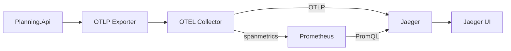
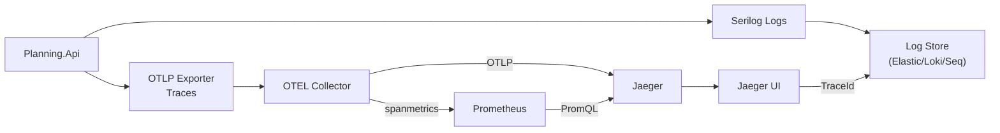
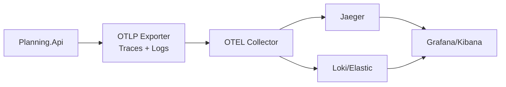
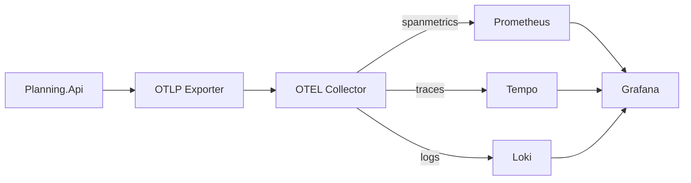

---
categories:
  - "[[Documentation]]"
  - "[[Resources]]"
  - "[[Work]]"
created: 2026-05-26
product: scpCloud
component:
tags:
  - documentation/intelligen
  - topic/telemetry
---
# Telemetry Overview

This document describes the current telemetry setup in this repo and three optional solution paths for logs + traces + metrics.

## Current Setup (as implemented now)

### App instrumentation (telemetry)
- Auto spans for incoming HTTP/gRPC requests via OpenTelemetry AspNetCore instrumentation.
- Custom spans from handlers (e.g., `COMMAND: ...`) via `PlanningApiActivitySource`.
- Custom spans from domain logic (e.g., `SchedulingService: ...`) via `PlanningDomainActivitySource`.
- Export protocol: OTLP (OpenTelemetry Protocol).

### Export path (telemetry)
- App sends OTLP to the OpenTelemetry Collector.
- Collector routes traces to Jaeger.
- Collector generates span-metrics and exposes them for Prometheus.
- Jaeger reads metrics from Prometheus for SPM (Monitor tab).

### Logs (current)
- Existing Serilog pipeline remains unchanged.
- Current sinks: Console; Elasticsearch sink exists but is commented out in `Services/Planning/Planning.Api/Program.cs`.

### Services (separate compose)
Telemetry runs in its own compose file:
- Jaeger (traces + UI)
- OTEL Collector (routing + spanmetrics)
- Prometheus (metrics store for SPM)

### Files in the repo
- `docker-compose.telemetry.yml`
- `observability/otel-collector.yml`
- `observability/prometheus.yml`
- `Services/Planning/Planning.Api/Telemetry/PlanningApiActivitySource.cs`
- `Services/Planning/Planning.Domain/Telemetry/PlanningDomainActivitySource.cs`
- `Services/Planning/Planning.Domain/Services/SchedulingService.cs`
- `Services/Planning/Planning.Api/Startup.cs`

### Endpoints
- Jaeger UI: http://localhost:16686
- Prometheus UI: http://localhost:9090

### Start/stop telemetry stack
Start:
```
docker compose -p telemetry -f docker-compose.telemetry.yml up -d
```
Stop:
```
docker compose -p telemetry -f docker-compose.telemetry.yml down
```

### Data flow (current)


## Proposed Solutions (options)

### Option 1: Correlate logs with traces (Serilog + TraceId)
Best if you want minimal changes and already have Serilog.



Notes:
- Prometheus is required if you want SPM (Monitor tab) in Jaeger.

Notes:
- Add trace/span id enrichment in Serilog so logs can be filtered by trace id.
- No change to telemetry stack required.

### Option 2: Full OTEL for traces + logs
Best if you want unified pipeline via the collector.



Notes:
- App exports logs via OTLP to the collector.
- Collector forwards logs to Loki or Elastic.
- Prometheus + spanmetrics are required if you want Jaeger SPM (Monitor tab).

### Option 3: Grafana stack (metrics + traces + logs)
Best if you want everything in one UI.



Notes:
- Requires adding Tempo and Grafana (and optionally Loki) to telemetry compose.
- Provides a single UI with cross-links between logs, traces, and metrics.
- Monitoring is provided via Prometheus + Grafana (SPM-style metrics).

