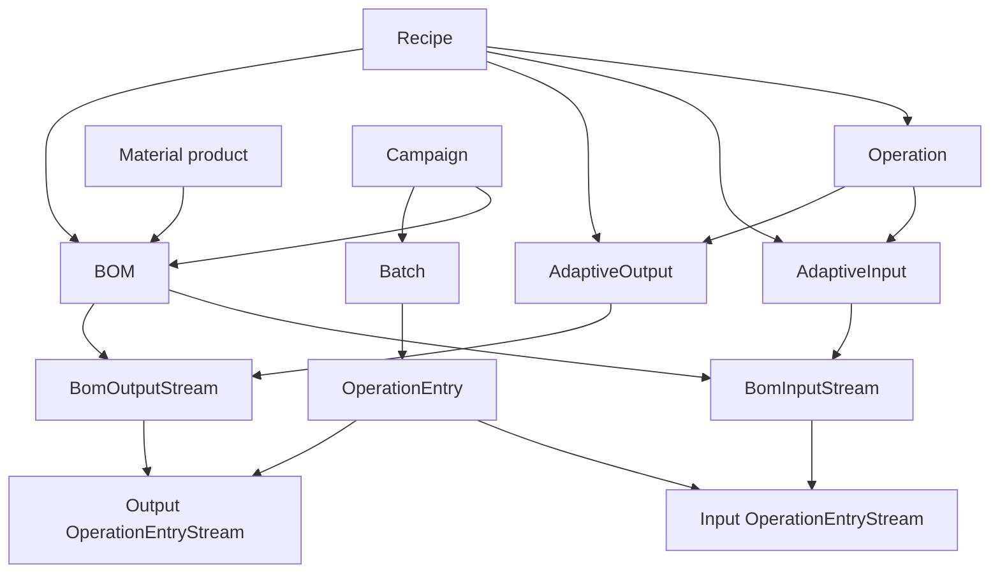

# BOM

## Overview
BOM is the runtime product choice for a campaign. It connects the generic recipe process to a concrete product material and concrete input/output streams.

## Adaptive Recipe and BOM Flow

## Current Behavior
- A BOM belongs to a product material.
- A BOM may be associated with a recipe.
- BOM input/output streams can be linked to adaptive input/output definitions.
- If the associated recipe changes, existing stream links are cleared because previous links may no longer be valid.
- Adaptive links must point to the same recipe as the BOM.

## Business Meaning
- Recipe defines process logic.
- BOM defines concrete material realization.
- Campaign selects the BOM to run the recipe for a specific product.

## Rules
- [[Campaign BOM Recipe Match]]
- [[Batch Product Context Resolution]]

## Related PRs
- [[PR-696 Implement SKU in material]]
