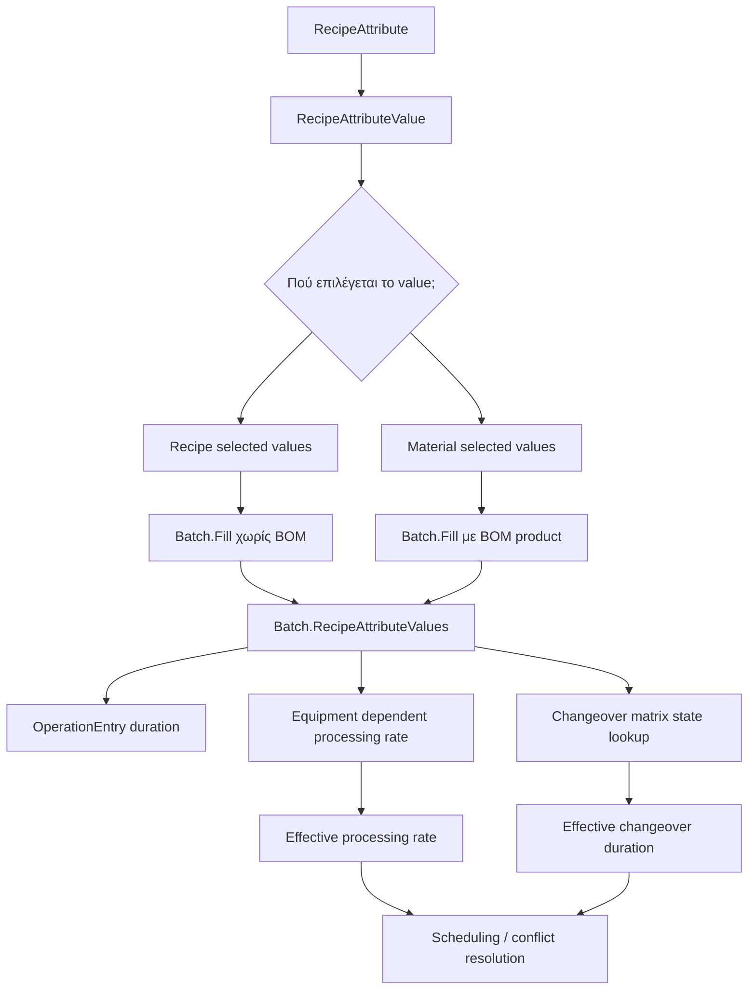

# Campaign Scheduling

## Overview
Scheduling becomes context-sensitive because operation durations may depend on product context and neighboring equipment state.

## SKU State Propagation

## Dynamic Scheduling Behavior
- Dynamic operation entries include conditional entries and changeover-matrix-based duration entries.
- Dynamic tasks can change duration after adjacent schedule state changes.
- Scheduling, conflict detection, conflict resolution and slot search must recalculate dynamic tasks.
- Slot search may initially treat changeover-matrix operation duration as zero, then recalculate the effective duration and retry if overlap appears.

## Important Behaviors
- `Campaign.UpdateDynamicTasks()` updates all batches.
- `SchedulingBoard.UpdateDynamicTasks()` updates campaigns and returns the first campaign that changed.
- `Campaign.GetCampaignAttributeValueForEquipment(...)` looks around a specific equipment/time to find previous or next SKU state.
- Procedure timing can exclude dynamic operations when checking stable processing span.

## Rules
- [[Changeover Matrix Duration]]
- [[Equipment Attribute Rate Resolution]]

## Related PRs
- [[PR-696 Implement SKU in material]]
