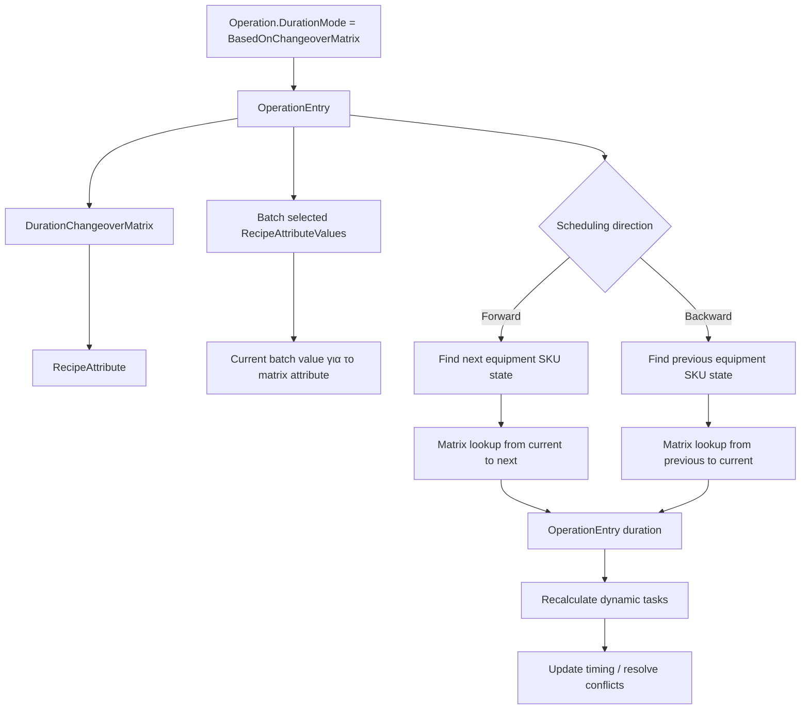

# Changeover Matrix

## Overview
A changeover matrix defines transition duration between values of the same recipe attribute.

## Changeover Matrix Duration

## Current Behavior
- A matrix belongs to one `RecipeAttribute`.
- Matrix values represent transition times from one `RecipeAttributeValue` to another.
- `null` from/to values represent transition from or to idle state.
- Duplicate from/to entries in the same matrix are rejected.
- If `IsSymmetrical` is enabled, reverse transition values may be reused.
- Missing matching matrix value means changeover time is zero.
- Idle-state threshold can change how the transition is evaluated.

## Rule
- [[Changeover Matrix Duration]]

## Related PRs
- [[PR-696 Implement SKU in material]]
