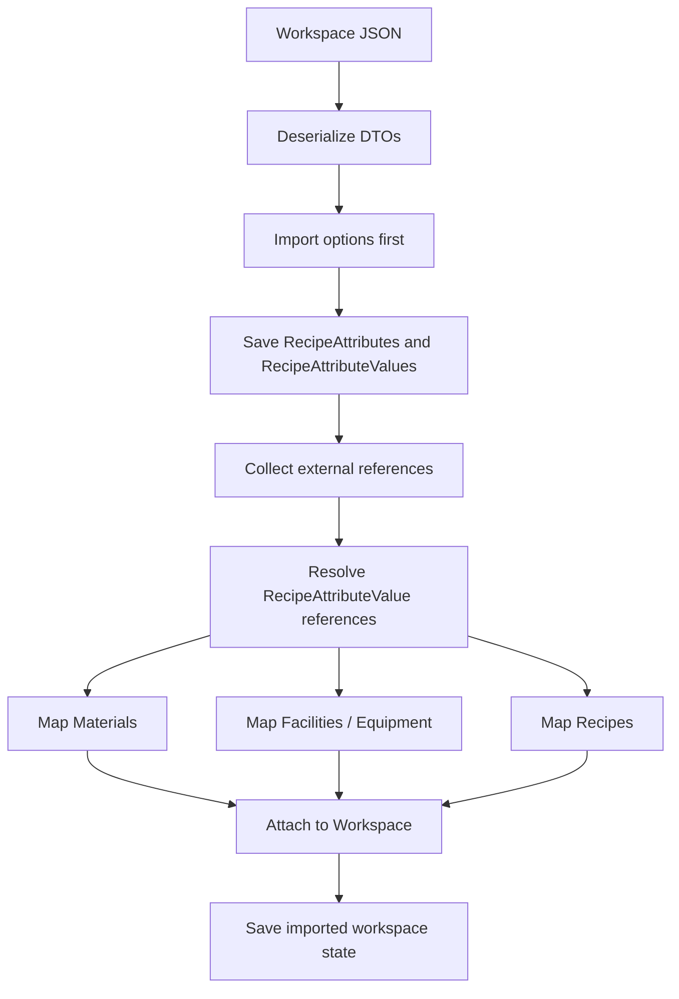

# Import Export Semantics

## Overview
Workspace import/export now needs to preserve recipe attributes, recipe attribute values, material attribute values, equipment attribute-dependent rates, BOMs, adaptive streams and changeover matrices.

## Import / Export Reference Resolution

## Current Behavior
- Workspace options export/import `RecipeAttributes` and nested `RecipeAttributeValues`.
- Recipe classifications/types are no longer part of workspace options.
- Recipe imports now resolve selected recipe attribute values.
- Material imports collect external references for material attribute values.
- Imported options are mapped and saved first so recipe attributes and values are available for later references.
- Materials are mapped through the external-reference collection path before facilities and recipes.

## Risks
- [[Material attribute values import-export round-trip incomplete]]
- [[RecipeAttributeValue external references keyed only by value name]]
- [[Equipment attribute rates import-export wiring incomplete]]

## Related PRs
- [[PR-696 Implement SKU in material]]
