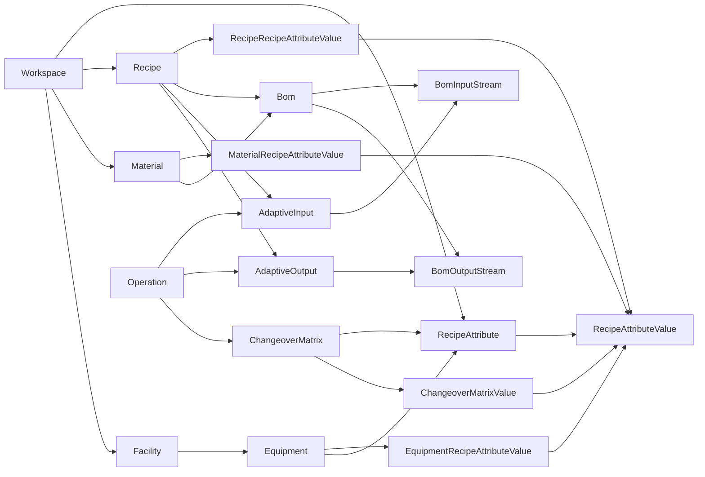
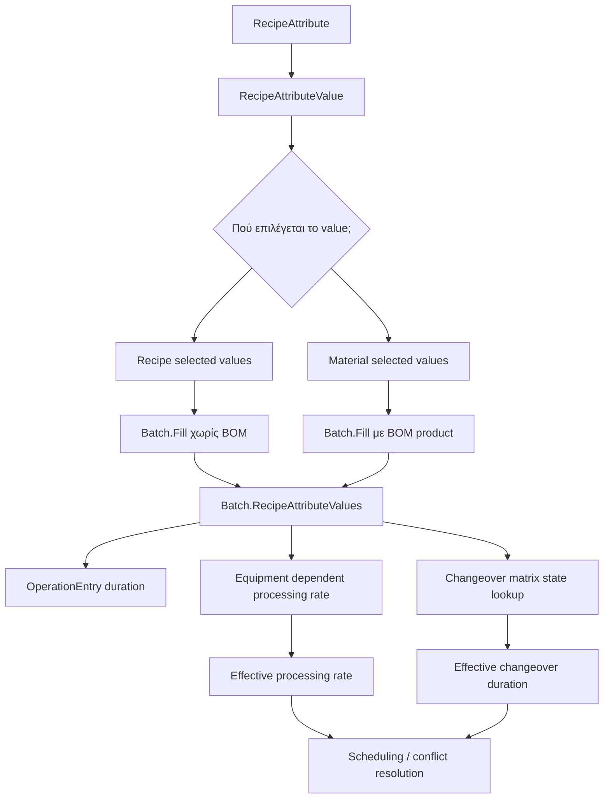

# Production Model

## Overview
Production behavior is no longer defined only by the recipe. It is defined by the combination of:

- recipe
- resolved product identity
- selected BOM
- equipment-specific attribute behavior
- transition behavior between recipe attribute values

The model moves from "one recipe schedules operations" to "recipe plus product context schedules operations".

## Domain Overview

## SKU State Propagation

## Product Context Resolution
A batch resolves effective product context from:

1. BOM product material attribute values, when a BOM exists.
2. Recipe default attribute values, when no BOM exists.

## Core Concepts
- `RecipeAttribute`
- `RecipeAttributeValue`
- `Material`
- `Bom`
- `AdaptiveInput`
- `AdaptiveOutput`
- `Campaign`
- `Batch`
- `EquipmentRecipeAttributeValue`
- `ChangeoverMatrix`
- dynamic `OperationEntry` behavior

## Related PRs
- [[PR-696 Implement SKU in material]]
