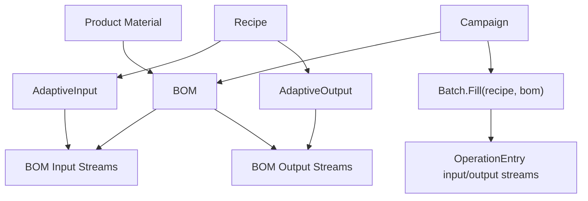

---
categories:
  - "[[Work]]"
  - "[[Documentation]]"
created: 2026-04-26
updated: 2026-04-26
product: scpCloud
component: Planning
tags:
  - documentation/Intelligen
  - topic/domain
---

# Adaptive Recipes and BOMs

## Overview
Adaptive recipes use BOM-specific input and output streams to let the same recipe adapt to different product materials.

## Current Behavior
- `Bom` links a product material to an optional recipe.
- `BomInputStream` and `BomOutputStream` describe BOM-specific stream mappings.
- `AdaptiveInput` and `AdaptiveOutput` connect recipe operations to BOM streams.
- When a batch is filled with a BOM, operation entry streams are built from the BOM streams matching that batch BOM.
- Re-associating a BOM with a different recipe clears existing BOM streams.

## Flow

## Rules
- [[Campaign BOM Must Match Recipe]]

## Risks
- BOM stream mappings are reset when a BOM is associated with another recipe.

## Related PRs
- [[PR-task-430-Implement-SKU-in-material Adaptive Recipes and Recipe Attributes]]
