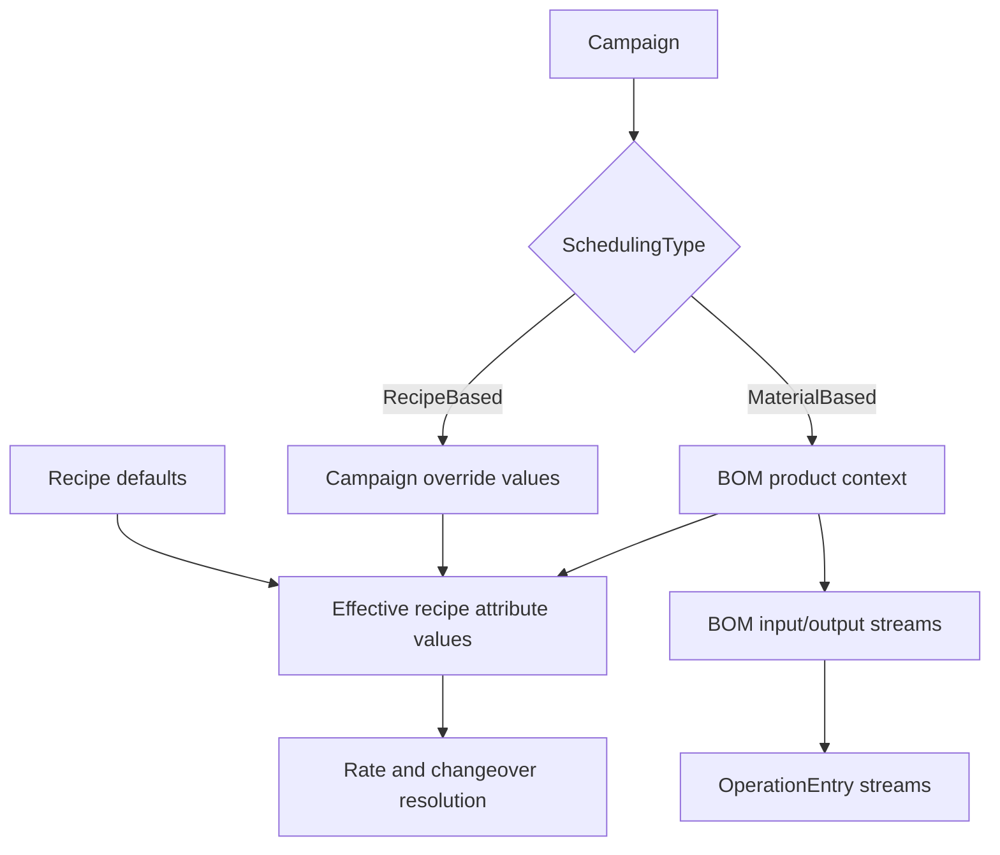

WARN missing: Adaptive remove risks ---
categories:
  - "[[Work]]"
  - "[[Documentation]]"
created: 2026-04-26
updated: 2026-06-18
product: scpCloud
component: Planning
tags:
  - documentation/Intelligen
  - topic/domain
---

# Adaptive Recipes and BOMs

## Overview
Adaptive recipes use BOM-specific input and output streams plus BOM-derived recipe attribute values so the same recipe can adapt to different product materials and product variants.

## Current Behavior
- `Campaign` now selects scheduling semantics through `SchedulingType`.
- `Bom` links a product material to an optional recipe and owns BOM-specific input/output stream mappings.
- `AdaptiveInput` and `AdaptiveOutput` connect recipe operations to BOM streams.
- Campaign.RecipeAttributeValueOverrides hold campaign-scoped overrides for recipe-based scheduling.
- Campaign override persistence is modeled through campaign-owned join rows in Campaign_RecipeAttributeValues, so the earlier dual-signal persistence ambiguity is no longer active on master.
- `Campaign.EffectiveRecipeAttributeValues` resolves the effective scheduling context from campaign overrides or BOM product values, then appends recipe defaults.
- `Batch.Fill(Recipe)` and `Batch.Fill(Bom)` no longer persist batch-local BOM or attribute state; they materialize runtime procedure and operation entries from the campaign inputs.
- In material-based mode, operation entry streams are built from the BOM streams whose adaptive mapping targets the current operation.
- `Campaign.Layout()` validates recipe-based campaigns against recipe validity and material-based campaigns against BOM validity plus BOM recipe validity.

## Flow

## Rules
- [[Campaign BOM Must Match Recipe]]
- [[One Recipe Attribute Value Per Attribute]]

## Risks

## Related PRs
- [[PR-task-430-Implement-SKU-in-material Adaptive Recipes and Recipe Attributes]]
- [[PR-feature-578-Adaptive-recipes-pt.4 Adaptive Recipes Part 4 Review]]
- [[PR-task-584-Improve-batch-scheduling Campaign-Level Batch Scheduling]]
