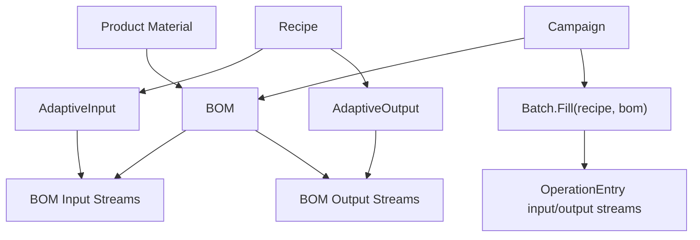

---
categories:
  - "[[Work]]"
  - "[[Documentation]]"
created: 2026-04-26
updated: 2026-06-10
product: scpCloud
component: Planning
tags:
  - documentation/Intelligen
  - topic/domain
---

# Adaptive Recipes and BOMs

## Overview
Adaptive recipes use BOM-specific input and output streams plus BOM-derived recipe attribute values so the same recipe can adapt to different product materials and product variants.

## Current Behavior
- `Bom` links a product material to an optional recipe.
- `BomInputStream` and `BomOutputStream` describe BOM-specific stream mappings.
- `AdaptiveInput` and `AdaptiveOutput` connect recipe operations to BOM streams.
- `Batch.Fill(recipe, bom)` copies recipe attribute values from the BOM product when a BOM is present, otherwise from the recipe itself.
- When a batch is filled with a BOM, operation entry streams are built from the BOM streams matching that batch BOM.
- `Campaign.CheckValidationStatus()` rejects campaigns whose selected BOM belongs to a different recipe than the campaign.
- Re-associating a BOM with a different recipe clears existing BOM streams.

## Flow

## Rules
- [[Campaign BOM Must Match Recipe]]
- [[One Recipe Attribute Value Per Attribute]]

## Risks
- BOM stream mappings are reset when a BOM is associated with another recipe.

## Related PRs
- [[PR-task-430-Implement-SKU-in-material Adaptive Recipes and Recipe Attributes]]
- [[PR-feature-578-Adaptive-recipes-pt.4 Adaptive Recipes Part 4 Review]]
