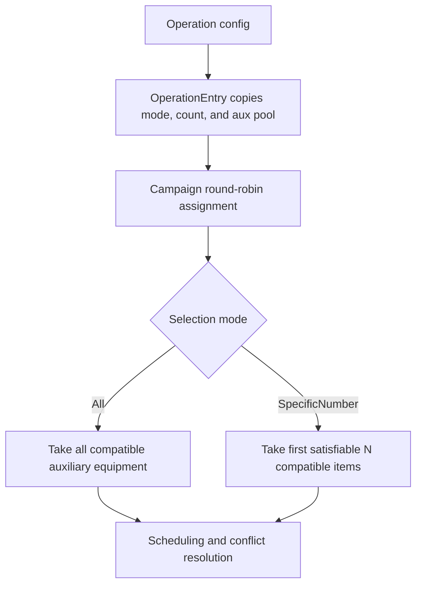

---
categories:
  - "[[Work]]"
  - "[[Documentation]]"
created: 2026-06-03
updated: 2026-06-03
product: scpCloud
component: Planning
tags:
  - documentation/Intelligen
  - topic/domain
---

# Auxiliary Equipment Assignment

## Overview
Auxiliary equipment selection moved from a boolean "use all compatible" switch to a required-count model that travels with operation configuration, scheduling, and board/EOC payloads.

## Current Behavior
- Operation configuration expresses auxiliary requirements as a selection mode (`All` or `SpecificNumber`) plus a required count.
- `OperationEntry` persists required-count metadata together with the auxiliary equipment pool used during scheduling.
- Campaign assignment can select all compatible auxiliary equipment or the first satisfiable `N` compatible items for each operation entry.
- Scheduling and conflict resolution operate on multiple selected auxiliary equipment entries instead of an all-or-nothing auxiliary selection.
- Scheduling board and EOC payloads expose auxiliary selection-mode metadata for consumers.

## Business Meaning
Operations can now model "this step needs exactly N helper resources" instead of only "use one" or "use every compatible resource."

## Flow

## Rules
- [[Required Auxiliary Equipment Count Must Remain Satisfiable]]
- [[Auxiliary Equipment Move Must Identify Source and Destination]]

## Risks
- [[Auxiliary Equipment DTO Required-Count Gaps]]
- [[Auxiliary Equipment Move Contract Is Single-Selection Shaped]]

## Related PRs
- [[PR-feature-568-implement-multiple-aux-equip-assignment Multiple Auxiliary Equipment Assignment]]
