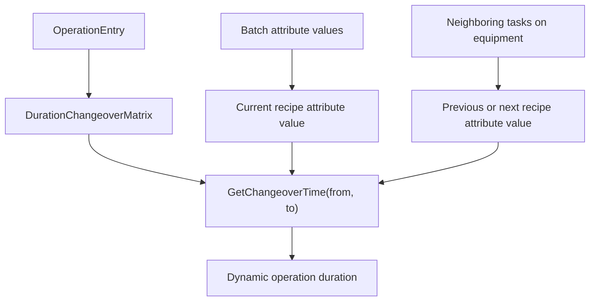

---
categories:
  - "[[Work]]"
  - "[[Documentation]]"
created: 2026-04-26
updated: 2026-06-10
product: scpCloud
component: Planning
tags:
  - documentation/Intelligen
  - topic/domain
---

# Changeover Matrices

## Overview
Changeover matrices define dynamic operation durations based on transitions between recipe attribute values.

## Current Behavior
- A `ChangeoverMatrix` belongs to a `RecipeAttribute`.
- Matrix values define from/to recipe attribute value transitions.
- Null from/to values represent transitions from or to idle state.
- Missing transitions return zero duration.
- Symmetrical matrices can resolve a reverse transition when the direct pair is absent.
- A matrix can optionally treat sufficiently long equipment idle time as an idle-state transition.
- Operations can use `OperationDurationMode.BasedOnChangeoverMatrix`.
- Forward scheduling uses the neighboring next state, while backward scheduling uses the neighboring previous state.
- Neighboring state lookup can scan other campaign tasks on the same equipment and read the corresponding batch recipe attribute value through `Campaign.GetCampaignAttributeValueForEquipment(...)`.

## Flow

## Rules
- [[Missing Changeover Matrix Value Means Zero Duration]]

## Risks
- [[Dynamic Scheduling Regression Surface]]

## Related PRs
- [[PR-task-430-Implement-SKU-in-material Adaptive Recipes and Recipe Attributes]]
- [[PR-feature-578-Adaptive-recipes-pt.4 Adaptive Recipes Part 4 Review]]
