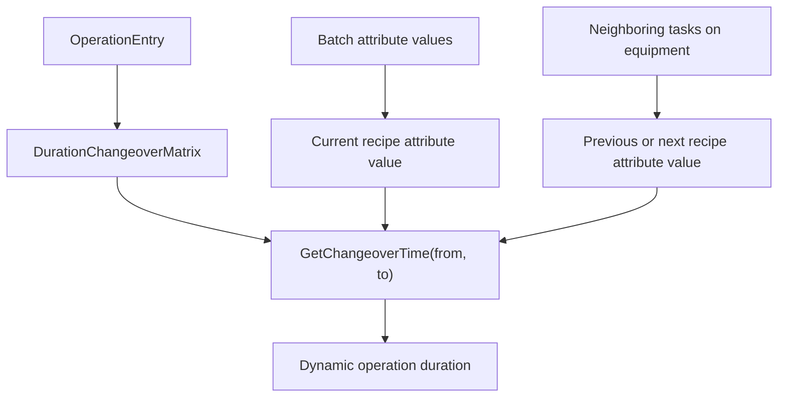

---
categories:
  - "[[Work]]"
  - "[[Documentation]]"
created: 2026-04-26
updated: 2026-04-26
product: scpCloud
component: Planning
tags:
  - documentation/Intelligen
  - topic/domain
---

# Changeover Matrices

## Overview
Changeover matrices define dynamic operation durations based on transitions between recipe attribute values.

## Current Behavior
- A `ChangeoverMatrix` belongs to a `RecipeAttribute`.
- Matrix values define from/to recipe attribute value transitions.
- Null from/to values represent transitions from or to idle state.
- Missing transitions return zero duration.
- Symmetrical matrices can resolve a reverse transition when the direct pair is absent.
- Operations can use `OperationDurationMode.BasedOnChangeoverMatrix`.

## Flow

## Rules
- [[Missing Changeover Matrix Value Means Zero Duration]]

## Risks
- [[Dynamic Scheduling Regression Surface]]

## Related PRs
- [[PR-task-430-Implement-SKU-in-material Adaptive Recipes and Recipe Attributes]]
