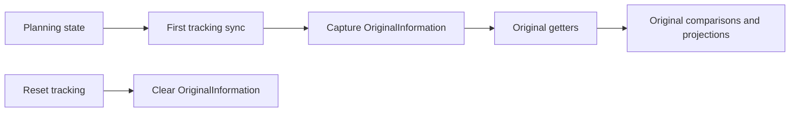

---
categories:
  - "[[Work]]"
  - "[[Documentation]]"
created: 2026-05-19
updated: 2026-05-19
product: scpCloud
component: Planning
tags:
  - documentation/Intelligen
  - topic/domain
---

# Original Baseline Snapshot

## Overview
Planning now persists the original baseline for an operation as an immutable snapshot object instead of separate original timing columns.

## Current Behavior
- `OperationEntry` captures `OriginalInformation` on the first tracking sync before tracking edits continue.
- The snapshot stores original timing plus original auxiliary equipment and staff assignments.
- `OriginalStart`, `OriginalDuration`, `OriginalEnd`, `OriginalAuxEquipment`, and `OriginalStaff` read from the snapshot when it exists.
- When no snapshot exists yet, original getters fall back to current planning values instead of returning `null`.
- `ProcedureEntry`, `Batch`, and `Campaign` aggregate original start and end values upward from operation entries.
- Resetting tracking clears the snapshot together with tracking state.

## Business Meaning
The original baseline becomes a durable point-in-time record of the plan that users can compare against later tracking changes without the baseline drifting over time.

## Rules
- [[First Tracking Sync Captures Immutable Original Snapshot]]
- [[TimingInfoType Original Is Read Only]]

## Risks
- [[Original Baseline Migration Backfill]]

## Related PRs
- [[PR-task-566-Wrap-original-start-end-into-info-object Original Baseline Snapshot and Production Original Views]]

## Flow

