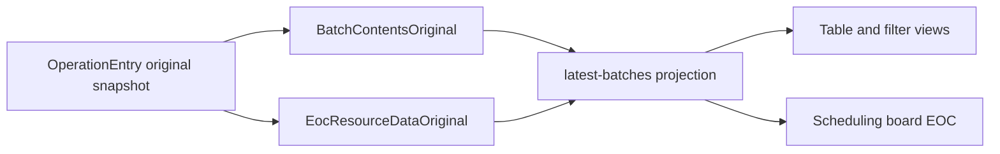

---
categories:
  - "[[Work]]"
  - "[[Documentation]]"
created: 2026-05-19
updated: 2026-06-18
product: scpCloud
component: Production
tags:
  - documentation/Intelligen
  - topic/domain
---

# Production Original Scheduling Views

## Overview
Production projections now store and serve an original branch so tables, filters, and EOC consumers can compare planning, original, and tracking data side by side.

## Current Behavior
- Planning-to-production sync publishes `BatchContentsOriginal` and `EocResourceDataOriginal` in both incremental tracking sync and full republish paths.
- The `latest-batches` projection persists original payloads beside planning and tracking payloads.
- Production filter mapping resolves original operation dates by correlating tracking operations to `BatchContentsOriginal` via `_id`.
- The scheduling board EOC API can return original resource data through EocResourceDataOriginal.
- The CommonSpa update modal now consumes original auxiliary equipment and original staff values when rendering original resource slots.
- Chart merging still uses tracking rows as the anchor, so original data augments tracking rows instead of rendering independently.

## Rules
- [[Production Original Views Are Tracking Anchored]]

## Risks
- [[Original EOC Outages Depend on Tracking Boundaries]]
- [[Original Only Chart Rows Need Independent Merge]]

## Related PRs
- [[PR-task-566-Wrap-original-start-end-into-info-object Original Baseline Snapshot and Production Original Views]]

## Flow

