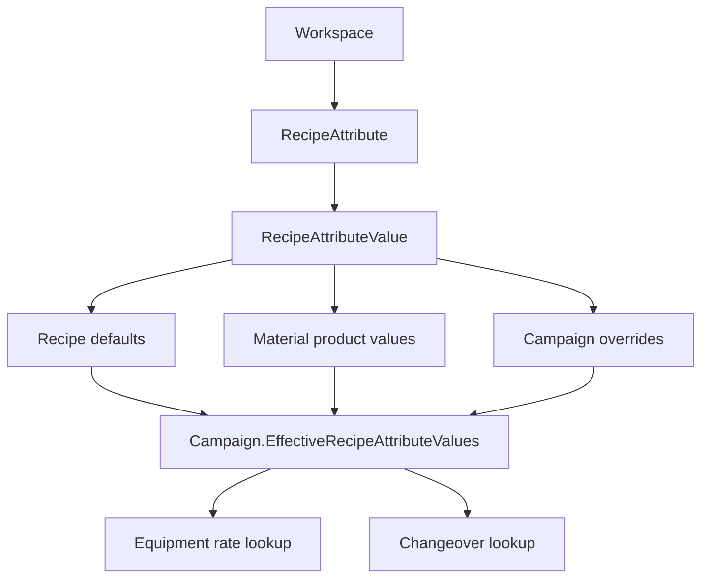

---
categories:
  - "[[Work]]"
  - "[[Documentation]]"
created: 2026-04-26
updated: 2026-06-18
product: scpCloud
component: Planning
tags:
  - documentation/Intelligen
  - topic/domain
---

# Recipe Attributes

## Overview
Recipe attributes are workspace-scoped dimensions whose values can be attached to recipes, materials, campaign scheduling overrides, equipment rates, and changeover matrices. Runtime batches consume effective attribute values through their campaign instead of persisting their own selected set.

## Current Behavior
- `Workspace` owns `RecipeAttributes`.
- `RecipeAttribute` owns `RecipeAttributeValues`.
- `Recipe` and `Material` can each carry selected recipe attribute values.
- Campaign can carry override values and derive EffectiveRecipeAttributeValues.
- Workspace import/export qualifies selected values with both the parent recipe attribute name and the value name.
- Campaign override persistence is modeled through campaign-owned join rows rather than a parallel direct campaign foreign key on recipe attribute values.
- `Equipment` can use a recipe attribute to choose per-value processing rates.
- `ChangeoverMatrix` uses recipe attribute values as transition states.
- `RecipeBased` scheduling resolves effective values from campaign overrides first and recipe defaults second.
- `MaterialBased` scheduling resolves effective values from the BOM product values first and recipe defaults second.
- `ProcedureEntry`, `OperationEntry`, and scheduling conflict resolution read attribute context from `Batch.Campaign.EffectiveRecipeAttributeValues`.

## Business Meaning
This model represents SKU-like or product-context choices that affect how a recipe runs, which material is produced, which equipment rate applies, and how long changeovers take.

## Flow

## Rules
- [[One Recipe Attribute Value Per Attribute]]
- [[Recipe Attribute Value Attribute Is Immutable]]

## Risks
- [[Recipe Classification Data Migration Risk]]

## Related PRs
- [[PR-task-430-Implement-SKU-in-material Adaptive Recipes and Recipe Attributes]]
- [[PR-feature-578-Adaptive-recipes-pt.4 Adaptive Recipes Part 4 Review]]
- [[PR-task-584-Improve-batch-scheduling Campaign-Level Batch Scheduling]]
