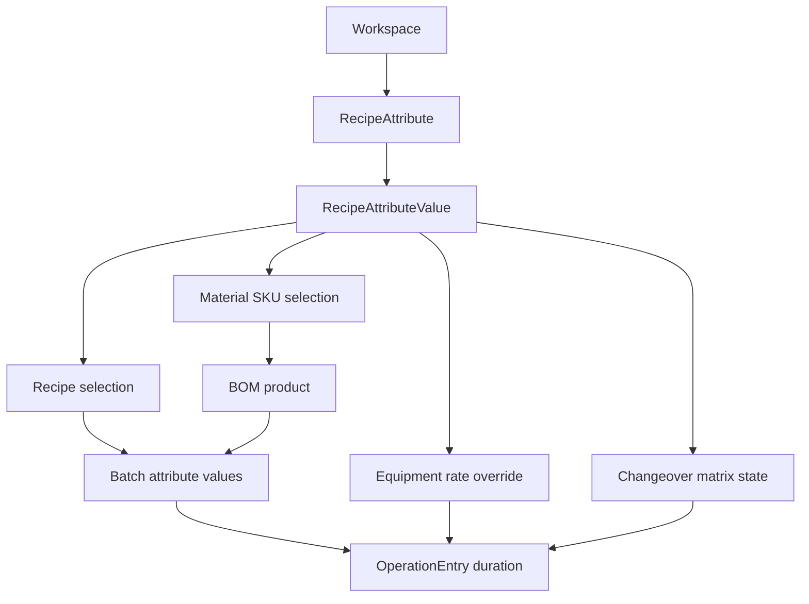

---
categories:
  - "[[Work]]"
  - "[[Documentation]]"
created: 2026-04-26
updated: 2026-04-26
product: scpCloud
component: Planning
tags:
  - documentation/Intelligen
  - topic/domain
---

# Recipe Attributes

## Overview
Recipe attributes are workspace-scoped dimensions whose values can be attached to recipes, materials, batches, equipment rates, and changeover matrices. They replace the older recipe classification/type model.

## Current Behavior
- `Workspace` owns `RecipeAttributes`.
- `RecipeAttribute` owns `RecipeAttributeValues`.
- `Recipe`, `Material`, and `Batch` can each carry selected recipe attribute values.
- `Equipment` can use a recipe attribute to choose per-value processing rates.
- `ChangeoverMatrix` uses recipe attribute values as transition states.

## Business Meaning
This model represents SKU-like or product-context choices that affect how a recipe runs, which material is produced, which equipment rate applies, and how long changeovers take.

## Flow

## Rules
- [[One Recipe Attribute Value Per Attribute]]
- [[Recipe Attribute Value Attribute Is Immutable]]

## Risks
- [[Recipe Classification Data Migration Risk]]
- [[Ambiguous Recipe Attribute Value Import References]]

## Related PRs
- [[PR-task-430-Implement-SKU-in-material Adaptive Recipes and Recipe Attributes]]
