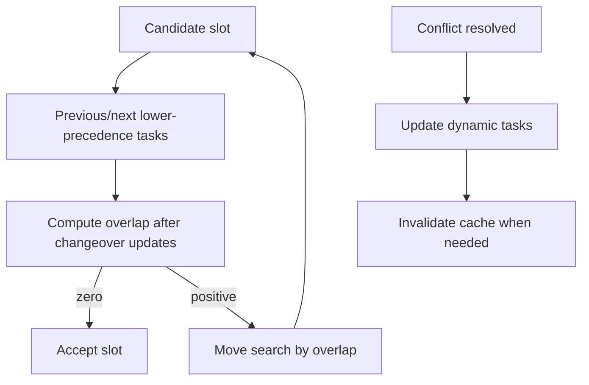

---
categories:
  - "[[Work]]"
  - "[[Documentation]]"
created: 2026-04-26
updated: 2026-06-10
product: scpCloud
component: Planning
tags:
  - documentation/Intelligen
  - topic/domain
---

# Scheduling Conflict Resolution

## Overview
Scheduling conflict resolution now accounts for dynamic tasks, changeover matrix durations, BOM-derived batch attribute values, campaign-level validation before layout, and auxiliary equipment replacement when operations require multiple auxiliary resources, but not every public scheduling entry point currently enforces the same validation gate.

## Current Behavior
- Campaigns are validated before layout, including BOM/recipe compatibility checks.
- `ScheduleCampaigns(...)` and `ScheduleFromToCampaigns(...)` call `Campaign.CheckValidationStatus()` before `Campaign.Layout()`.
- `ScheduleIndependentCampaign(...)` only checks `campaign.Recipe != null` before layout, so validation strictness differs by entry point.
- Dynamic tasks include conditional operations and changeover-matrix-based operations.
- Equipment slot search checks whether selected slots create start/end changeover overlap with neighboring lower-precedence tasks.
- Conflict cleanup recalculates dynamic tasks after shifting or reassignment.
- Loop-producing intrabatch conflicts are skipped and surfaced as warning messages instead of being retried indefinitely.
- The schedule utilization cache can be invalidated when a higher-precedence campaign changes.
- Round-robin auxiliary assignment can satisfy either `All` compatible resources or a `SpecificNumber` of compatible resources for each operation entry.
- `AuxEquipmentOveruse` and `MainAuxEquipmentIncompatibility` resolution can replace only the conflicting auxiliary equipment instead of discarding the full auxiliary selection.

## Flow

## Rules
- [[Campaign BOM Must Match Recipe]]
- [[Required Auxiliary Equipment Count Must Remain Satisfiable]]

## Risks
- [[Auxiliary Equipment Move Contract Is Single-Selection Shaped]]
- [[Dynamic Scheduling Regression Surface]]
- [[Dynamic Task Change Propagation]]
- [[Scheduling Entry Point Validation Drift]]

## Related PRs
- [[PR-feature-568-implement-multiple-aux-equip-assignment Multiple Auxiliary Equipment Assignment]]
- [[PR-task-430-Implement-SKU-in-material Adaptive Recipes and Recipe Attributes]]
- [[PR-feature-578-Adaptive-recipes-pt.4 Adaptive Recipes Part 4 Review]]
