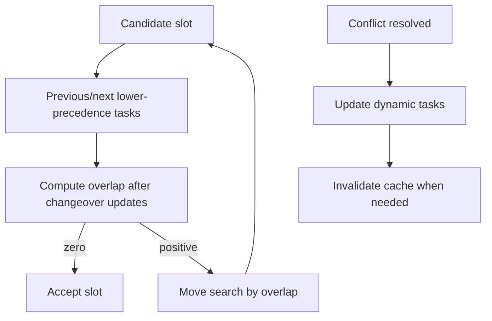

---
categories:
  - "[[Work]]"
  - "[[Documentation]]"
created: 2026-04-26
updated: 2026-04-26
product: scpCloud
component: Planning
tags:
  - documentation/Intelligen
  - topic/domain
---

# Scheduling Conflict Resolution

## Overview
Scheduling conflict resolution now accounts for dynamic tasks, changeover matrix durations, and BOM-derived batch attribute values.

## Current Behavior
- Campaigns are validated before layout.
- Dynamic tasks include conditional operations and changeover-matrix-based operations.
- Equipment slot search checks whether selected slots create start/end changeover overlap with neighboring lower-precedence tasks.
- Conflict cleanup recalculates dynamic tasks after shifting or reassignment.
- The schedule utilization cache can be invalidated when a higher-precedence campaign changes.

## Flow

## Rules
- [[Campaign BOM Must Match Recipe]]

## Risks
- [[Dynamic Scheduling Regression Surface]]

## Related PRs
- [[PR-task-430-Implement-SKU-in-material Adaptive Recipes and Recipe Attributes]]
