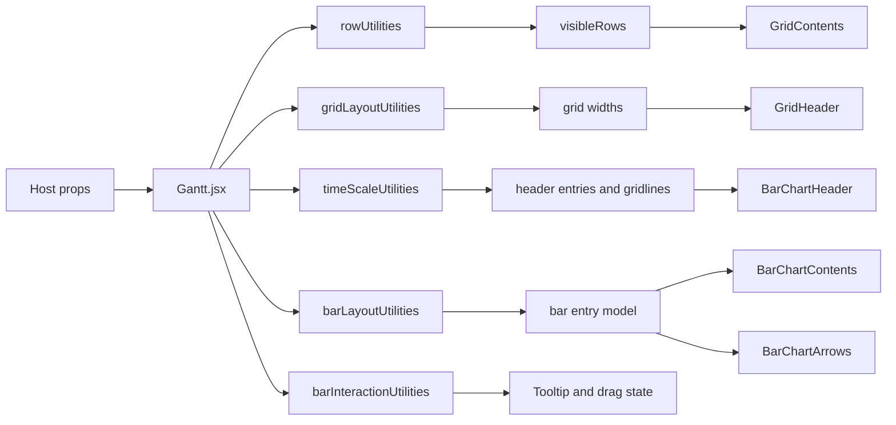

---
categories:
  - "[[Work]]"
  - "[[Documentation]]"
created: 2026-05-06
updated: 2026-05-06
product:
component: fluidence-gantt
tags:
  - documentation/fluidence-gantt
  - topic/domain
---

# Fluidence Gantt Architecture

## Overview
`fluidence-gantt` is a reusable React Gantt widget built as a split-pane renderer: a hierarchical grid on the left and a time-based bar chart on the right. The central orchestration happens in `components/Gantt.jsx`, while most other components are memoized presentation layers.

## Current Behavior
- `src/fluidence-gantt/index.js` exposes `Gantt` as the public entrypoint.
- `components/Gantt.jsx` owns layout measurement, visible-row projection, time-scale selection, synchronized scrolling, drag/drop state, resize state, tooltip state, timeline overlays, and composition of subcomponents.
- Grid rendering is delegated to `GridHeader`, `GridContents`, and `GridBottomSpacer`.
- Bar chart rendering is delegated to `BarChartHeader`, `BarChartContents`, `BarChartArrows`, and `BarChartBottomSpacer`.
- Layout values are pushed into CSS custom properties and the CSS layer performs most of the final positioning.

## Business Meaning
- The module is not a simple table or chart. It is a timeline workspace that combines structural hierarchy, scheduling placement, and interaction rules in one surface.
- The architecture is optimized for rendering consistency between grid rows, bars, arrows, shading, and timeline markers.

## Rules
- [[Row expansion visibility rule]]
- [[Time scale auto-selection rule]]
- [[Drag eligibility and droppable row rule]]
- [[Bar click resolution rule]]
- [[Tooltip visibility rule]]

## Risks
- [[Monolithic Gantt Orchestrator]]
- [[Public API Drift In Gantt Component]]
- [[Mouse-First Interaction Model]]

## Related PRs
- [[PR-fluidence-gantt Module Architecture and Rules]]

## Diagram

