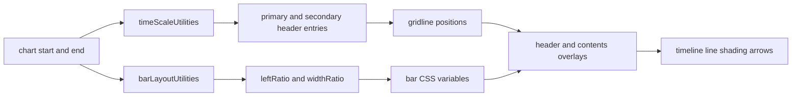

---
categories:
  - "[[Work]]"
  - "[[Documentation]]"
created: 2026-05-06
updated: 2026-05-06
product:
component: fluidence-gantt
tags:
  - documentation/fluidence-gantt
  - topic/domain
---

# Timeline Rendering

## Overview
Timeline rendering is ratio-based. JavaScript computes chart ranges, interval boundaries, and bar layout ratios, then CSS percentages and overlay layers are used to place the visual output.

## Current Behavior
- The chart start and end can be provided explicitly or inferred from all visible bar data.
- `timeScaleUtilities.js` builds dual-level header data for absolute or relative time modes.
- `buildTimelineLayout(...)` converts header intervals into positioned header entries and gridline positions.
- `buildVisibleBarEntries(...)` converts row bars into positioned bar entries using `leftRatio` and `widthRatio`.
- Leading shading, timeline markers, and arrows are rendered as overlays aligned to the same track geometry.
- Bar chart width is zoom-aware and can overflow horizontally while remaining synchronized with the header.

## Business Meaning
- Ratio-based rendering keeps the visual time model stable as viewport width, zoom, or pane widths change.
- The timeline is designed to support both operational scheduling views and broader planning scales.

## Rules
- [[Time scale auto-selection rule]]
- [[Bar click resolution rule]]
- [[Tooltip visibility rule]]

## Risks
- [[Monolithic Gantt Orchestrator]]

## Related PRs
- [[PR-fluidence-gantt Module Architecture and Rules]]

## Diagram

